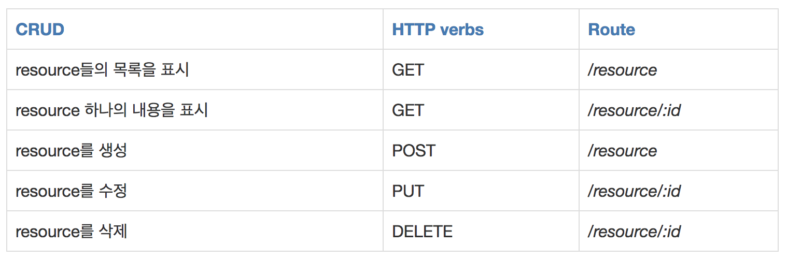

# REST란 무엇인가?
REST(Representational State Transfer)는 자원의 표현을 이용하여 상태를 주고받는 것을 의미한다.
여기서 자원이란 소프트웨어가 관리하는 모든 것을 의미하며 자원의 표현은 자원을 나타내기 위한 이름을 의미한다.
가령, 서버가 관리하는 주문 데이터는 "Order" 라고 표현할 수 있다.
최근에는 일반적으로 자원의 상태를 나타내기 위해 JSON 포맷을 사용한다. REST는 네트워크 상에서 클라이언트와 서버의 통신 방식 중 하나이며, HTTP 프로토콜을 사용한다. 구체적으로는 HTTP URI를 활용하여 자원을 명시하고 HTTP 메서드를 통해 CRUD(Create, Read, Update, Delete) 작업을 수행한다.

API(Application Programming Interface)는 컴퓨터 프로그램 간 정보를 주고받을 수 있도록 하는 일종의 출입구 역할을 수행한다. API가 REST 기반으로 구현되어 있다면, 이를 REST API라고 부른다.

## REST의 장,단점은?
### 장점
- **표준화**: REST는 HTTP 프로토콜을 기반으로 하므로, HTTP 프로토콜을 따르는 다른 모든 플랫폼에서 사용이 가능하다.
- **간편한 테스트**: REST API는 HTTP 프로토콜을 사용하기 때문에, 브라우저나 CURL, Postman과 같은 도구를 통해 쉽게 테스트할 수 있다.
- **하위 호환성**: JSON 메시지 포멧을 사용하기 때문에, 메시지 소비자가 자신이 관심 있는 값(필드)만 선택적으로 사용할 수 있다. 불필요한 나머지는 무시할 수 있기 때문에 메시지 구조가 자주 바뀌어도 하위 호환성을 보장하는 것이 유리하다.

### 단점
- **상태 비저장성**: REST는 클라이언트의 상태를 서버가 저장하지 않기 때문에, 매 요청마다 필요한 모든 정보를 포함해야 한다. 이로 인해 요청이 복잡해질 수 있다.
- **보안**: REST API는 기본적으로 HTTP를 사용하므로, HTTPS를 사용하지 않으면 데이터가 노출될 위험이 있다. 또한, REST는 인증 및 권한 부여를 위한 표준화된 방법이 부족하다.
- **고정된 스타일**: REST는 요청 및 응답 스타일의 통신만 지원한다. 이로 인해, HTTP 메서드로 행위를 표현하기 어려운 경우도 존재하며 요청 한 번으로 여러 자원을 가져오기 어렵다는 단점이 있다.
- **성능 저하의 가능성**: REST는 각 요청마다 전체 자원의 표현을 전송해야 하므로, 메시지의 길이가 다소 길다. 메시지가 길다는 것은 네트워크 대역폭을 더 많이 소모하게 되어 전송 속도가 느려질 수 있다. 또한, 서버가 자원의 상태를 저장하지 않기 때문에, 클라이언트가 매번 필요한 정보를 모두 포함해야 하므로 메시지를 해석하는 데에 오버헤드가 발생할 수 있다.

## REST가 필요한 이유는?
- **애플리케이션 분리 및 통합**: REST는 클라이언트와 서버 간의 명확한 분리를 제공하여, 서로 독립적으로 개발 및 배포할 수 있게 한다. 이는 애플리케이션의 유지보수성과 확장성을 높인다.
- **다양한 플랫폼 지원**: REST는 HTTP 프로토콜을 기반으로 하므로, 다양한 플랫폼과 언어에서 쉽게 구현하고 사용할 수 있다. 최근의 서버 프로그램은 다양한 브라우저와 안드로이폰, 아이폰과 같은 모바일 디바이스에서도 통신을 할 수 있어야 한다.
> 멀티 플랫폼에 대한 지원을 위해 서비스 자원에 대한 아키텍처를 세우고 이용하는 방법을 모색한 결과 REST가 주목받게 되었다.

## REST의 구성요소
1. 자원(Resouce) : URI
    - 모든 자원에는 고유한 ID가 존재하고, 이 자원은 Server에 존재한다.
    - 자원을 구별하는 ID는 '/groups/{groupId}'와 같은 형태로 표현된다.
    - 클라이언트는 이 URI를 사용하여 특정 자원에 대한 조작을 서버에 요청한다.
2. 행동(Behavior) : HTTP 메서드
    - REST는 HTTP 메서드를 사용하여 자원에 대한 행위를 정의한다.
    - 주요 HTTP 메서드로는 GET(조회), POST(생성), PUT(수정), DELETE(삭제)가 있다.
3. 표현(Representation) : 보통 JSON, XML 포맷
    - 클라이언트가 자원의 상태(정보)에 대한 조작을 요청하면 서버는 이에 적절한 응답을 보낸다.
    - REST에서 하나의 자원은 JSON, XML, TEXT, RSS등 여러 형태의 표현으로 제공될 수 있다.
    - JSON 혹은 XML 포맷이 가장 많이 사용된다.

## REST의 특징
1. 서버-클라이언트 구조:
    - 자원이 있는 쪽이 서버이고, 자원을 요청하는 쪽이 클라이언트이다.
        - REST 서버 : API를 제공하고 비즈니스 로직 처리 및 저장을 책임진다.
        - 클라이언트 : 사용자 인증이나 context(세션, 로그인 정보)등을 직접 관리하고 책임진다.
    - 서로 간 의존성이 줄어든다.
2. 무상태(Stateless):
    - HTTP 프로토콜의 특성상, 각 요청은 독립적이며 이전 요청의 상태를 저장하지 않는다. REST 역시 이러한 특성을 따른다.
    - 클라이언트의 context를 서버에 저장하지 않는다.
        - 즉, 세션과 쿠키와 같은 context 정보를 신경쓰지 않아도 되기 때문에 구현이 단순해진다.
    - 서버는 각각의 요청을 완전히 별개의 것으로 인식하고 처리한다.
        - 각 API 서버는 클라이언트의 요청만을 단순 처리한다. 즉, 이전 요청이 다음 요청의 처리에 연관되어서는 안된다.
        - 물론 이전 요청이 DB를 수정하여 DB에 의해 바뀌는 것은 허용한다.
        - Server의 처리 방식에 일관성을 부여하고 부담이 줄어들며, 서비스의 자유도가 높아진다.
3. Cacheable(캐시 처리 가능)
    - 웹 표준 HTTP 프로토콜을 그대로 사용하므로 웹에서 사용하는 기존의 인프라를 그대로 활용할 수 있다.
    즉, HTTP가 가진 가장 강력한 특징 중 하나인 캐싱 기능을 적용할 수 있다.
    - HTTP 프로토콜 표준에서 사용하는 Last-Modified 태그나 E-Tag를 이용하면 캐싱 구현이 가능하다.
    - 대량의 요청을 효율적으로 처리하기 위해 캐시가 요구된다.
    - 캐시 사용을 통해 응답시간이 빨라지고 REST Server 트랜잭션이 발생하지 않기 때문에 전체 응답시간, 성능, 서버의 자원 이용률을 향상시킬 수 있다.
4. 계층화(Layered System):
    - 클라이언트는 REST API 서버만 호출한다.
    - REST API 서버는 여러 개의 하위 서버로 구성될 수 있다.
        - API 서버는 순수 비즈니스 로직을 수행하고 그 앞단에 보안 로드밸런싱, 암호화, 사용자 인증 등을 추가하여 구조상의 유연성을 줄 수 있다.
        - 로드밸런싱, 공유 캐시 등을 통해 확장성과 보안성 향상 가능
    - 프록시, 게이트웨이 같은 네트워크 기반의 중간 매체를 사용할 수 있다.
5. Code-on-Demand(필요 시 코드 전송)
    - REST는 클라이언트가 필요로 하는 코드를 서버에서 전송받아 실행할 수 있는 기능을 지원한다.
    - 이를 통해 클라이언트의 초기 로딩 시간을 단축하고, 필요한 기능만을 선택적으로 로드할 수 있다.
6. 일관된 인터페이스(Uniform Interface):
    - URI로 지정한 자원에 대한 조직을 통일되고 한정적인 인터페이스로 수행한다.
    - HTTP 표준 프로토콜에 따르는 모든 플랫폼에서 사용 가능
        - 특정 언어나 기술에 종속되지 않는다.

## REST API 설계 예시

### 응답 상태 코드
- 1xx : 전송 프로토콜 수준의 정보 교환
- 2xx : 성공적인 요청 처리
- 3xx : 클라이언트의 요청을 완료하기 위해 추가적인 행동이 필요함 (리다이렉션)
- 4xx : 클라이언트측의 잘못된 요청
- 5xx : 서버쪽 오류에 의한 상태코드