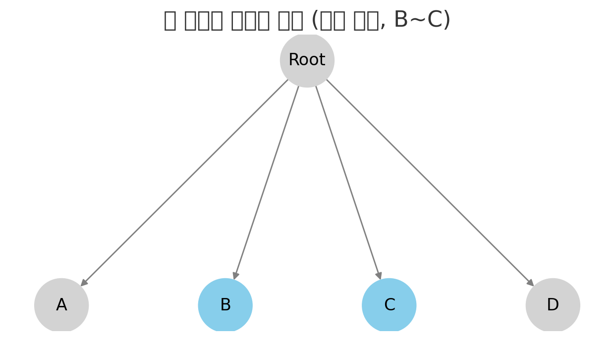
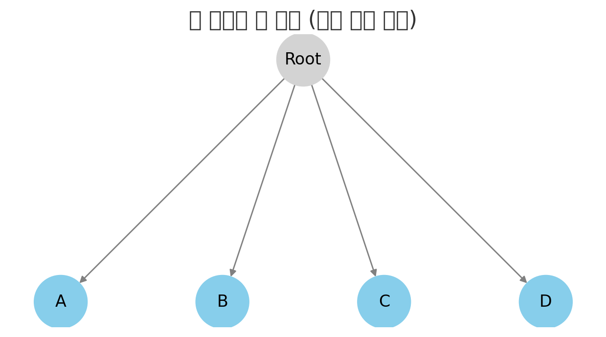
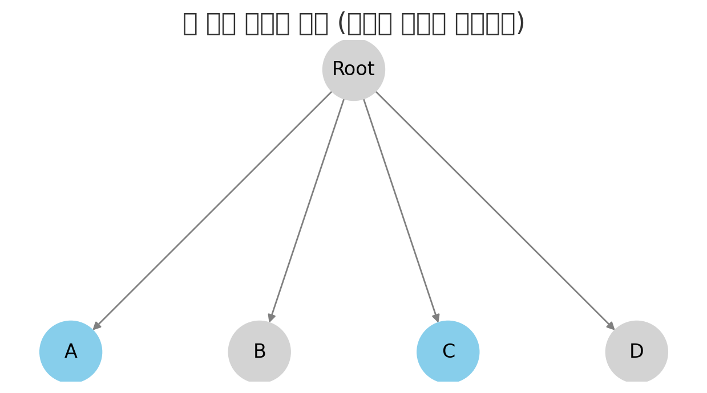

# 데이터베이스 인덱스
인덱스는 데이터베이스 테이블의 검색 속도를 향상시키는 자료구조로, 백과사전의 색인과 같다.  
저장된 컬럼 값을 이용해 항상 정렬된 상태를 유지하는 것이 특징이다.  
이로 인해 인덱스는 INSERT, UPDATE, DELETE 작업에서 성능 저하가 발생하는 단점이 있다.

## 인덱스의 구조
MySQL InnoDB를 기준으로, 인덱스는 B+Tree와 같은 변형된 B-Tree 자료구조로 구현된다.  
B+Tree 인덱스는 컬럼 값을 변형하지 않고, 인덱스 내에서 항상 정렬된 상태를 유지한다.

B+Tree는 크게 세 종류의 노드로 구성된다.  
- 최상위의 루트 노드  
- 중간에 위치한 브랜치 노드  
- 최하위의 리프 노드  

리프 노드는 실제 데이터 레코드의 주소값을 포함한다.  

InnoDB 스토리지 엔진에서 세컨더리 인덱스(프라이머리 인덱스를 제외한 모든 인덱스)의 리프 노드에는 레코드의 기본키(PK)가 저장된다.  
따라서 세컨더리 인덱스 검색 시에는 PK를 이용해 다시 B+Tree를 탐색해야 한다.

## MySQL의 인덱스 스캔 방식
MySQL에서는 대표적으로 인덱스 레인지 스캔, 인덱스 풀 스캔, 루스 인덱스 스캔 방식이 사용된다.

### 1. 인덱스 레인지 스캔 (Index Range Scan)
조건절로 인덱스 범위가 정해졌을 때 사용하며, 가장 빠른 방식이다.

- 인덱스에서 조건에 맞는 시작 리프 노드를 찾는다 (Index seek).  
- 시작 리프 노드부터 필요한 범위만큼 인덱스를 순차적으로 읽는다 (Index scan).  
- 인덱스 키와 레코드 주소를 이용해 저장된 페이지에서 레코드를 읽는다.  

레코드 읽기 과정에서 랜덤 IO가 발생할 수 있다.  
읽어야 할 데이터가 전체의 20~25% 이상일 경우, 순차 IO를 이용하는 풀 테이블 스캔이 더 효율적일 수 있다.

```
SELECT * FROM users WHERE age BETWEEN 20 AND 29;
```

```
도식 해설:
범위 조건이 존재하여, 리프 노드 중 시작 노드부터 연속적으로 탐색한다.

       [Root]
         ↓
      [Branch]
         ↓
[Leaf]-[Leaf]-[Leaf]-[Leaf]
         ↑     ↑
     시작값   끝값
```

---

### 2. 인덱스 풀 스캔 (Index Full Scan)
인덱스를 처음부터 끝까지 모두 읽는 방식이다.

- WHERE 절이 인덱스 앞쪽 컬럼을 사용하지 않거나 정렬 목적일 때 사용한다.  
- 예를 들어, 인덱스가 ABC 순서로 생성되었는데 조건절에 B나 C 컬럼만 검색하는 경우에 해당한다.  
- 데이터 레코드까지 읽지 않는 경우라면 풀 테이블 스캔보다는 효율적이다.

```
SELECT email FROM users WHERE gender = 'F';
```

```
도식 해설:
인덱스 조건과 일치하지 않아 인덱스를 처음부터 끝까지 탐색한다.

       [Root]
         ↓
      [Branch]
         ↓
[Leaf]-[Leaf]-[Leaf]-[Leaf]
   ↑                     ↑
 시작                  끝까지
```

---

### 3. 루스 인덱스 스캔 (Loose Index Scan)
GROUP BY, MAX, MIN 등에서 필요한 값만 성근하게 건너뛰며 읽는 방식이다.

- 중간에 필요 없는 인덱스 키는 무시하고 다음 키로 넘어간다.  
- 특정 조건에서만 사용 가능하며, 효율적인 접근법이다.

```
SELECT MIN(age), gender FROM users GROUP BY gender;
```

```
도식 해설:
중간 인덱스 키를 무시하고 필요한 키만 점프하여 조회한다.

       [Root]
         ↓
      [Branch]
         ↓
[Leaf]   [X]   [Leaf]   [X]   [Leaf]
   ↓             ↓             ↓
  min1          min2          min3
```

---

## 면접 대비 질문

- **"인덱스 레인지 스캔과 풀 스캔의 차이는 무엇인가요?"**  
  → "레인지 스캔은 범위를 기반으로 필요한 값만 읽지만, 풀 스캔은 인덱스 전체를 처음부터 끝까지 순회한다는 차이가 있다."

- **"루스 인덱스 스캔은 어떤 상황에서 쓰이나요?"**  
  → "GROUP BY, MIN/MAX 함수 최적화 시 일부 키만 건너뛰며 조회할 수 있는 상황에서 사용한다."