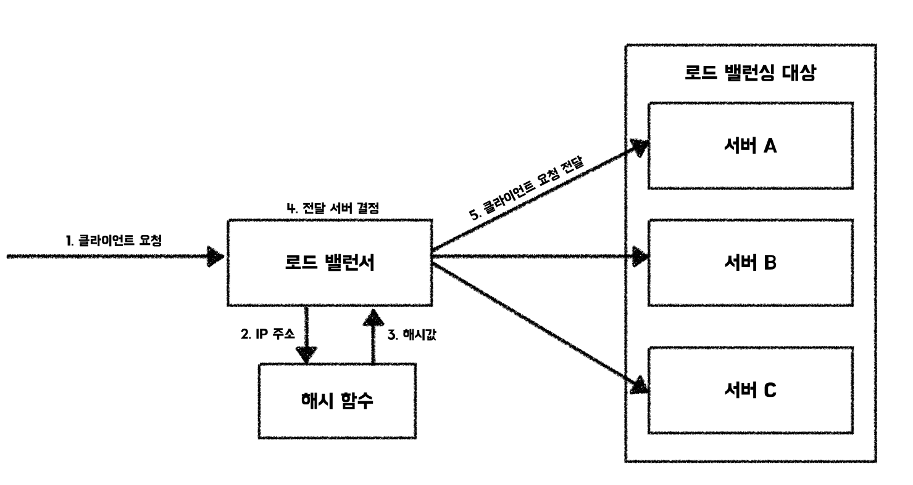
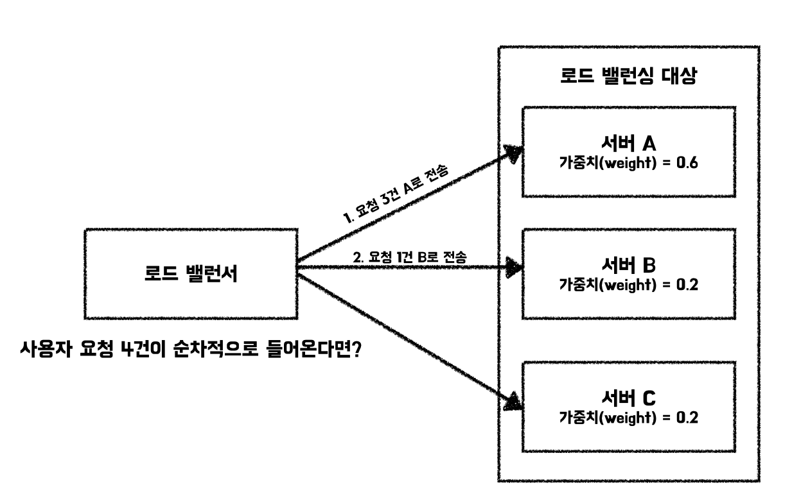

# 로드 밸런싱
로드 밸런싱이란 애플리케이션을 지원하는 리소스 풀에 들어오는 네트워크 트래픽(들어오는 요청)을 균등하게 분산하는 것을 의미한다. 이를 수행하는 로드 밸런서는 애플리케이션 서버 앞단에 위치하며 클라이언트 요청을 지시하고 제어한다.  
이를 통해서 애플리케이션의 가용성, 확장성, 보안 및 성능을 확보할 수 있다.  
> 요약하자면, 서버에 들어오는 트래픽을 여러 서버에 분산시켜 서버의 부하를 줄여 애플리케이션의 안정성을 높이는 것이다.

## 로드 밸런싱 알고리즘

### 라운드 로빈(Round Robin)
- **개요**: 모든 요청이 순서대로 처리되는 방식이다.  
  예를 들어, 서버가 3대(A, B, C)라면 요청 1은 A, 요청 2는 B, 요청 3은 C, 요청 4는 A로 돌아가며 처리한다.  
- **장점**: 구현이 쉽고, 요청을 고르게 분산시켜 서버 부하를 균등하게 분산한다.  
- **단점**: 서버 부하나 응답 시간을 고려하지 않으며, 서버의 처리 능력이 다를 경우 비효율적이다.  
- **적합한 상황**: 모든 서버의 처리 능력이 동등하고, 요청의 고른 분산이 필요한 경우.

### 최소 연결(Least Connections)
- **개요**: 각 서버의 현재 활성 연결 수를 기준으로 요청을 분배한다. 가장 적은 활성 연결이 존재하는 서버에 요청을 전달한다.  
- **장점**: 특정 서버가 일시적으로 느려지거나 장애가 발생했을 때, 부하를 적절히 분산할 수 있다.  
- **단점**: 서버 처리 능력이 다르면 부적합할 수 있다. 처리 능력이 큰 서버는 상대적으로 더 많은 연결을 가질 수 있기 때문이다.  
- **적합한 상황**: 서버 처리 능력이 비슷하며, 연결 수의 불균형이 발생할 때 유용하다.

### 최소 응답 시간(Least Response Time)
- **개요**: 각 서버의 응답 시간을 모니터링하여, 가장 빠른 서버에 요청을 전달한다.  
- **장점**: 응답 시간이 다양한 서버 환경에서 사용자 경험을 개선할 수 있다.  
- **단점**: 응답 시간만 고려하므로 서버 부하 상태나 활성 연결 수 등 다른 요소는 반영하지 않는다.  
- **적합한 상황**: 서버 응답 시간 차이가 큰 경우.

### IP 해시(IP Hash)

- **개요**: 클라이언트 요청의 IP를 기반으로 해시값을 계산하여 요청을 특정 서버에 전달한다.  
- **장점**: 클라이언트와 서버 간의 친화성을 유지할 수 있어, 세션 유지가 필요한 경우에 유리하다.  
- **단점**: 부하가 균등하게 분산되지 않을 수 있다.  
- **적합한 상황**: 세션 유지가 중요하고, 클라이언트가 동일 서버에 연결되어야 하는 경우.

### 가중치 기반 알고리즘 (Weighted Round Robin, Weighted Least Connections)
- **개요**: 서버의 처리 능력과 가용 자원에 따라 가중치를 부여하여 요청을 분배한다.  
  - **Weighted Round Robin**: 라운드 로빈 방식에 가중치를 적용하여, 가중치가 높은 서버가 더 많은 요청을 받는다.  
  - **Weighted Least Connections**: 활성 연결 수가 적은 서버 중 가중치가 높은 서버에 우선적으로 요청을 전달한다.  
- **장점**: 서버 처리 능력 차이를 고려하여 더 효율적인 부하 분산이 가능하다.  
- **단점**: 구현이 복잡하며, 여전히 실시간 서버 부하나 응답 시간을 완벽히 반영하지는 못한다.  
- **적합한 상황**: 서버 처리 능력이 다르고, 이를 반영하여 요청을 분배하고자 할 때.

#### 가중치 라운드 로빈 흐름도

---

## 로드 밸런싱 알고리즘 비교표

| 알고리즘                | 장점                                  | 단점                                       | 적합한 상황                                   |
|---------------------|-------------------------------------|------------------------------------------|------------------------------------------|
| 라운드 로빈 (RR)         | 구현이 쉽고, 고른 분산 보장                    | 서버 처리 능력 차이 무시                         | 서버 처리 능력이 동등한 경우                         |
| 가중치 라운드 로빈 (WRR)   | 서버 처리 능력 반영, 효율적인 요청 분배             | 구현 복잡, 실시간 부하 반영 어려움                   | 서버 처리 능력이 다를 때                            |
| 최소 연결 (Least Connections) | 부하 불균형 및 장애 대응에 효과적                 | 서버 처리 능력 차이 반영 어려움                       | 서버 처리 능력이 비슷할 때, 장애 상황 대응 필요 시           |
| 가중치 최소 연결 (Weighted Least Connections) | 서버 처리 능력과 연결 수를 모두 고려                 | 구현 복잡, 실시간 부하 반영 제한적                      | 서버 처리 능력 차이 있고, 연결 수 고려가 필요할 때            |
| 최소 응답 시간 (Least Response Time) | 사용자 경험 개선에 효과적                     | 부하 상태, 연결 수 등 다른 요소 미반영                   | 서버 응답 시간 편차 클 때                            |
| IP 해시 (IP Hash)         | 세션 유지에 유리                          | 부하 균등 분산 어려움                             | 세션 유지가 중요한 서비스                            |

---

## 로드 밸런서의 종류
- **하드웨어 로드 밸런서**  
  전용 장비로 구성되며, 높은 처리 성능과 안정성을 제공한다. 대규모 엔터프라이즈 환경에서 주로 사용된다.  
- **소프트웨어 로드 밸런서**  
  소프트웨어 기반으로 동작하며, 유연성과 비용 효율성이 높다. 클라우드 환경이나 중소규모 서비스에 적합하다.  
- **클라우드 로드 밸런서**  
  AWS ELB, Azure Load Balancer, Google Cloud Load Balancing 등 클라우드 서비스 제공자가 제공하는 관리형 로드 밸런서이다. 자동 확장 및 관리 기능을 포함한다.

---

## 세션 문제와 해결책
로드 밸런싱 시 클라이언트 세션이 여러 서버에 분산되면서 세션 정보가 일관되지 않는 문제가 발생할 수 있다.  
- **세션 고정(Session Persistence)**: 클라이언트 요청을 항상 같은 서버로 전달하는 방법 (예: IP 해시 방식).  
- **세션 공유**: 모든 서버가 공통 세션 저장소(예: Redis, Memcached)를 사용하여 세션 상태를 공유.  
- **쿠키 기반 세션 유지**: 로드 밸런서가 세션 정보를 쿠키에 저장하여 요청을 특정 서버로 유도.

---

## 클라우드 환경에서의 활용
클라우드 환경에서는 자동 확장(Auto Scaling)과 결합하여 로드 밸런서가 중요한 역할을 한다.  
- **자동 확장과 연동**하여 트래픽 증가 시 서버 인스턴스를 자동으로 추가하고, 감소 시 제거한다.  
- **글로벌 로드 밸런싱**으로 여러 리전(region)에 분산된 서버에 트래픽을 분산하여 지연 시간을 최소화하고 장애에 대비한다.  
- **보안 기능 통합**: SSL 종료, DDoS 방어, 웹 애플리케이션 방화벽(WAF) 등 보안 기능을 로드 밸런서에 통합하여 제공한다.

---

## 면접에서는 이런 질문으로도 나올 수 있어요
- 로드 밸런싱이 필요한 이유는 무엇인가요?  
- 라운드 로빈과 최소 연결 방식의 차이점은 무엇인가요?  
- 가중치 기반 로드 밸런싱의 장단점에 대해 설명해보세요.  
- 세션 유지 문제를 어떻게 해결할 수 있나요?  
- 클라우드 환경에서 로드 밸런서는 어떤 역할을 하나요?  
- 로드 밸런서의 종류와 각각의 특징을 설명해보세요.
