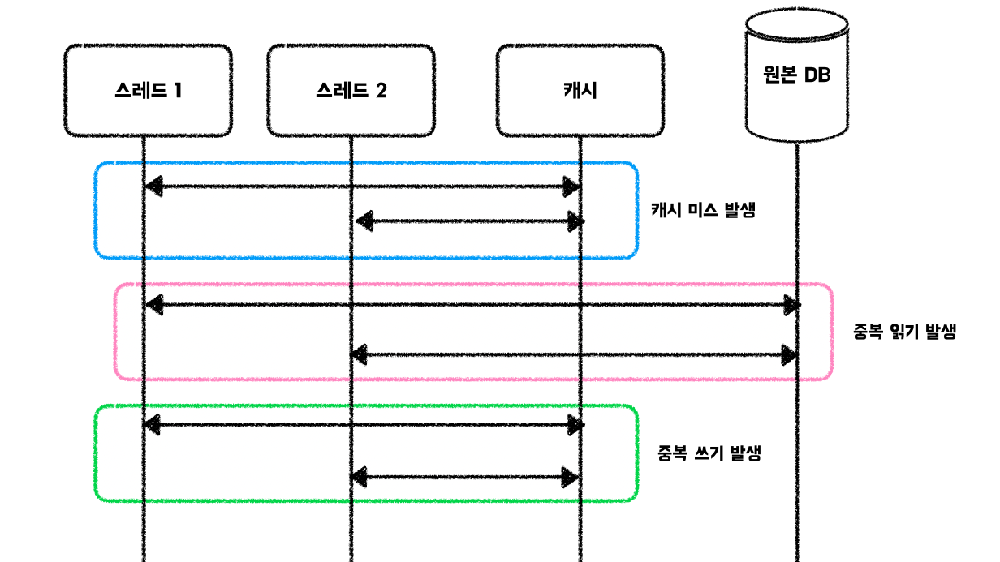

# 캐시 스탬피드
대규모 트래픽 환경에서 캐시를 운용하는데, Cache Aside(캐시 미스 발생 시 적재)전략을 사용한다면 캐시 스탬피드 현상이 발생할 수 있다. 캐시 스탬피드란, 캐시 미스가 발생했을 때 여러 요청이 원본 저장소에서 데이터를 가져와 동시에 캐시에 데이터를 적재하려고 시도하는 현상이다. 이로 인해 데이터베이스에 과부하가 걸릴 수 있다.
Thundering Herd라고도 표현한다.

Stampede라는 단어는 원래 영어에서 **“(동물들의) 우르르 몰려가는 상황”**을 뜻한다.
예를 들어, 소 떼나 말 떼가 놀라서 한 방향으로 갑자기 몰려 달리는 상황을 stampede라고 부른다.
캐시가 한 번 만료되면, 수많은 요청(소 떼처럼)이 동시에 원본 DB로 몰려들어가서
트래픽이 한꺼번에 DB를 두드리는 현상을 “캐시 스탬피드(Cache Stampede)”라고 한다.

## 해결 방안
크게 잠금, 외부 재계산, 확률적 조기 재계산 방식이 있다.
### 잠금(Locking)
한 요청 처리 스레드가 해당 캐시 키에 대한 잠금을 획득한다. 이로 인해 다른 요청 처리 스레드들은 잠시 대기한다.
잠금을 획득한 스레드는 사용자 요청에 응답하는 과정동안 캐시 적재 작업은 비동기 스레드로 처리할 수 있다.
잠금을 사용하기 때문에 성능 저하 가능성이 존재하며, 잠금 획득 스레드의 실패, 잠금의 생명 주기, 데드락 등 다양한 상황을 고려해야 한다. 분산 캐시 환경(예: Redis)에서 흔히 사용된다.

### 외부 재계산(External Recalculation)
모든 요청 처리 스레드가 캐시 적재를 수행하지 않는다. 대신, 캐시를 주기적으로 모니터링하는 스레드를 별도로 관리하여 캐시의 만료시간이 얼마 남지 않은 경우, 데이터를 갱신하여 문제를 예방한다. 해당 방식은 다시 사용되지 않을 데이터를 포함하여 갱신하기 때문에 메모리에 대한 불필요한 연산이 발생하고, 메모리 공간을 비효율적으로 사용할 가능성이 존재한다.

또한, 이와 관련된 개념으로 **Cache Warming(캐시 예열)**이 있다. 캐시 예열은 자주 사용되는 데이터를 미리 캐시에 적재하여 캐시 미스를 줄이고, 초기 트래픽 폭주 시 데이터베이스 부하를 완화하는 방법이다.

### 확률적 조기 재계산(Probabilistic Early Recomputation)
캐시 만료 시간이 얼마 남지 않은 경우, 확률이라는 개념을 사용하여 여러 요청처리 스레드 중에서 적은 수만이 캐시를 적재하는 작업을 수행하여 스탬피드 현상을 완화할 수 있다. 예를 들어, 10%의 확률로 캐시 적재 작업을 수행하도록 설정한다면, 10개의 요청 중 1개만 캐시 적재 작업을 수행하게 된다. 이로 인해 데이터베이스에 대한 부하를 줄일 수 있다. 확률적 조기 재계산은 캐시 적재 작업이 실패할 경우, 다른 요청 처리 스레드가 캐시 적재 작업을 수행할 수 있도록 해야 한다.
---

## TTL과 캐시 무효화 전략과의 관계
캐시 스탬피드 문제를 완화하기 위해서는 TTL(Time To Live)을 적절히 설정하는 것이 중요하다. TTL이 너무 짧으면 캐시가 자주 만료되어 스탬피드가 발생할 위험이 커지고, 너무 길면 오래된 데이터가 캐시에 남아 최신성에 문제가 생길 수 있다. 따라서 각 스탬피드 해결 전략과 TTL 설정은 상호 보완적으로 고려되어야 한다. 예를 들어, 확률적 조기 재계산 방식은 TTL 만료 직전 확률적으로 캐시를 갱신하여 스탬피드를 줄이고, 잠금 방식은 TTL 만료 시점에 한 번에 적재하도록 조절하는 식이다. 이처럼 TTL과 캐시 무효화 전략의 조합이 캐시 시스템의 안정성과 성능을 결정짓는다.