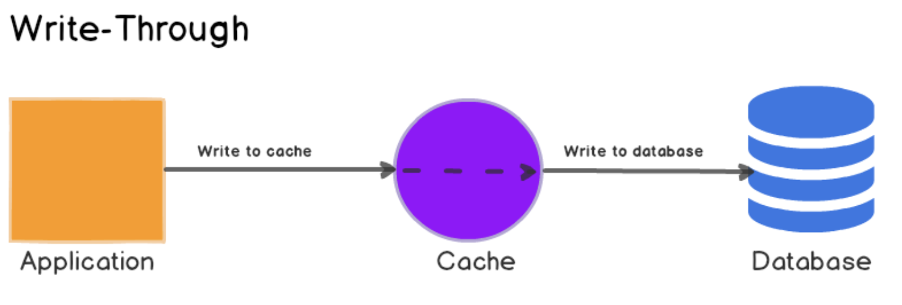

# 캐싱 전략
캐시는 성능 향상과 부하 감소를 목표로 한다. 이때 캐시를 사용하는 양상이 서비스에 큰 영향을 끼치기도 한다.

## Cache Aside(Lazy Loading)
캐시 히트 시 캐시에서 데이터를 불러오며, 캐시 미스 발생 시 원본 데이터베이스에서 조회하여 반환한다. 
애플리케이션은 캐시 미스가 발생하면 해당 데이터를 캐시에 적재한다.

해당 전략은 실제 요청된 데이터만 캐시에 저장되므로 불필요한 데이터 캐싱을 줄일 수 있다. 
또한, 캐시에 문제가 발생해도 애플리케이션은 원본 데이터베이스에 직접 접근할 수 있기 떄문에 서비스가 계속 동작할 수 있다는 장점이 있다. 
하지만, 캐시 미스가 발생하는 경우에만 데이터를 캐시에 적재하기 때문에 원본 데이터베이스와 캐시 간의 데이터 불일치가 발생할 수 있다. 
또, 초기에는 대량의 캐시 미스로 인해 데이터베이스에 부하가 증가할 수 있다.

### TTL(시간 기반 만료)
Cache Aside는 TTL 만료 전까지 캐시가 유지되며 데이터 불일치의 가능성이 존재한다.
Cache Aside는 캐시 무효화를 명시적으로 수행하지 않는 경우가 많아, 데이터 불일치 방지를 위해 TTL(Time To Live)을 설정하는 것이 일반적이다.
TTL이 너무 짧으면 캐시 적중률이 낮아져 DB 부하가 커지고, 너무 길면 캐시에 남아있던 오래된 데이터가 사용자에게 반환될 수 있다.
데이터의 특성에 따라 TTL을 조정하거나, 변경 이벤트 발생시 캐시를 강제 무효화하는 방법을 사용할 수 있다.

## 캐시 불일치 해소를 위한 쓰기 전략.
캐시 불일치란 원본 데이터베이스에 저장된 데이터와 캐시에 저장된 데이터가 서로 다른 상황을 말한다.
이를 해소하기 위한 전략으로 Write Through, Cache Invalidation, Write Behind가 있다.

### Write Through
원본 데이터에 대한 변경 소요가 발생한 경우, 매번 캐시에 해당 데이터를 찾아 변경하는 방식이다.
2번 쓰기가 발생하지만 캐시는 항상 최신 데이터를 가지고 있는다. 캐시는 다시 조회되는 경우에 제 기능을 발휘할 수 있다.'
무작정 데이터를 갱신하거나 저장하는 방식은 리소스 낭비가 될 수 있으나 해당 방식을 사용하는 경우, 만료 시간을 설정하여 캐시를 주기적으로 갱신할 수 있다.
#### 동작 흐름

1. 애플리케이션이 데이터를 캐시에 기록한다.
2. 캐시는 해당 데이터를 메인 데이터베이스에 기록한다.
3. 2번이 완료되면 캐시와 데이터베이스가 완벽히 동기화된 상태가 된다.

### Cache Invalidation
원본 데이터에 대한 변경 소요가 발생한 경우, 캐시 데이터를 만료시키는 방식이다. 
Write Through 방식으 단점을 보완했으며 캐시에 데이터가 삭제되니 캐시 불일치에 대한 걱정이 줄어든다.

### Write Behind
원본 데이터에 대한 변경 소요가 발생한 경우, 캐시를 먼저 업데이트한 이후 추후에 원본데이터를 변경한다.
디스크 쓰기 작업을 비동기로 처리할 수 있어 성능이 향상될 수 있다.
원본 데이터와 캐시가 일시적으로 일치하지 않을 수 있기 때문에 쓰기 작업이 빈번하며 일시적인 캐시 불일치를 허용하는 서비스에서 유용하다.
