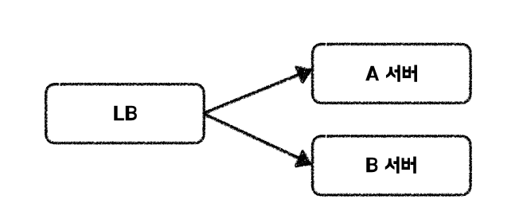

# 헬스 체크
- 현재 서버의 상태가 정상인지 파악하는 것을 의미한다.
API 엔드포인트를 호출하거나 특정 포트로 TCP 연결을 시도하는 방식을 사용할 수 있으며, 스프링 엑추에이터(Spring Actuator)를 활용하여 헬스체크 기능을 사용할 수 있다.
- 서비스의 고가용성(HA, High Avaliablity), 고성능을 위한 부하 분산 등의 이유로 서버의 이중화(혹은 그 이상)를 하고, 앞에서 어떤 서버로 요청을 보낼지 라우팅 역할을 하는 로드 밸런서를 둔다.
- 즉, 헬스 체크는 정상적으로 서비스가 가능한 서버에만 트래픽을 보내서 서비스의 고가용성을 확보하는 데 도움이 된다.

## 헬스 체크의 필요성은?
서버가 헬스 체크 기능을 제공하면 최신 코드를 배포할 댸 신규 배포가 정상적으로 이뤄졌는지 확인할 수 있으며, 장애를 감지하여 대응할 수 있다는 이점이 있다.

- 장애 대응의 예시로, 로드 밸런서가 존재하고 트래픽 분산 대상 서버 2대(A,B)가 있을 때, A 서버의 헬스체크 결과가 비정상으로 판단되면 로드 밸런서는 A 서버를 트래픽 분산 대상에서 제외하고, 이후 B 서버로만 요청을 전달할 수 있다.
- 비정상 서버는 CPU, 메모리, I/O 자원이 고갈되었거나 내부 오류 상태일 가능성이 높다.
이런 상태에서 요청이 전달되면, 정상 서버가 존재함에도 사용자는 오류 응답을 받을 수 있다.
- 또한, 클라이언트가 재시도를 수행할 경우 전체 트래픽이 증가할 위험도 있다.

# Spring Boot Actuator
- Spring Boot Actuator를 의존성 추가하면 기본적으로 헬스 체크 엔드포인트가 활성화 된다.
- </actuator/health> 가 default 엔드포인ㅌ
- 해당 주소로 입장하면 HTTP 200 상태 코드와 해당 서버의 상태가 Response Body

## Spring Boot Actuator 헬스 체크 동작 원리

### HealthIndicator란?
- Spring Boot는 여러 구성 요소(DB, Redis, Elasticsearch 등)의 상태를 개별적으로 진단하는 HealthIndicator들을 자동 구성한다.
- 이들은 `HealthContributor` 또는 `ReactiveHealthContributor`를 통해 `/actuator/health`로 수집된다.
- 예를 들어, DataSource가 있는 경우 `DataSourceHealthIndicator`가 자동 활성화된다.

### 전체 상태 판단 방식
- 내부적으로는 `HealthEndpointSupport` 클래스가 여러 `HealthIndicator`의 상태를 수집하고, 이를 `SimpleStatusAggregator`를 통해 종합한다.

#### 주요 동작 코드:
```java
@Override
public Status getAggregateStatus(Set<Status> statuses) {
    return statuses.stream()
        .filter(this::contains)
        .min(this.comparator)
        .orElse(Status.UNKNOWN);
}
```
- `this::contains`는 내부적으로 `order.contains(status.getCode())`를 수행하며, 정해진 상태 목록(`DOWN`, `OUT_OF_SERVICE`, `UP`, `UNKNOWN`)만 허용한다.
- 이후 `min(this.comparator)`로 우선순위가 가장 낮은(=심각한) 상태를 선택한다.

### 상태 우선순위(Default Order)
```java
DOWN < OUT_OF_SERVICE < UP < UNKNOWN
```
- 이 순서로 비교되어, `DOWN`이 하나라도 있으면 전체 상태는 `DOWN`으로 판단된다.

## 주의사항 및 실무 팁

### 1. 의도치 않은 장애
- 로그 저장 DB, 외부 시스템 등은 죽어도 서비스가 가능한데, 해당 구성요소의 HealthIndicator가 `DOWN`을 반환하면 전체 서버 상태도 `DOWN`이 된다.
- 이로 인해 로드밸런서는 해당 서버를 죽은 서버로 간주하고 트래픽을 보내지 않는다.

### 2. 트러블슈팅 지연
- 단순한 외부 서비스 오류로 인해 헬스 체크가 실패할 경우, 서버는 살아 있는데도 전체가 죽은 것처럼 보여 문제 원인 파악이 어려워질 수 있다.

### 해결 방법
- 비핵심 구성 요소는 HealthIndicator 비활성화 (`management.health.xxx.enabled=false`)
- 커스텀 헬스 체크 API 구현
- 필요한 경우 HealthIndicator를 오버라이드하여 영향도 조절