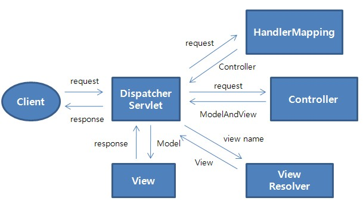

# ✅ Spring MVC 실행 흐름



---

## 📌 전체 흐름 요약

클라이언트가 HTTP 요청을 보내면, Spring MVC는 DispatcherServlet을 중심으로 다음과 같은 흐름으로 동작합니다:

---

## 1️⃣ [Client → DispatcherServlet]  
- **요청(request)**: 사용자의 HTTP 요청 (예: GET /users)
- **설명**: DispatcherServlet이 모든 요청을 가장 먼저 받아 처리하는 **프론트 컨트롤러** 역할을 수행함

---

## 2️⃣ [DispatcherServlet → HandlerMapping]  
- **전달 내용**: 요청 URI, HTTP 메서드 등의 정보
- **설명**: 이 요청을 처리할 **Controller 메서드(Handler)** 가 무엇인지 조회

---

## 3️⃣ [DispatcherServlet → HandlerAdapter → Controller]  
- **전달 내용**: 요청 객체(HttpServletRequest), 파라미터, 바인딩 객체 등
- **설명**: HandlerAdapter를 통해 실제 **Controller의 메서드**를 호출함

---

## 4️⃣ [Controller → DispatcherServlet]  
- **반환 내용**: `ModelAndView` 객체  
  - `Model`: View에 전달할 데이터  
  - `View name`: 응답을 렌더링할 View의 논리 이름 (예: "userList")
- **설명**: 컨트롤러는 로직을 처리한 뒤 결과와 뷰 이름을 함께 반환

---

## 5️⃣ [DispatcherServlet → ViewResolver]  
- **전달 내용**: View name (예: "userList")
- **설명**: 논리적 뷰 이름을 물리적인 뷰 경로로 매핑 (예: `/WEB-INF/views/userList.jsp`)

---

## 6️⃣ [DispatcherServlet → View (JSP, Thymeleaf 등)]  
- **전달 내용**: Model 데이터
- **설명**: 선택된 뷰에 모델 데이터를 전달하고, HTML 응답을 생성

---

## 7️⃣ [View → DispatcherServlet → Client]  
- **반환 내용**: 최종 렌더링된 HTML 문서
- **설명**: 클라이언트에게 최종 응답 전송

---

## 🔁 요약 순서 흐름

```
Client                    ← 사용자 요청을 보냄
  ↓
DispatcherServlet         ← 프론트 컨트롤러, 전체 요청 흐름 제어
  ↓
HandlerMapping            ← 어떤 Controller가 처리할지 결정
  ↓
HandlerAdapter            ← Controller를 실행할 수 있는 어댑터
  ↓
Controller                ← 요청 처리 및 ModelAndView 반환
  ↓
ModelAndView              ← Model + ViewName 반환
  ↓
ViewResolver              ← View 이름 → 실제 뷰 경로로 변환
  ↓
View (HTML)               ← Model 데이터를 HTML로 렌더링
  ↓
Client                    ← 최종 HTML 응답 수신
```

---

### 헷갈리는 부분
1.	DispatcherServlet이 HTTP 요청을 받습니다.
2.	이 요청을 처리할 수 있는 **핸들러(Controller의 메서드 등)**를 찾기 위해
 → HandlerMapping에게 “이 요청에는 어떤 Handler가 연결되어 있지?” 하고 문의합니다.
 → HandlerMapping은 해당 Handler 객체를 반환합니다. (ex. @RequestMapping된 메서드 정보)
3.	이제 DispatcherServlet은 이 Handler를 실제로 실행시킬 방법을 찾아야 하므로
 → 적절한 HandlerAdapter에게 “이 Handler 실행 좀 해줘” 하고 요청합니다.
4.	HandlerAdapter는 넘겨받은 Handler를 실제로 호출해서,
 → @Controller의 메서드를 실행하고
 → 그 결과로 ModelAndView를 반환합니다.


## 🧠 주요 컴포넌트 핵심 요약

| 컴포넌트 | 역할 |
|----------|------|
| **Client** | 브라우저나 앱 등, 요청을 보내는 사용자 |
| **DispatcherServlet** | 모든 요청의 진입점, 중앙 제어 허브 (프론트 컨트롤러) |
| **HandlerMapping** | 요청 URI에 대응하는 핸들러(Controller) 검색 |
| **HandlerAdapter** | 찾은 핸들러를 실제로 실행시켜주는 실행 어댑터 |
| **Controller** | 요청을 처리하고 Model과 View 정보를 생성 |
| **ModelAndView** | View 이름 + 데이터(Model)를 담은 객체 |
| **ViewResolver** | 논리 View 이름을 실제 View 파일로 변환 |
| **View** | Model 데이터를 렌더링해 최종 HTML 생성 |

---

이 흐름은 스프링에서 `@Controller` 또는 `@RestController`를 통해 웹 요청을 처리할 때의 기본 골격이며, 예외 처리기(ExceptionResolver), 인터셉터(HandlerInterceptor), 필터(Filter) 등의 컴포넌트도 DispatcherServlet을 중심으로 추가될 수 있습니다.


## Message Converter의 동작
- JSON과 문자열 등을 응답하는 경우는 View를 응답하는 경우와 유사한 흐름으로 동작한다.
단, ViewResolver 대신 HttpMessageConverter가 동작합니다. MessageConverter는 HTTP 요청과 응답 두 경우 모두 사용될 수 있다. 이때 클라이언트의 HTTP Accept 헤더와 반환 타입 정보, Content-Type 등을 조합하여 타입에 맞는 HttpMessageConverter가 선택된다.

---

## ✅ MessageConverter의 동작 흐름 요약

### 📥 요청(Request) 처리 흐름

1. **Client → DispatcherServlet**  
   클라이언트가 JSON, XML 등의 데이터를 담은 HTTP 요청을 보냄.  
   DispatcherServlet이 이를 가장 먼저 받아 처리함.

2. **DispatcherServlet → HandlerMapping**  
   요청 URL 및 HTTP 메서드를 기반으로 적절한 컨트롤러(Handler)를 찾음.

3. **DispatcherServlet → RequestMappingHandlerAdapter**  
   실제 핸들러 메서드를 호출하기 위해 RequestMappingHandlerAdapter를 사용.

4. **ArgumentResolver → HttpMessageConverter**  
   메서드 파라미터에 주입할 객체가 필요할 경우, ArgumentResolver가  
   HttpMessageConverter를 통해 JSON/XML → Java 객체로 변환하여 전달.

### 📤 응답(Response) 처리 흐름

5. **Controller → ReturnValueHandler → HttpMessageConverter**  
   컨트롤러가 반환한 객체가 `@ResponseBody`, `ResponseEntity` 등일 경우  
   ReturnValueHandler가 이를 감지하고 HttpMessageConverter를 호출하여  
   Java 객체 → JSON/XML로 변환함.

6. **DispatcherServlet → Client**  
   변환된 JSON/XML이 HTTP 응답 본문으로 클라이언트에 전달됨.

---

### 🧩 핵심 포인트 요약

- `@RequestBody`, `@ResponseBody`, `HttpEntity`, `ResponseEntity`는 HttpMessageConverter를 동작시킴.
- 요청 시: JSON → Java 객체 (`ArgumentResolver + MessageConverter`)
- 응답 시: Java 객체 → JSON (`ReturnValueHandler + MessageConverter`)
- ViewResolver는 JSP/Thymeleaf 등 HTML 렌더링에 사용되고,  
  MessageConverter는 JSON/XML 등 데이터 처리에 사용됨.

---

## ✅ ViewResolver vs MessageConverter (현대 Spring MVC 관점)

### 🔄 사용 비중 변화

| 구분 | 설명 | 사용 빈도 |
|------|------|-----------|
| **ViewResolver 기반 View 반환** | JSP, Thymeleaf 등으로 HTML 페이지 렌더링<br>(예: `return "viewName"`) | 전통적인 서버 사이드 렌더링(Spring MVC 초기)<br>→ 현재는 주로 관리용 페이지, 일부 예외적 상황 |
| **MessageConverter 기반 JSON 반환** | JSON, XML 등 객체 데이터를 직접 반환<br>(예: `@ResponseBody`, `ResponseEntity`) | **현대 웹/모바일 백엔드 API에서 기본 방식** |

### 💡 MessageConverter가 더 일반적인 이유

- **FE/BE 분리 구조**로 인해 HTML 대신 JSON 응답 제공
- `@RestController` 사용 시 자동으로 MessageConverter 적용
- 비동기 통신(AJAX, Fetch 등)이 일반화된 UX 패턴
- Spring Boot는 Jackson 기반 JSON 변환기를 기본으로 제공

### 🧠 면접 포인트

- `@Controller` vs `@RestController` 차이
- `@ResponseBody`의 동작 원리
- JSON 응답 처리 시 어떤 컴포넌트가 관여하는가?
- ViewResolver와 MessageConverter의 역할 차이

✅ **결론**  
현대 Spring MVC에서는 View 렌더링보다 **MessageConverter 기반 JSON 응답**이 훨씬 더 일반적인 흐름이다.
