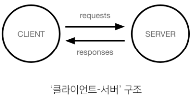
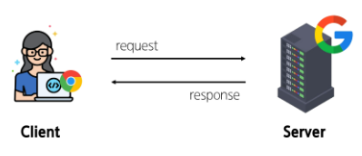
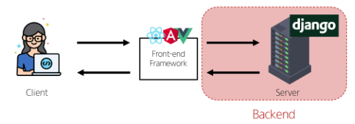
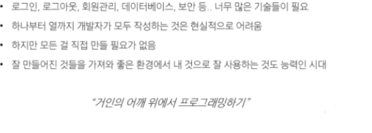
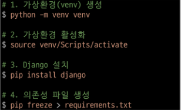
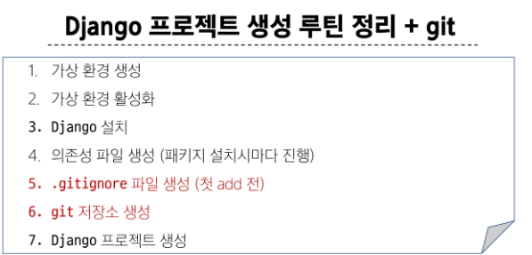
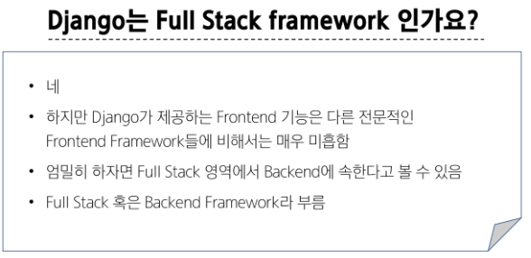
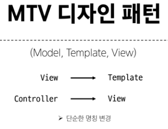
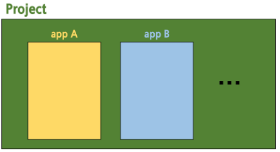

# [TIL] 2024-03-12

## Web Application
- 인터넷을 통해 사용자에게 제동괴는 SW 프로그램을 구축하는 과정
- 다양한 디바이스(모바일,태블릿,pc 등)에서 웹 브라우저를 통해 접근하고 사용할 수 있음

## 클라이언트와 서버
- 웹의 동작 방식
    - 우리가 컴퓨터 혹은 모바일 기기로 웹 페이지를 보게 될 때까지 무슨 일이 일어날까?
- 클라이언트-서버 구조
    

### 클라이언트
- 서비스를 요청하는 주체
    - 웹 사용자의 인터넷이 연결된 장치, 웹 브라우저
### 서버
- 클라이언트의 요청에 응답하는 주체
    - 웹 페이지, 앱을 저장하는 컴퓨터

## 우리가 웹 페이지를 보게 되는 과정

1. 웹 브라우저(클라이언트)에서 'google.com'을 입력
2. 브라우저는 인터넷에 연결된 전세계 어딘 가에 있는 구글 컴퓨터(서버)에게 'Google 홈페이지.html' 파일을 달라고 요청
3. 요청을 받은 구글 컴퓨터는 DB에서 'Google 홈페이지.html'파일을 찾아 응답
4. 전달받은 'Google 홈페이지.html'파일을 사람이 볼 수 있도록 웹 브라우저가 해석해주면서 사용자는 구글의 메인 페이지를 보게 됨

## Frontend & Backend
- Frontend
    - 사용자 인터페이스(UI)를 구성하고, 사용자가 애플리케이션과 상호작용할 수 있도록 함
    - HTML, CSS, JavaScript, 프론트엔드 프레임워크 등
- Backend
    - 서버 측에서 동작하며, 클라이언트의 요청에 대한 처리와 DB와의 상호작용 등을 담당
    - 서버 언어(Python, Java등) 및 백엔드 프레임워크, DB, API, 보안 등 


## 웹 서비스 개발에는 무엇이 필요할까?


### Web Framework
- 웹 애플리케이션을 빠르게 개발할 수 있도록 도와주는 도구
    - 개발에 필요한 기본 구조, 규칙, 라이브러리 등을 제공

## Django
- 다양성
    - Python 기반으로 소셜 미디어 및 빅데이터 관리 등 광범위한 서비스 개발에 적함
- 확장성
    - 대량의 데이터에 대해 빠르고 유연하게 확장할 수 있는 기능을 제공
- 보안
    - 취약점으로부터 보호하는 보안 기능이 기본적으로 내장되어 있음
- 커뮤니티 지원
    - 개발자를 위한 지원, 문서 및 업데이트를 제공하는 활성화된 커뮤니티

## 가상환경
- Python 애플리케이션과 그에 따른 패키지들을 격리하여 관리할 수 있는 *독립적인* 실행 환경

### 명령어
1. 가상 환경 vnev 생성
    - python -m venv venv
2. 가상 환경 활성화
    - source venv/Scripts/activate
3. 설치된 패키지 목록
    - pip list
4. 의존성 패키지 목록 생성
    - pip freeze > requirements.txt

## Django 프로젝트 생성 루틴

## Django 프로젝트 생성 루틴 + git


### LTS
- 프레임워크나 라이브러리 등의 SW에서 자기간 지원되는 안정적인 버전을 의미할 때 사용
- 기업이나 대규모 프로젝트에서는 SW 업그레이드에 많은 비용과 시간이 필요하기 때문에 안정적이고 장기간 지원되는 버전이 필요


## 디자인 패턴
- SW 설계에서 발생하는 문제를 해결하기 위한 일반적인 해결책
    - 공통적인 문제를 해결하는 데 쓰이는 형식화 된 관행
    - "애플리케이션의 구조는 이렇게 구성하자" 라는 관행

### MVC 디자인 패턴 (Model,View,Controller)
- 애플리케이션을 구조화하는 대표적인 패턴
    - 데이터 & 사용자 인터페이스(UI) & 비즈니스 로직을 분리
    - 시각적인 요소와 뒤에서 실행되는 로직을 서로 영향 없이, 독립적이고 쉽게 유지 보수할 수 있는 애플리케이션을 만들기 위해
### MTV 디자인 패턴 (Model,Template,View)
- Django에서 애플리케이션을 구조화하는 패턴
    - 기존 MVC와 동일한 패턴 (단순히 명칭만 다름)
    

## Project & App


1. 앱 생성 - 이름은 복수형으로 지정하는 것을 권장
- python manage.py startapp articles

## 요청과 응답
1. URLs

```python

urlpatterns = [
    path('admin/', admin.site.urls),
    path('index/', 호출할 view 함수)
]
```

### 시험문제
- app 생성시 생성되는 파일이 아닌것은 ? -settings