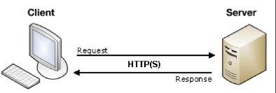

# [TIL] 2024-03-13

## Django Template system
- 데이터 표현을 제어하면서, 표현과 관련된 부분을 담당

### Django Template Language(DTL)
- Template에서 조건,반복,변수 등의 프로그래밍적 기능을 제공하는 시스템

### DTL Syntax 종류
1. Variable
2. Filters
3. Tags
4. Comments

## DTL Syntax
### Vairable
- render 함수의 세번째 인자로 딕셔너리 데이터를 사용
- 딕셔너리 key에 해당하는 문자열이 template에서 사용 가능한 변수명이 됨
- dot('.')를 사용하여 변수 속성에 접근할 수 있음

### Filters
- 표시할 변수를 수정할 때 사용(변수+'|'+필터)
- chained(연결)이 가능하며 일부 필터는 인자를 받기도 함
- 60개의 built-in template filters를 제공

### Tags
- 반복 또는 논리를 수행하여 제어 흐름을 만듦
- 일부 태그는 시작과 종료 태그가 필요
- 약 24개의 built-in template tags를 제공

### Coments
- DTL에서의 주석

- 예시

## 기존 템플릿 구조의 한계
- 만약 모든 템플릿에 bootstrap을 적용하려면?
- 모든 템플릿에 bootstrap CDN을 작성해야 할까?
### 템플릿 상속
- *페이지의 공통요소를 포함*하고, *하위 템플릿이 재정의 할 수 있는 공간*을 정의하는 기본 'skeleton'(뼈대) 템플릿을 작성하여 상속 구조를 구축
- 'extens' tag
    - 
    - 자식(하위) 템플릿이 부모 템플릿을 확장한다는 것을 알림
    - 반드시 자식 템플릿 최상단에 작성되어야 한다.(2개 사용 불가)

## HTML form(요청과 응답)
- 데이터를 보내고 가져오기
- HTML 'form' element를 통해 사용자와 애플리케이션 간의 상호작용 이해하기
- HTML 'form'은 HTTP 요청을 서버에 보내는 가장 편리한 방법

- 'form' element
    - 사용자로부터 할당된 데이터를 서버로 전송
    - 웹에서 사용자 정보를 입력하는 여러 방식
    (text,password,checkbox 등)을 제공
## action과 method
- action
    - 입력 데이터가 전송될 URL을 지정(목적지)
    - 만약 이 속성을 지정하지 않으면 데이터는 현재 form이 있는 페이지의 URL로 보내짐
- method
    - 데이터를 어떤 방식으로 보낼 것인지 정의
    - 데이터의 HTTP request methods(GET,POST)를 지정

### input element
- 사용자의 데이터를 입력 받을 수 있는 요소
(type 속성 값에 따라 다양한 유형의 입력 데이터를 받음)
### name attribute - input의 핵심 속성
- 입력한 데이터에 붙이는 이름(key)
- 데이터를 제출했을 때 서버는 name 속성에 설정된 값을 통해서만 사용자가 입력한 데이터에 접근할 수 있음

### Query String Parameter

### DTL 주의사항

### URL dispatcher
- URL 패턴을 정의하고 해당 패턴이 일치하는 요청을 처리할 view 함수를 연결 (매핑)
### 현재 URL 관리의 문제점
- 템플릿의 많은 부분이 중복되고, URL의 일부만 변경되는 상황이라면 계속해서 비슷한 URL과 템플릿을 작성해야 하는가?

### Variable Routing
- URL 일부에 변수를 포함 시키는 것
- (변수는 view 함수의 인자로 전달할 수 있음)

### GET, POSt
- GET : 받는 대상, 보내는 대상을 모두 기재함 신뢰성 O
- POST : 내용만 담아서 보냄 - 신뢰성 x

CRUD의 GET,POST 사용여부
R만 GET 사용