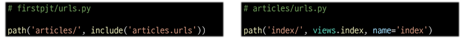
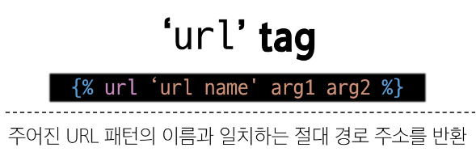
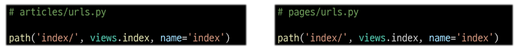
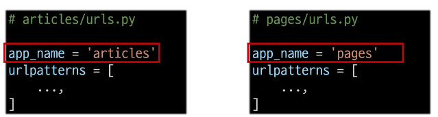
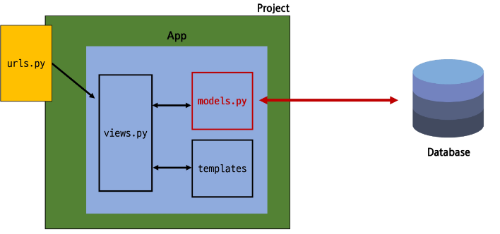
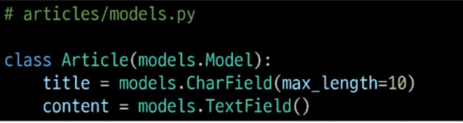
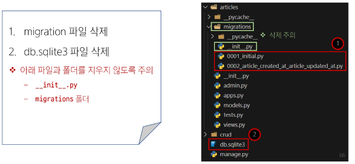

# [TIL] 2024-03-14

## Django URLs
- URL dispatcher
- URL 패턴을 정의하고 해당 패턴이 일치하는 요청을 처리할 view 함수를 연결(매핑)

### APP과 URL
- APP URL mapping
    - 각 앱에 URL을 정의하는 것
    - 프로젝트와 각 앱이 URL을 나누어 관리를 편하게 하기 위함

### include()
- 프로젝트 내부 앱들의 URL을 참조할 수 있도록 매핑하는 함수
- URL의 일치하는 부분까지 잘라내고, 남은 문자열 부분은 후속 처리를 위해 include된 URL로 전달

### URL 구조 변경에 따른 문제점
- 기존 'articles/' 주소가 'articles/index'로 변경됨에 따라 해당 주소를 사용하는 모든 위치를 찾아가 수정해야함
- URL에 이름을 지어준다면?

### url tag 사용

### 이름 지정 후 남은 문제
- articles 앱의 url이름과 pages 이름이 같은 상황
- 단순히 이름만으로는 완벽히 분리 불가
- *이름에 성(key)을 붙이자*

- 'app_name' 속성 지정

- URL tag의 최종 변화 (url 태그 사용되는 곳 모두 수정)

## Model
### Model을 통한 DB 관리

### Django Model
- DB의 테이블을 정의하고 데이터를 조작할 수 있는 기능들을 제공
    - 테이블 구조를 설계하는 청사진, 설계도 역할

### model 클래스 작성

(클래스의 변수명)열,컬럼 : 필드

### model 클래스 살펴보기
- django.db.models 모듈의 Model이라는 부모 클래스를 상속 받으
- Model은 model에 관련된 모든 코드가 이미 작성되어 있는 클래스
- 개발자는 가장 중요한 테이블 구조를 어떻게 설계할지에 대한 코드만 작성하도록 하기 위한 것 (상속을 활용한 프레임워크의 기능 제공)

### Migration
- model 클래스의 변경사항(필드 생성, 수정, 삭제 등)을 DB에 최종 반영하는 방법
- 명령어 2가지
    - python manage.py makemigrations
        - model class 기반으로 최종 설계도 장석
    - python manage.py migrate
        - 최종 설계도를 db에 전달 및 반영
- *model class에 변경사항이 생겼다면, 반드시 새로운 설계도를 생성하고 이를 DB에 반영해야한다.*
1. class 변경 사항 발생
2. makemigrations
3. migrate

### Model Field
- DB 테이블의 필드(열)을 정의하며, 해당 필드에 저장되는 데이터 타입과 제약 조건을 정의
- CharField()
    - 길이가 제한이 있는 문자열을 넣을 때 사용
    - 필드의 최대 길이를 결정하는 max_length는 필수 인자
- TextField()
    - 글자의 수가 많을 때 사용
- DateTimeField()
    - 날짜와 시간을 넣을 때 사용
    - 선택인자
        - auto_now : 데이터가 저장될 때마다 자동으로 현재 날짜, 시간을 저장
        - auto_now_add : 데이터가 처음 생성될 때만 자동으로 현재 날짜, 시간을 저장
### Admin
- Automatic admin interface
    - django는 추가 설치 및 설정 없이 자동으로 관리자 인터페이스 제공
    - 데이터 확인 및 테스트 등을 진행하는데 유용하다.
- 계정 생성 명령어
    - python manage.py createsuperuser
### DB 초기화
