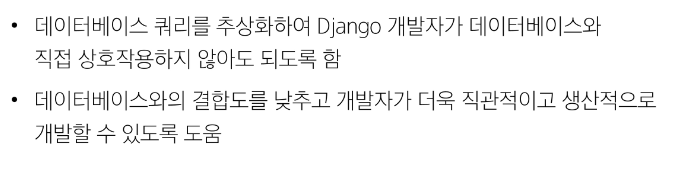

# [TIL] 2024-03-25

## ORM
- 객체 지향 프로그래밍 언어를 사용하여 호환되지 않는 유형의 시스템 간에 데이터를 변환하는 기술
## ORM의 역할

- Django에 내장된 ORM이 중간에서 이를 해석한다.

## QuerySet API
- ORM에서 데이터를 검색, 필터링, 정렬 및 그룹화 하는 데 사용하는 도구
    - API를 사용하여 SQL이 아닌 Python코드로 데이터를 처리
## QuerySet API 구문 (행동->메서드)

- Manager를 통해 Model에 접근한다. 

## Query
- DB에 득정한 데이터를 보여 달라는 요청
- "쿼리문을 작성한다"
    - 원하는 데이터를 얻기 위해 DB에 요청을 보낼 코드를 작성한다.
- 파이썬으로 작성한 코드가 ORM에 의해 SQL로 변환되어 DB에 전달되며, 데이터베이스의 응답 데이터를 ORM이 QuerySet이라는 자료 형태로 변환하여 우리에게 전달

## QuerySet
- DB에서 전달받은 객체 목록(데이터 모음)
    - 순회가 가능한 데이터로써 1개 이상의 데이터를 불러와 사용할 수 있음
- Django ORM을 통해 만들어진 자료형
- 단, 데이터베이스가 단일한 객체를 반환할 때는 QuerySet이 아닌 모델(Class)의 인스턴스로 반환됨

### QuerySet API
- Python의 모델 클래스와 인스턴스를 활용해 DB에 데이터를 저장, 조회, 수정, 삭제하는 것

## QuerySet API 실습
### Create

### Django shell
- Django 환경 안에서 실행되는 python shell
    - (입력하는 QuerySet API 구문이 Django 프로젝트에 영향을 미침)
### Django shell 실행

## 데이터 객체를 만드는 3가지 방법
1. 

2. 

3.

### 메서드
- save() : 객체를 DB에 저장하는 메서드
- all() : 전체 데이터 조회
- filter() :

- get():

    - 객체를 찾을 수 없으면 DoesNotExist 예외를 발생시키고, 둘 이상의 객체를 찾으면 MultipleObjectsReturned 예외를 발생시킴
    - 위와 같은 특징을 가지고 있기 때문에 *primary key와 같이 고유성을 보장하는 조회에서 사용해야 함*

### Field lookups
- 특정 레코드에 대한 조건을 설정하는 방법
- QuerySet 메서드 filter(), exclude() 및 get()에 대한 키워드 인자로 지정

### QuerySet API를 사용하는 이유
