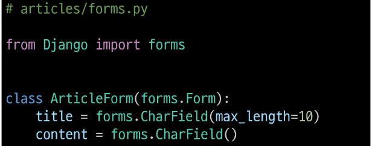
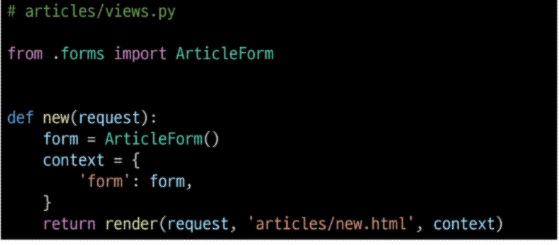
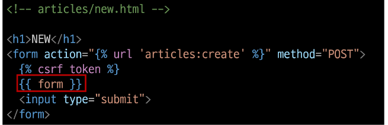
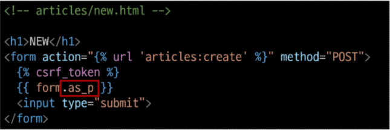
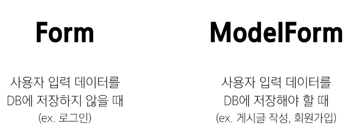
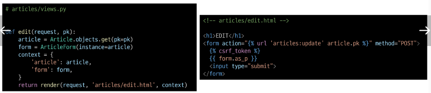
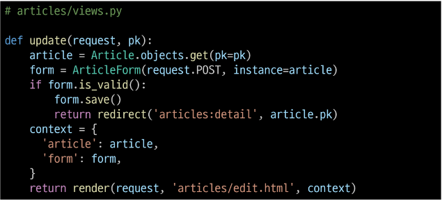
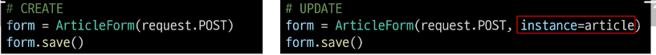
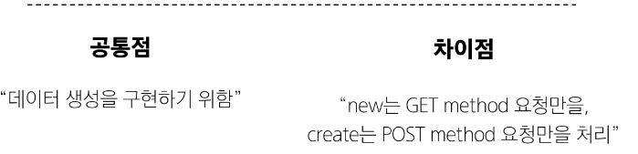

# [TIL] 2024-03-27

## Django form
- HTML - form
    - 지금까지 사용자로 부터 데이터를 받기 위해 활용한 방법
    - 그러나 비정상적 혹은 악의적인 요청을 필터링 할 수 없음
    - 유효한 데이터인지에 대한 확인 필요

### 유효성 검사
- 수집한 데이터가 정확하고 유효한지 확인하는 과정
- Django가 제공하는 form을 사용하여 고려할 사항들을 편리하게 관리

### Django form
- 사용자 입력 데이터를 수집하고, 처리 및 유효성 검사를 수행하기 위한 도구
- 유효성 검사를 단순화하고 자동화 할 수 있는 기능을 제공

### forms class 정의

### Form class 적용 과정 변화

### 옵션

- as_p, as_div 등등 

### ModelForm

### edit

### update

### save() 메서드가 생성과 수정을 구분하는 방법
- 키워드 인자 instance 여부를 통해 생성, 수정을 결정

### Django Form 정리
- 사용자로 부터 데이터를 수집하고 처리하기 위한 강력하고 유연한 도구
- HTML form의 생성, 데이터 유효성 검사 및 처리를 쉽게 할 수 있도록 도움

## new와 create view 간의 공통점, 차이점

