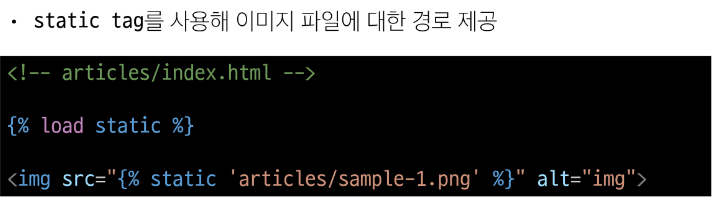
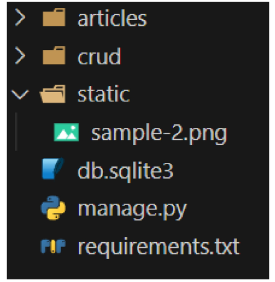
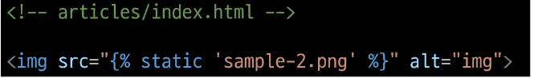
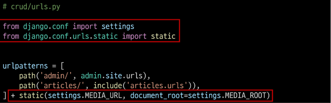
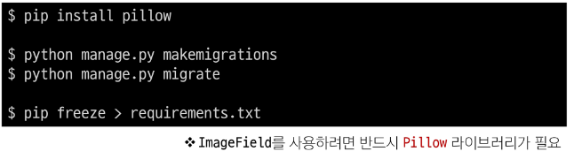
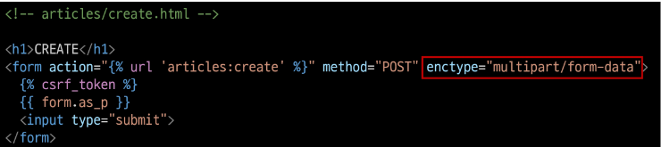
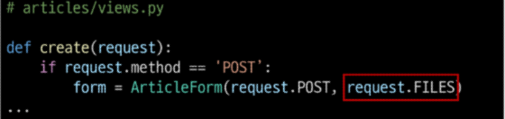
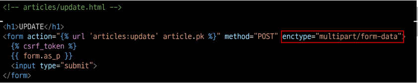
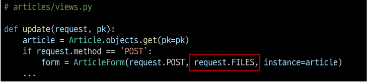
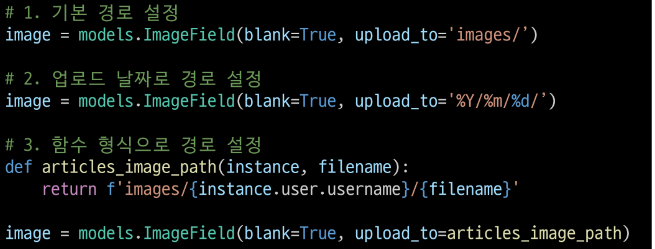

# [TIL] 2024-03-28

## Static Files 
- 정적 파일
- 서버 측에서 변경되지 않고 고정적으로 제공되는 파일(이미지, JS, CSS)

### 웹 서버와 정적 파일

- 웹 서버의 기본동작은 특정 위치(URL)에 있는 자원을 요청(HTTP request) 받아서 응답(HTTP response)을 처리하고 제공하는 것
- 이는 "자원에 접근 가능한 주소가 있다." 라는 의미
- 웹 서버는 요청 받은 URL로 서버에 존재하는 정적 자원을 제공함
- *정적 파일을 제공하기 위한 경로(URL)*가 있어야 함

## Static files 제공하기
1. 기본 경로에서 제공하기
    - articles/static/articles/ 경로에 이미지 파일 배치
    - 
    - 
    - STATIC_URL
        - 
        - 기본 경로 및 추가 경로에 위치한 정적 파일을 참조하기 위한 URL
        - 실제 파일이나 디렉토리가 아니며, URL로만 존재
        - 실제 주소 구성
            - 
2. 추가 경로에서 제공하기
    - STATICFILES_DIRS에 문자열 값으로 추가 경로 설정
    - STATICFILES_DIRS
        - 정적 파일의 기본 경로 외에 추가적인 경로 목록을 정의하는 리스트
    - 추가 경로 static file 제공하기
        
        1. 임의의 추가 경로 설정
        
        2. 추가 경로에 이미지 파일 배치
        
        3. static tag를 사용해 이미지 파일에 대한 경로 제공
        4. 이미지를 제공 받기 위해 요청하는 Request URL 확인
### 결론 : 정적 파일을 제공하려면 요청에 응답하기 위한 URL이 필요

## Media files
- 사용자가 웹에서 업로드하는 정적 파일 (user-uploaded)

    ### ImageField()
    - 이미지 업로드에 사용하는 모델 필드
    - 이미지 객체가 직접 저장되는 것이 아닌 '이미지 파일의 경로'가 문자열로 DB에 저장

    ### 미디어 파일 제공을 위한 사전 준비
    1. settings.py에 MEDIA_ROOT, MEDIA_URL 설정
    - MEDIA_ROOT
        
        - 실제 미디어 파일들이 위치하는 디렉토리의 절대 경로
    - MEDIA_URL
        
        - MEDIA_ROOT에서 제공되는 미디어 파일데 대한 주소를 생성(STATIC_URL과 동일한 역할)
    2. 작성한 MEDIA_ROOT와 MEDIA_URL에 대한 url 지정
        
        - 업로드 된 파일을 제공하는 URL == settings.MEDIA_URL
        - 위 URL을 통해 참조하는 파일의 실제 우치 == settings.MEDIA_ROOT

### 이미지 업로드
1. 

- blank = True 속성을 작성해 빈 문자열이 저장괼 수 있도록 제약 조건 설정
    - 게시글 작성 시 이미지 없이 작성할 수 있도록
2. 

- migration 진행
3. form 요소의 enctype 속성 추가

4. view 함수에서 업로드 파일에 대한 추가 코드 작성

## 업로드 이미지 제공하기
- 'url' 속성을 통해 업로드 파일의 경로 값을 얻을 수 있음
- article.image.url
    - 업로드 파일의 경로
- article.image
    
    - 업로드 파일의 파일 이름

## 업로드 이미지 수정
1. 

- 수정 페이지 form 요소에 enctype 속성 추가

2. update view 함수에서 업로드 파일에 대한 추가 코드 작성

### 참고
- 'upload_to' argument
    - ImageFiled()의 upload_to 인자를 사용해 미디어 파일 추가 경로 설정
    