# [TIL] 2024-03-29

# Authentication System 1(인증 시스템)

## Cookie & Session
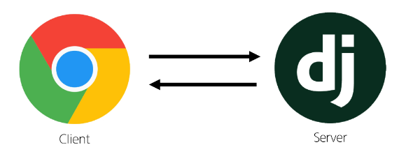
- 우리가 서버로부터 받은 페이지를 둘러볼 때 우리는 서버와 서로 연결되어 있는 상태가 아니다.
    ### HTTP
    - HTML 문서와 같은 리소스들을 가져올 수 있도록 해주는 규약
    - 웹에서 이루어지는 모든 데이터 교환의 기초
    - 특징
        - 비 연결 지향(connectionless)
            - 서버는 요청에 대한 응답을 보낸 후 연결을 끊음
        - 무상태(stateless)
            - 연결을 끊는 순간 클라이언트와 서버 간의 통신이 끝나며 상태 정보가 유지되지 않음
    ### 상태가 없다는 것은?
    - 장바구니에 담은 상품을 유지할 수 없음
    - 로그인 상태를 유지할 수 없음
    - 상태를 유지하기 위한 기술이 필요

    ### Cookie(쿠키)
    - 서버가 사용자의 웹 브라우저에 전송하는 작은 데이터 조각
    - 클라이언트 측에서 저장되는 작은 데이터 파일이며, 사용자 인증, 추적, 상태 유지등에 사용되는 데이터 저장 방식
    - 사용 예시
        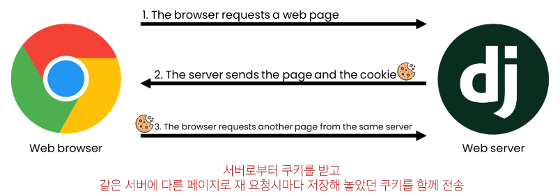
    - 사용 원리
        1. 브라우저(클라이언트)는 쿠키를 키-값의 데이터 형식으로 저장
        2. 이렇게 쿠키를 저장해 놓았다가, 동일한 서버에 재요청 시 저장된 쿠키를 함께 전송
        - 쿠키는 두 요청이 동일한 브라우저에서 들어왔는지 아닌지를 판단할 때 주로 사용
            - 이를 이용해 사용자의 로그인 상태를 유지할 수 있음
            - 상태가 없는 HTTP 프로토콜에서 상태 정보를 기억시켜줌
    - 사용 목적
        1. 세션 관리
            - 로그인, 아이디, 자동원성, 공지 하루 안보기, 팝업 체크, 장바구니 등의 정보 관리
        2. 개인화
            - 사용자 선호, 테마등의 설정
        3. 트래킹
            - 사용자 행동을 기록 및 분석
    ### Session(세션)
    - 서버 측에서 생성되어 클라이언트와 서버 간의 상태를 유지 상태 정보를 저장하는 데이터 저장 방식
    - 쿠키에 세션 데이터를 저장하여 매 요청시마다 세션 데이터를 함께 보냄
    - 작동 원리
        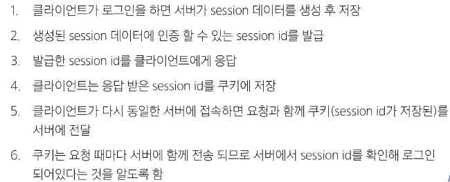
    - 서버 측에서는 세션 데이터를 생성 후 저장하고 이 데이터에 접근할 수 있는 세션 ID를 생성
    - 이 ID를 클라이언트 측으로 전달하고, 클라이언트는 쿠키에 이 ID를 저장
    - 이후 클라이언트가 같은 서버에 재요청 시마다 저장해 두었던 쿠키도 요청과 함께 전송
    - 예를 들어 로그인 상태 유지를 위해 로그인 되어 있다는 사실을 입증하는 데이터를 매 요청마다 계속해서 보내는 것
    ### 쿠키와 세션의 목적
    - 서버와 클라이언트 간의 '상태'를 유지
    ### 쿠키 종류별 Lifetime(수명)
    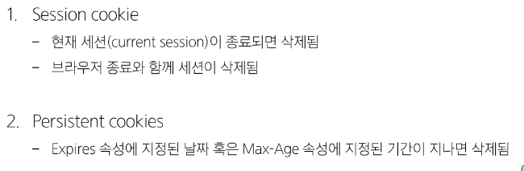
    ### Session in Django
    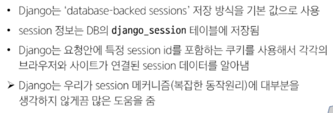

## Django Authentication System
- 사용자 인증과 관련된 기능을 모아 놓은 시스템
    ### Authentication(인증)
    - 사용자가 자신이 누구인지 확인하는 것(신원 확인)
    ### 사전준비
    - 두번째 app accounts 생성 및 등록
    - auth와 관련한 경로나 키워드들을 django 내부적으로 accounts라는 이름으로 사용하고 있기 때문에 되도록 'accounts'로 지정하는 것을 권장
    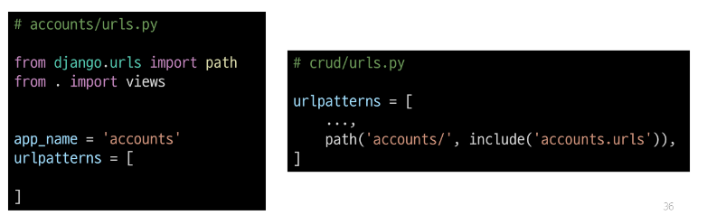

    ### user model 대체하기
    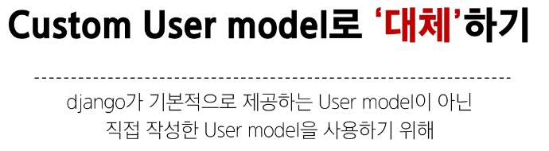
    - django가 기본적으로 제공하는 User model이 아닌 직접 작성한 User model을 사용하기 위해
    ### User 클래스를 대체하는 이유
    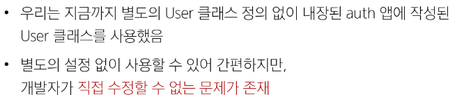

    ### 대체하기
    1. AbstractUser 클래스를 상속받는 커스텀 User 클래스 작성
        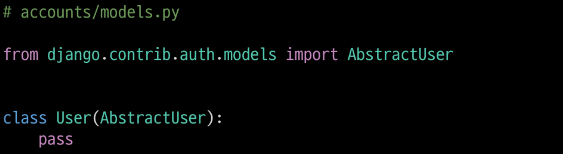
        - 기존 User 클래스도 AbstractUser를 상속받기 때문에 이렇게 하면
        커스텀 User 클래스도 기존 User 클래스와 같은 모습을 가지게 됨
    2. Django 프로젝트가 사용하는 기본 User 모델을 우리가 적성한 User 모델로 지정
        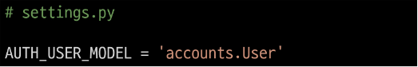
        - 수정 전 기본 값은 'auth.User'
    3. admin site에 대체한 User 모델 등록
        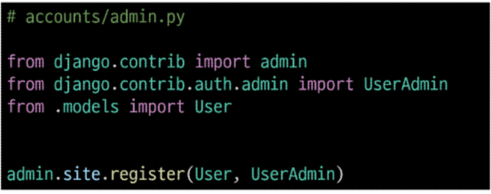
        - 기본 User 모델이 아니기 때문에 등록하지 않으면 촐력되지 않음
    ### Auth_USER_MODEL
    - Django 프로젝트의 User를 나타내는 데 사용하는 모델을 지정
    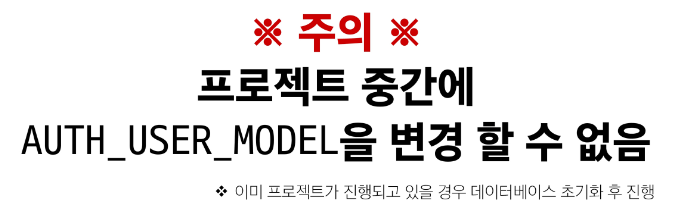
    *중도에는 DB 초기화*
    - 초기화 후 migrate 실시
    ### 프로젝트를 시작하며 반드시 User 모델을 대체한다.
    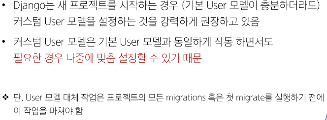

## Login
- 세션을 생성하는 과정
    ### AuthenticationForm()
    로그인 인증에 사용할 데이터를 입력 받는 built-in form
## Logout
- 세션을 삭제하는 과정
- 현재 요청에 대한 Session Data를 DB에서 삭제
- 클라이언트의 쿠키에서도 Session ID를 삭제

## Template with Authentication data
- 현재 로그인 되어 있는 유저 정보 출력
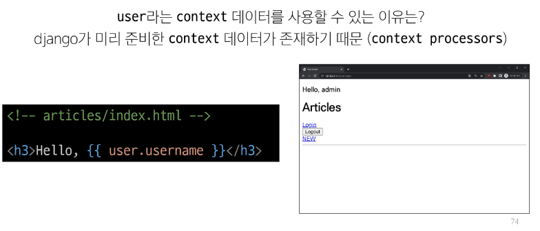