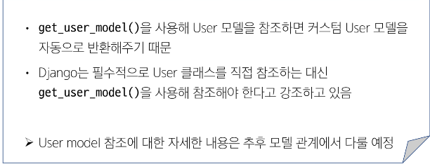
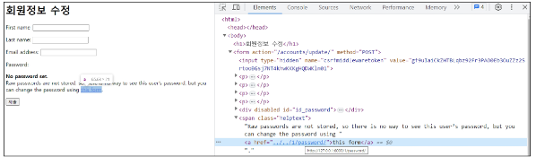
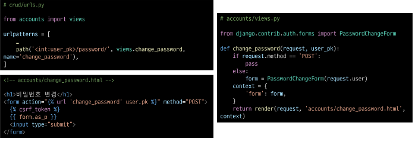
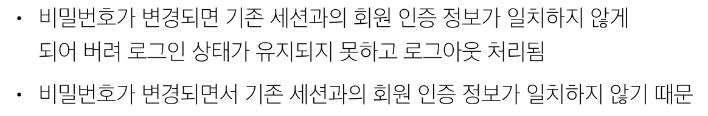
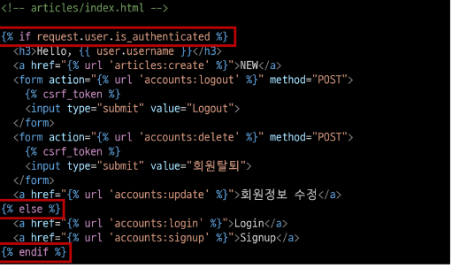
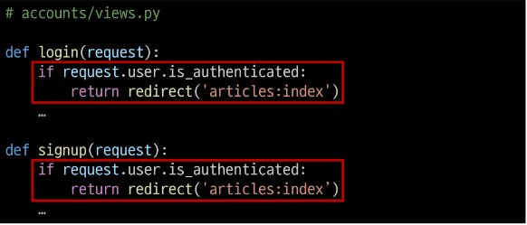

# [TIL] 2024-04-01

### User 모델을 직접 참조하지 않는 이유

### 비밀번호 변경
- 인증된 사용자의 Session 데이터를 Update 하는 과정
- PasswordChangeForm():
    - 비밀번호 변경 시 사용자 입력 데이터를 받는 built-in Form

### 비밀번호 변경 페이지 작성
1. django는 비밀번호 변경 페이지를 회원정보 수정 form에서 별도 주소로 안내

2.

## 세션 무효화 방지

- udpate_session_auth_hash(request,user)
    - 암호 변경시 세션 무효ㅗ화를 막아주는 함수
    - 암호가 변경되면 새로운 password의 Session Data로 기존 Session을 자동 갱신

## 인증된 사용자에 대한 접근 제한
- 로그인 사용자에 대해 접근을 제한하는 2가지 방법
    1. is_authenticated 속성
        - 사용자가 인증 되었는지 여부를 알 수 있는 User model의 속성
        - 모든 User 인스턴스에 대해 항상 True인 읽기 전용 속성이며,
        비인증 사용자에 대해서는 항상 False
        - 적용하기
            1. 로그인과 비로그인 상태에서 화면에 출력되는 링크 다르게 설정 
            
            2. 인증된 사용자라면 로그인/회원가입 로직을 수행할 수 없도록 하기

    2. login_required 데코레이터
    