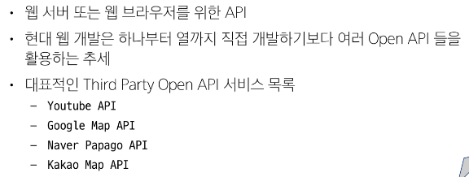
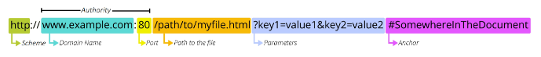
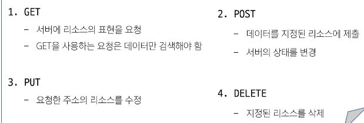
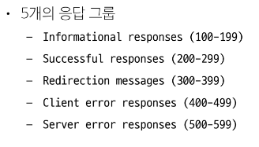

# [TIL] 2024-04-11

## API
- 두 SW가 서로 통신할 수 있게 하는 메커니즘
- 클라이언트-서버처럼 다른 프로그램에서 요청과 응답을 받을 수 있도록 만든 체계
    ### WEB API
    

    ### REST
    - API Server를 개발하기 위한 일종의 SW 설계 방법론
        - 모두가 설계하는 구조가 다르니 이렇게 맞춰서 설계하는 게 어떄? - 규칙 x
    ### RESTful API
    - REST 원리를 따르는 시스템을 RESTful하다고 부름
    - "자원을 정의"하고 "자원에 대한 주소를 지정"하는 전반적인 방법 서술

    ### REST에서 자원을 사용하는 방법 3가지
    

    ### 자원의 식별
    - URI (통합 자원 식별자)
        - 인터넷에서 리소스(자원)를 식별하는 문자열
        - 가장 일반적인 URI는 웹 주소로 알려진 URL
    - URL (통합 자원 위치)
        - 웹에서 주어진 리소스의 주소
        - 
        - Schema(or Protocol) : 브라우저가 리소스를 요청하는 데 사용해야 하는 규약
        - Domain Name : 요청 중인 웹 서버를 나타냄
        - Port : 웹 서버의 리소스에 접근하는데 사용되는 기술적인 문(Gate)
        - Path : 웹 서버의 리소스 경로
        - Parameters : 웹 서버에 제공하는 추가적인 데이터, '&'로 구분되는 키-값 쌍목록
        - Anchor : 일종의 "북마크"를 나타내며 브라우저에 해당 지점에 있는 콘텐츠를 표시, 부분 식별자(#)이후 부분은 서버에 전송 x

    ### HTTP Request Methods
    - 리소스에 대한 행위를 정의
    
    ### HTTP response status codes
    - 특정 HTTP 요청이 성공적으로 완료 되었는지 여부를 나타냄
    

    ### DRF(Django REST framework)
    - Django에서 Restful API 서버를 쉽게 구축할 수 있도록 도와주는 오픈 소스 라이브러리