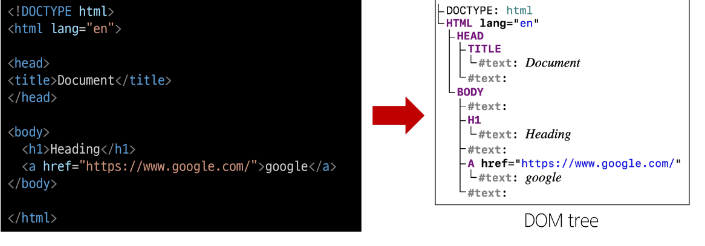
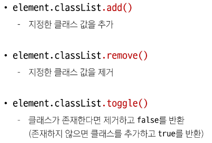
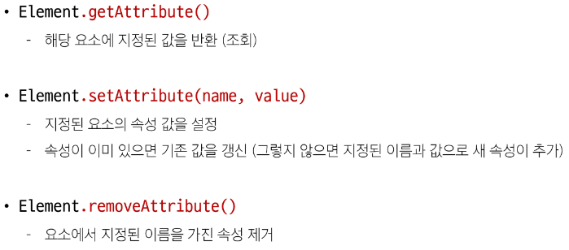

# [TIL] 2024-04-16

# DOM
- The Document Object Moel
- 웹 페이지를 구조화된 객체로 제공하여 프로그래밍 언어가 페이지 구조에 접근할 수 있는 방법을 제공
- 문서 구조, 스타일, 내용 등을 변경할 수 있도록 함
    ## DOM API
    - 다른 프로그래밍 언어가 웹 페이지에 접근 및 조작 할 수 있도록 페이지 요소들을 객체 형태로 제공하며 이에 따른 메서드 또한 제공
    ## 특징
    - DOM에서 모든 요소, 속성, 테스트는 하나의 객체
    - 모두 document 객체의 하위 객체로 구성
    ## DOM tree
    
    - 브라우저는 HTML 문서를 해석하여 DOM tree라는 객체 트리로 구조화
    - 객체 간 상속 구조가 존재
    ## DOM 핵심
    - 문서의 요소들을 객체로 제공하여 다른 프로그래밍 언어에서 접근하고 조작할 수 있는 방법을 제공하는 API
    ## document 객체
    - 웹 페이지 객체
    - DOM Tree의 진입점
    - 페이지를 구성하는 모든 객체 요소를 포함
    ## DOM 조작 시 기억해야 할 것
    
    - 조작 순서
    1. 조작 하고자 하는 요소를 선택(또는 탐색)
    2. 선택된 요소의 콘텐츠 또는 속성을 조작

    ## 선택 메서드
    - document.querySelector() : 요소 한 개 선택
    - document.querySelectorAll() : 요소 여러 개 선택
    ### 문법
    document.querySelector(selector)
    - 제공한 CSS selector를 만족하는 첫 번째 element 객체 반환 없으면 null
    document.querySelectorAll(selector)
    - 제공한 CSS selector를 만족하는 NodeList를 반환
    ### DOM 조적
    - 속성(attribute)조작
        - 클래스 속성 조작
        - 일반 속성 조작
    - HTML 콘텐츠 조작
    - DOM 요소 조작
    - 스타일 조작

    ### 클래스 속성 조작
    
    1. classList 메서드
    
    ### 일반 속성 조작 메서드
    