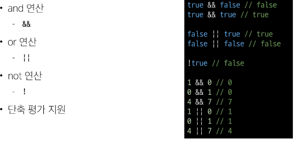

# [TIL] 2024-04-17

# 변수
## 식별자(변수명) 작성 규칙
- 반드시 문자, 달러($), 또는 밑줄(_)로 시작
- 대소문자 구분
- 예약어 사용 불가(for, if, function)
### Naming case
- 카멜 케이스(camelCase)
    - 변수, 객체, 함수에 사용
- 파스칼 케이스(PascalCase)
    - 클래스, 생성자에 사용
- 대문자 스네이크 케이스(SNAKE_CASE)
    - 상수에 사용
### 변수 선언 키워드 3가지
1.let
2.const
3.var
### let

- 블록 스코프를 갖는 지역 변수를 선언
- 재할당 가능
- 재선언 불가능
- ES6에서 추가
### const

- 블록 스코프를 갖는 지역 변수를 선언
- 재할당 불가능
- 재선언 불가능
- ES6에서 추가

### 블록 스코프

- if, for 함수 등의 중괄호 내부를 가리킴
- 블록 스코프를 가지는 변수는 블록 바깥에서 접근 불가능
### 어떤 변수 선언 키워드를 사용해야 할까?
- 기본적으로 const 사용 권장
- 재할당이 필요할 때 let으로 변경해서 사용

## 데이터 타입
### 원시 자료형(Primitive Type)
- Number, String, Boolean, null, undefined
- 변수에 값이 직접 저장되는 자료형(불변, 값이 복사)

- 변수에 할당될 때 값이 복사된다.
    - 변수간에 서로 영항을 미치지 않음

### 참조 자료형(Reference Type)
- Objects(Object,Array,Function)
- 객체의 주소가 저장되는 자료형(가변, 주소가 복사)

- 객체를 생성하면 객체의 메모리 주소를 변수에 할당
    - 변수 간에 서로 영향을 미침

### 원시 자료형(Primitive Type)의 종류
- Number
    - 정수 또는 실수형 숫자를 표현하는 자료형
    
    - 'ab'//3 -> NaN -> 숫자로 연산이 불가능할 때
- String
    - 텍스트 데이터를 표현하는 자료형
    
    - '+' 연산자를 사용해 문자열끼리 결합
    - 뺄셈, 곱셈, 나눗셈 불가능
- Template literals(템플릿 리터럴)
    
    - 내장된 표현식을 허용하는 문자열 작성 방식
    - 백틱(``)을 이용하며, 여러 줄에 걸쳐 문자열을 정의할 수도 있고 JavaScript의 변수를 문자열 안에 바로 연결할 수 있음
    - 표현식은 '$'와 중괄호(${expression})로 표기

- Boolean
    - true/false
    - 조건문 또는 반복문에서 Boolean이 아닌 데이터 타입은 "자동 형변환 규칙"에 따라 true 또는 false로 변환됨
    - 자동 형변환
        - 

- null
    
    - 변수의 값이 없음을 의도적으로 표현할 때 사용
- undefined
    
    - 변수 선언 이후 직접 값을 할당하지 않으면 자동 할당
- 값이 없음에 대한 표현이 2가지인 이유

## 연산자
### 할당 연산자

- 오른쪽에 있는 피연산자의 결과를 왼쪽 피연산자에 할당하는 연산자
- 단축 연산자 지원 

### 증감 연산자

- 증가 연산자 ('++')
    - 피연산자를 증가시키고 연산자의 위치에 따라 증가하기 전이나 후의 값을 반환
- 감소 연산자 ('--')
    - 피연산자를 감소시키고 연산자의 위치에 따라 감소하기 전이나 후의 값을 반환
- '+=' or '-=' 같이 더 명시적인 표현을 권장

### 동등 연산자(==)

- 두 피연산자가 같은 값으로 평가되는지 비교 후 boolean값을 반환
- 암묵적인 타입 변환을 통해 타입을 일치 시킨 후 같은 값인지 비교
- 두 피연산자가 모두 객체일 경우 메모리의 같은 객체를 바라보는지 판별
### 일치 연산자(===)

- 두 피연산자의 값과 타입이 모두 같은 경우 true를 반환
- 같은 객체를 가리키거나, 같은 타입이면서 같은 값인지를 비교
- 엄격한 비교가 이뤄지며 암묵적 타입 변환이 발생하지 않음
- 특수한 경우를 제외하고는 동등 연산자가 아닌 일치 연산자 권장 
### 논리 연산자

## 반복문
### 배열 반복과 for..in
- 객체 관점에서 배열의 인덱스는 정수 이름을 가진 열거 가능한 속성
- for...in은 정수가 아닌 이름과 속성을 포함하여 열거 가능한 모든 속성을 반환
- 내부적으로 for...in은 배열의 반복자가 아닌 속성 열거를 사용하기 때문에 특정 순서에 따라 인덱스를 반환하는 것을 보장할 수 없음
- for...in은 인덱스의 순서가 중요한 배열에서는 사용하지 않는다.
- 배열에서는 for,for...of문을 사용한다,

- 객체 관점에서 배열의 인덱스는 정수 이름을 가진 속성이기 때문에 인덱스가 출력된다. (순서 보장x)

### 반복문 사용 시 const 사용 여부
- for 문
    - for (let i=0; i < arr.length;i++){...}의 경우에는 최초 정의한 i를 "재할당"하면서 사용하기 때문에 const를 사용하면 에러
- for...in, for...out
    - 재할당이 아니라, 매 반복마다 다른 속성 이름이 변수에 지정되는 것이므로 const를 사용해도 에러가 발생하지 않는다.
    - 단, const 특징에 따라 블록 내부에서 변수 수정은 불가능
    