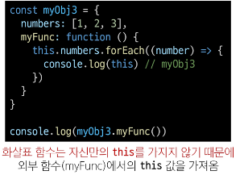

# [TIL] 2024-04-18
## 함수
- Function
    - 참조 자료형에 속하며 모든 함수는 Function object이다.
### 참조 자료형
- 객체의 주소가 저장되는 자료형
- Objects 
    - Object, Array, Function
### 함수 구조

- function 키워드
- 함수의 이름
- 함수의 매개변수
- 함수의 body를 구성하는 statements
- return 값이 없다면 undefined를 반환
### 함수 정의 방법

### 함수 표현식 특징

- 함수 이름이 없는 '익명 함수'를 사용할 수 있음
- 선언식과 달리 표현식으로 정의한 함수는 호이스팅 되지 않으므로 함수를 먼저 정의하기 전에 사용 불가
- "평가" -> "값"
- "평가 -> 표현식을 -> 값
- 값 -> 평가된 표현식

### 매개변수

1. 기본 함수 매개변수
- 전달하는 인자가 없거나 undefined가 전달될 경우 이름 붙은 매개변수를 기본값으로 초기화

2. 나머지 매개변수
- 임의의 수의 인자를 배열로 허용하여 가변 인자를 나타내는 방법
- 작성 규칙
    - 함수 정으 ㅣ시 나머지 매개변수는 하나만 작성 가능
    - 나머지 매개변수는 함수 정의에서 매개변수 마지막에 위치해야함

### 매개변수와 인자 개수가 불일치 할 떄

- 매개변수 개수 > 인자 개수
    - 누락된 인자는 undefined로 할당

- 매개변수 개수 < 인자 개수
    - 초과 입력한 인자는 사용하지 않음

### 전개 구문 ".."
- 전개 구문
    - 배열이나 문자열과 같이 반복 가능한 항목을 펼치는 것(확장,전개)
    - 전개 대상에 따라 역할이 다름
        - 배열이나 객체의 요소를 개별적인 값으로 분리하거나 다른 배열이나 객체의 요소를 현재 배열이나 객체에 추가하는 등
### 전개 구문 활용처
1. 함수와의 사용
    1. 함수 호출 시 인자 확장
    2. 나머지 매개변수(압축)
2. 객체와의 사용
3. 배열과의 활용

### 활용
- 함수와의 사용
    
    1. 함수 호출 시 인자 확장

    
    2. 나머지 매개변수 (압축)

### 화살표 함수

- 작성과정
    
    1. function 키워드 제거 후 매개변수와 중괄호 사이에 화살표(=>)작성

    
    2. 함수의 매개변수가 하나 뿐이라면, 매개변수의 '()'제거 가능(생략하지 않는 것 권장)
    
    
    3. 함수 본문의 표현식이 한줄이라면, '{}'와 return 제거 가능
### 화살표 함수 심화

## Object
- 키로 구분된 데이터 집합을 저장하는 자료형
### 구조

- 중괄호('{}')를 이용해 작성
- 중괄호 안에는 key:value 쌍으로 구성된 속성(property)를 여러개 작성 가능
- key는 문자형만 허용
- value는 모든 자료형 허용
### 속성참조

- 점 ('.') 또는 대괄호('[]')로 객체 요서 접근
- key 이름에 띄어쓰기 같은 구분자가 있으면 대괄호 접근만 가능

### in 연산자

- 속성이 객체에 존재하는지 여부를 확인

## 객체
- Method : 객체 속성에 정의된 함수
### Method 사용 예시

- object.method() 방식으로 호출
- 메서드는 객체를 '행동' 할 수 있게 함
### this keyword
- 함수나 메서드를 호출한 객체를 가리키는 키워드
    - 함수 내에서 객체의 속성 및 메서드에 접근하기 위해 사용
- "일반"함수로 호출된 경우 -> "전역객체"
- "메서드"로 호출되었을 경우 -> 그 메서드를 보유한 "객체"
- "생성자" 함수로 호출되었을 경우 -> "미래에 생성될 인스턴스"
    - 클래스 -> 생성자
    - class 
### 사용예시

### 단순 호출 시 this

- 가리키는 대상 => 전역 객체
### 메서드 호출 시 this

- 가리키는 대상 => 메서드를 호출한 객체

### 중첩된 함수에서의 this 문제점과 해결책

### this 정리

### 단축 속성

- 키 이름과 값으로 쓰이는 변수의 이름이 같은 경우

### 콜백 함수
- 다른 함수에 인자로 전달되는 함수

