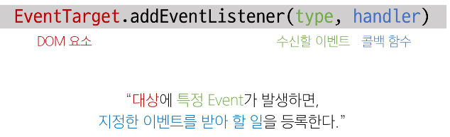
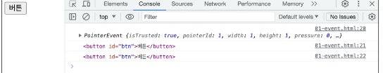
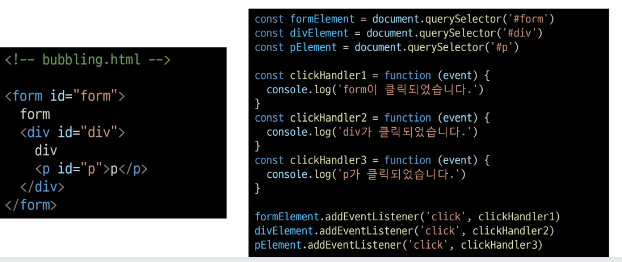
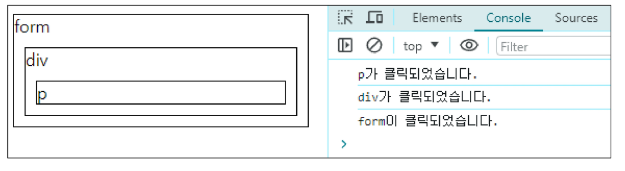
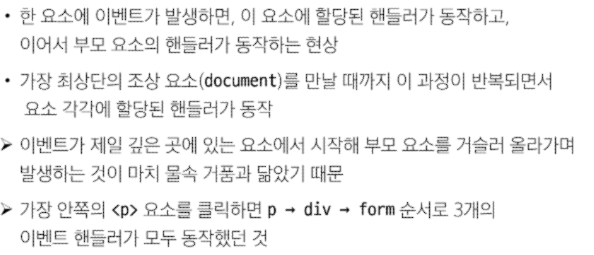
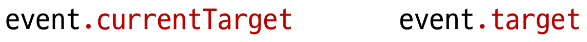
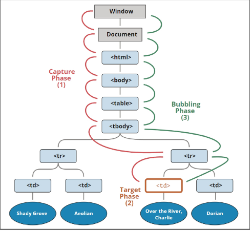
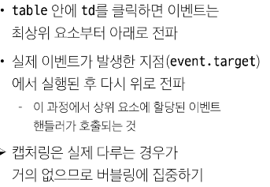

# [TIL] 2024-04-22

## event 객체
- 무언가 일어났다는 신호, 사건
- 모든 DOM 요소는 이러한 event를 만들어냄
- DOM에서 이벤트가 발생했을 때 생성되는 객체
- DOM 요소는 event를 받고 받은 event를 처리할 수 있음

## event handler
- 이벤트가 발생했을 때 실행되느 함수
- 사용자의 행동에 어떻게 반응할지를 JavaScript 코드로 표현한 것
## .addEventListener

- 대표적인 이벤트 핸들러중 하나
- 특정 이벤트를 DOM 요소가 수신할 때마다 콜백 함수를 호출
- 인자
    - type 
        - 수신할 이벤트 이름
        - 문자열로 작성 (ex, 'click')
    - handler
        - 발생한 이벤트 객체를 수신하는 콜백함수
        - 콜백 함수는 발생한 event object를 유일한 매개변수로 받음
- 활용

    - 버튼을 클릭하면 버튼 요소 출력하기
    - 버튼에 이벤트 처리기를 부착하여 이벤트 발생시 이벤트가 발생한 버튼 정보 출력

## 버블링

- form > div > p 형태의 중첩된 구조에 각각 이벤트 핸들러가 있을 때 만약 
 요소를 클릭하면? 

- 왜 
요소만 클릭했는데 모든 핸들러가 작동?

- 이벤트가 정확히 어디서 발생했는 지 접근할 수 있는 방법

- currentTarget
    - 현재 요소
    - 항상 이벤트 핸들러가 연결된 요소만을 참조하는 속성
    - 'this'와 같음
- 'target' 속성
    - 이벤트가 발생한 가장 안쪽의 요소를 참조하는 속성
    - 실제 이벤트가 시작된 요소
    - 버블링이 진행 되어도 변하지 않음

## 캡처링

- 이벤트가 하위 요소로 전파되는 단계
