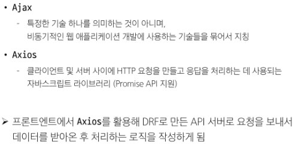
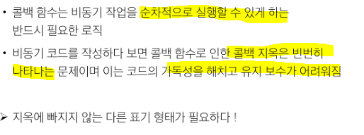

# [TIL] 2024-04-23

## 동기 (Synchronous)
- 프로그램의 실행 흐름이 순차적으로 진행
- 하나의 작업이 완료된 후에 다음 작업이 실행되는 방식
- 결과를 예측할 수 있다.

## 비동기(Asynchronous)
- 프로그램의 실행 흐름이 순차적이지 않으며, 작업이 완료되기를 기다리지 않고 다음 작업이 실행되는 방식
- 작업의 완료 여부를 신경 쓰지 않고 동시에 다른 작업들을 수행할 수 있다.

## 동기와 비동기를 구분할 줄 알아야한다.

## 자바스크립트는 Single Thread 언어이다.
- Thread란?
    - 작업을 처리할 때 실제로 작업을 수행하는 주체로, multi-thread라면 업무를 수행할 수 있는 주체가 여러 개라는 의미
- JavaScript는 한 번에 하나의 일만 수행할 수 있는 Single thred언어로 동시에 여러 작업 처리 불가
- 즉, 작업을 요청한 순서대로 처리해야함

## JavaScript Runtime
- 'JavaScript가 동작할 수 있는 환경
- JavaScript 자체는 Single Thread이므로 비동기 처리를 할 수 있도록 도와주는 환경 필요
- JavaScript에서 비동기와 관련한 작업은 '브라우저' 또는 'Node'와 같은 환경에서 처리

## 브라우저 환경에서 JavaScript 비동기 처리 관련 요소

## 브라우저 환경에서의 JavaScript 비동기 처리 동작 방식
1. 모든 작업은 Call Stack(LIFO)으로 들어간 후 처리된다.
2. 오래 걸리는 작업이 Call Stack으로 들어오면 Web Api로 보내 별도로 처리
3. Web API에서 처리가 끝난 작업들은 곧바로 Call Stack으로 들어가지 못하고 Task Queue(FIFO)에 순서대로 들어간다.
4. Event Loop가 Call Stack이 비어 있는 것을 계속 체크하고 Call Stack이 빈다면 Task Queue에서 가장 오래된(가장 먼저 처리되어 들어온) 작업을 Call Stack으로 보낸다.

## JavaScript 비동기 처리 동작 요소
1. Call Stack
    - 요청이 들어올 때 마다 순차적으로 처리하는 Stack
    - 기본적인 JavaScript의 Single Thread 작업처리
2. Web API
    - JavaScript 엔진이 아닌 브라우저에서 제공하는 runtime 환경
    - 시간이 소요되는 작업을 처리
3. Task Queue(Callback Queue)
    - 비동기 처리된 Callback 함수가 대기하는 Queue(FIFO)
4. Event Loop
    - 작업이 들어오길 기다렸다가 태스크가 들어오면 이를 처리하고, 처리할 태스크가 없는 경우엔 잠드는, 끊임없이 돌아가는 자바스크립트 내 루프
    - CallStack 과 Task Queue를 지속적으로 모니터링
    - CallStack이 비어 있는지 확인후 비어 있다면 Task Queue에서 대기중인 오래된 작업을 Call Stack으로 push
## 정리

## Ajax
- XMLHttpReqeust 기술을 사용해 복잡하고 동적인 웹 페이지를 구성하는 프로그래밍 방식
### 정의

### 목적
- 전체 페이지가 다시 로드되지 않고 HTML 페이지 일부 DOM만 업데이트
- 웹 페이지 일부가 다시 로드되는 동안에도 코드가 계속 실행되며 비동기식으로 작업 가능
## XMLHttpReqeust 객체
- 서버와 상호작용할 때 사용하는 객체
- 페이지의 새로고침 없이도 데이터를 가져올 수 있음
## XMLHttpReqeust 특징

## 기존 기술과의 차이 - 기존 방식

## -Ajax

## Axios
- JavaScript에서 사용되는 HTTP 클라이언트 라이브러리
## 정의

## Ajax를 활용한 클라이언트 서버 간 동작

## 정리

## 비동기 콜백
- 비동기 처리의 단점

- 비동기 적으로 처리되는 작업이 완료되었을 때 실행되는 함수
- 연쇄적으로 발생하는 비동기 작업을 순차적으로 동작할 수 있게 함
- 작업의 순서와 동작을 제어하거나 결과를 처리하는 데 사용

## 비동기 콜백의 한계

## 콜백 지옥
- 비동기 처리를 위한 콜백을 작성할 때 마주하는 문제

## 콜백 함수 정리

## Promise
- JavaScript에서 비동기 작업의 결과를 나타내는 객체
- 비동기 작업이 완료되었을 때 결과 값을 반환하거나, 실패 시 에러를 처리할 수 있는 기능을 제공

## Promise 객체

## 비동기 콜백 vs Promise

## then & catch의 chaining

## then 메서드 chaining의 목적
- 비동기 작업의 "순차적인" 처리 가능
- 코드를 보다 직관적이고 가독성 좋게 작성할 수 있도록 도움
- 장점
    

## then 메서드 chaining 적용

## Promise가 보장하는 것

3 4 2 5 1