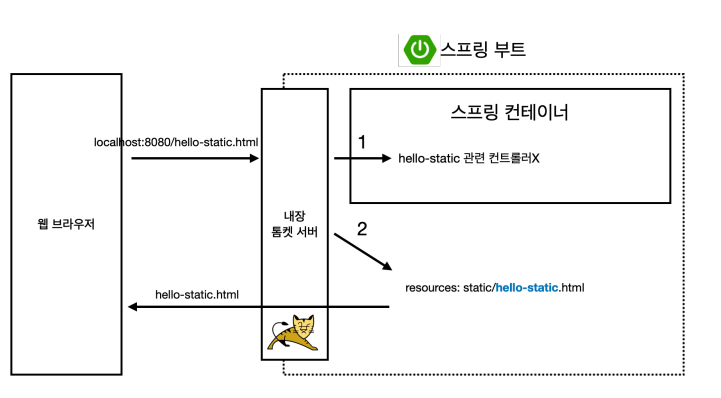
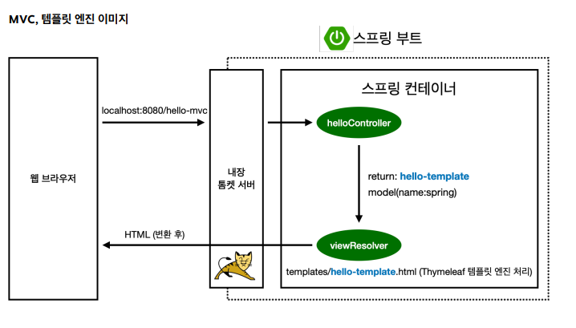

# [TIL] 2024-05-30

## 빌드
- window : ./gradlew.bat build
- mac : ./gradlew build

- cd build/libs -> java -jar jar 파일명

- ./gradlew clean : 빌드 폴더 삭제

서버 배포시 jar 파일만 복사해서 서버에 넣고 실행시키면 서버에서 스프링 동작이 된다.

## 웹 개발 기초
- 정적 컨텐츠 : 파일을 그냥 브라우저에 띄우는 것
- MVC와 템플릿 엔진 : 서버에서 HTML을 동적으로 작업하여 내리는 것
- API : 서버끼리 통신 할 때 어떤 데이터가 담겨 있는지 알리는 것

## 정적 컨텐츠 흐름도

- hello-static 관련 controller가 없으면 resources:static에서 hello-static.html을 찾아 랜더링

## MVC 패턴
- M : Model
- V : View
- C : Controller

- 웹 브라우저 -> 내장 톰캣 서버 -> helloController에 맵핑 확인 -> hello-templat 리턴, model에 name:spring 파라미터 전달- > viewResolver에서 리턴 받은 hello-templat과 이름이 같은 템플릿을 찾음 (template/hello-template.html) -> 타임리프 쳄플릿 엔진 처리