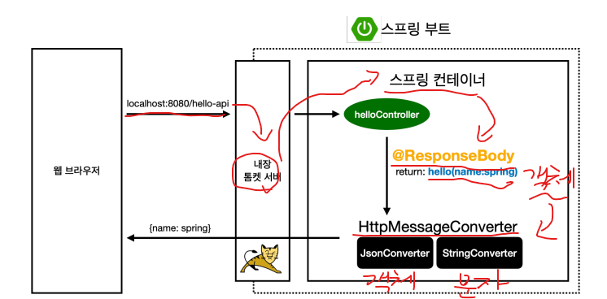
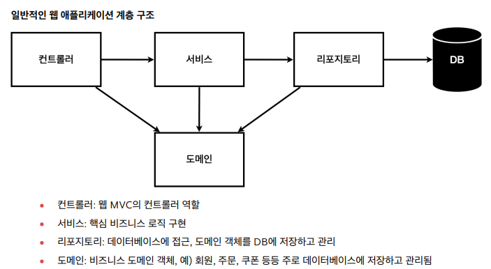

# [TIL] 2024-06-12

## @ReqeustBody의 사용 원리

- HTTP의 BODY에 문자 내용을 직접 반환
- 'viewResolver' 대신에 'HttpMessageConverter'가 동작
- 기본 문자 처리 : StringHttpMessageConverter
- 기본 객체 처리 : MappingJackson2HttpMessageConverter
- byte 처리 등등 기타 여러 HttpMessageConverter가 기본으로 등록되어 있음
- 참고 : 클라이언트의 HTTP Accept 헤더와 서버의 컨트롤러 반환 타입 정보 둘을 조합해서 'HttpMessageConverter'가 선택된다.

## 비즈니스 요구사항 정리


## Optional
- JAVA의 영원한 숙적인 NullPointerException을 방지해주는. 즉, null인 값을 참조해도 NullPointerException이 발생하지 않도록 값을 래퍼로 감싸주는 타입.
- 사용시 null 값이라면 Optional 타입으로 반환된다.

## Optional 메서드
1. empty() : 비어있는 Optional 객체를 생성 / 리턴값 : Optional<T>

문법 : .empty()

```java
// Optional 메소드
Optional<String> empty = Optional.empty();

// 아웃풋
System.out.println(empty.isEmpty()); // true
```

2. of() : 전달된 값으로 새로운 Optional 객체를 생성 / 리턴값 : Optional<T>

문법 : .of(T value)

```java
// Optional 메소드
Optional<String> opt = Optional.of("Hello");

// 아웃풋
System.out.println(opt.get()); // Hello
```

3. ofNullable() : 비어있을 수도 있고, 아닐 수도 있는 Optional 객체를 생성 / 리턴값 : Optional<T>

문법 : .ofNullable(T value)

```java
// Optional 메소드
String imNull = null;
Optional<String> opt = Optional.ofNullable(imNull);
Optional<String> opt1 = Optional.ofNullable("Hello");

// 아웃풋
System.out.println(opt.isEmpty()); // true
System.out.println(opt1.isEmpty()); // false
```

4. equals() : Optional 객체의 값을 비교. 리턴값 : boolean

문법 : .equals(Object obj)

```java
// 인풋
Optional<String> opt1 = Optional.of("Hello");
Optional<String> opt2 = Optional.of("Hello");
Optional<String> opt3 = Optional.of("World");

// Optional 메소드
boolean isEqual1 = opt1.equals(opt2);
boolean isEqual2 = opt1.equals(opt3);

// 아웃풋
System.out.println(isEqual1); // true
System.out.println(isEqual2); // false
```

5. filter() : Optional 객체의 값을 조건에 따라 만족하면 그 값을 포함한 객체를, 만족하지 않으면 빈 Optional 객체 리턴 / 리턴값 : Optional

문법 : .filter(Predicate<? Super T> predicate)

```java
// 인풋
Optional<Integer> opt1 = Optional.of(10);
Optional<Integer> opt2 = Optional.of(1);
        
// Optional 메소드
Optional<Integer> filter1 = opt1.filter(num -> num < 5); // opt1 의 10은 num < 5를 만족하지 못하므로 빈 Optional 객체를 리턴한다.
Optional<Integer> filter2 = opt2.filter(num -> num < 5);

// 아웃풋
System.out.println(filter1.isEmpty()); // true
System.out.println(filter2.isEmpty()); // false
```

6. map() :  Optional 객체 내부의 값을 변환하여 결과를 새로운 Optional 객체로 반환. / 리턴값 : Optional<U>

문법 : .map(Function<? Super T, ? Extends U> mapper)

```java
// 인풋
Optional<String> optional = Optional.of("hello");

// Optional 메소드
Optional<Integer> result = optional.map(s -> s.length());

// 아웃풋
System.out.println(result.get()); // 5
```

7. isEmpty() : Optional 객체가 비어있는지 확인.  / 리턴값 : boolean

문법 : .isEmpty()

```java
// 인풋
Optional<String> opt1 = Optional.ofNullable("Hello");
Optional<String> opt2 = Optional.ofNullable(null);

// 아웃풋
System.out.println(opt1.isEmpty()); // false
System.out.println(opt2.isEmpty()); // true
```

8. isPresent() : Optional 객체가 있는지 확인. / 리턴값: boolean

문법 : .isPresent()

```java
// 인풋
Optional<String> opt1 = Optional.ofNullable("Hello");
Optional<String> opt2 = Optional.ofNullable(null);

// 아웃풋
System.out.println(opt1.isPresent()); // true
System.out.println(opt2.isPresent()); // false
```

9. orElse() : Optional 객체가 비어있다면, 전달된 기본값 other를 반환. / 리턴값: T

문법 : .orElse(T other)

```java
// 인풋
Optional<String> optional1 = Optional.empty();
Optional<String> optional2 = Optional.of("Hello");

// Optional 메소드 사용
String result1 = optional1.orElse(null);
String result2 = optional2.orElse(null);

// 아웃풋
System.out.println(result1); // null
System.out.println(result2); // Hello
```

10 . orElseThrow() : 기능: Optional 객체가 비어있다면, Exception을 발생. / 반환: T

문법 : .orElseThrow() / .orElseThrow(Supplier<? Extends X> exceptionSupplier)

파라미터 x
```java
// 인풋
Optional<String> optional = Optional.empty();


// Optional 메소드 사용
String result = optional.orElseThrow(); // NoSuchElementException 발생
```

파라미터 o 
```java
// 인풋
Optional<String> optional = Optional.empty();


// Optional 메소드 사용
String result = optional
					.orElseThrow(IllegalArgumentException::new); 
// IllegalArgumentException 발생
```

11. stream() : ptional 객체의 값을 Stream으로 변환. / 리턴값: Stream<T>

문법 : .stream()

```java
// 인풋
Optional<String> optional = Optional.of("Hello");

// Optional 메소드 사용
optional.stream()
        .map(String::toUpperCase)
        .forEach(System.out::println); // HELLO
```

# test 코드 작성시 문법
```java
// given (기반 데이터)

// when (이것을 검증)

// then (검증부)
```