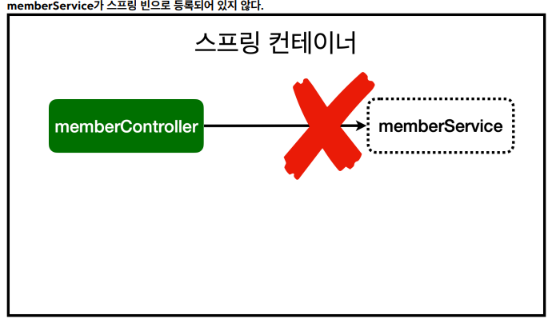
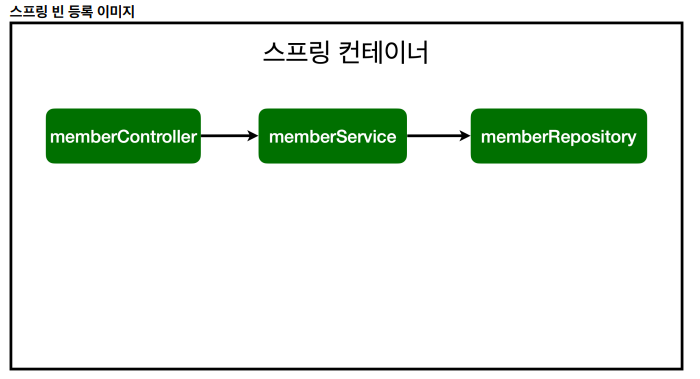

# [TIL] 2024-06-13

## 초기 스프링 컨테이너 

- memberService는 현재 컨테이너에 등록되어 있지 않은 순수 Java 클래스이기 때문에 Autowired로 연결시켜준다.


- repository 또한 같은 이유로 동일한 처리를 해준다.

## 스프링 빈을 등록하는 2가지 방법
1. 컴포넌트 스캔과 자동 의존관계 설정
2. 자바 코드로 직접 스프링 빈 등록
    ```java
    @Configurable
    public class SpringConfig {
        @Bean
        public MemberService memberService() {
            return new MemberService(memberRepository());
        }

        @Bean
        public MemberRepository memberRepository() {
            return new MemoryMemberRepository();
        }
    }
    ```

## 컴포넌트 스캔 범위
- 기본적으로 SpringApplication이 속한 패키지 하위의 범위만 스캔을 하기 때문에 다른 패키지 소속의 컴포넌트들은 스캔을 하지 않는다.