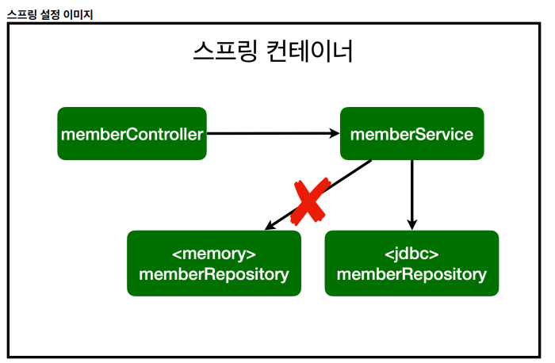

# [TIL] 2024-06-13

## 초기 스프링 컨테이너 

- memberService는 현재 컨테이너에 등록되어 있지 않은 순수 Java 클래스이기 때문에 Autowired로 연결시켜준다.


- repository 또한 같은 이유로 동일한 처리를 해준다.

## 스프링 빈을 등록하는 2가지 방법
1. 컴포넌트 스캔과 자동 의존관계 설정
2. 자바 코드로 직접 스프링 빈 등록
    ```java
    @Configurable
    public class SpringConfig {
        @Bean
        public MemberService memberService() {
            return new MemberService(memberRepository());
        }

        @Bean
        public MemberRepository memberRepository() {
            return new MemoryMemberRepository();
        }
    }
    ```

## 컴포넌트 스캔 범위
- 기본적으로 SpringApplication이 속한 패키지 하위의 범위만 스캔을 하기 때문에 다른 패키지 소속의 컴포넌트들은 스캔을 하지 않는다.

## DB
```sql
create table member
(
 id bigint generated by default as identity, // 값을 지정하지 않으면 DB가 알아서 값을 채워준다.
 name varchar(255),
 primary key (id)
);PUBLIC.MEMBER 
```

## 스프링을 사용하는 이유

- 개방-폐쇄 원칙 : 확장에는 열려있고, 수정에는 닫혀있다. -> SOLID 
- 기존 코드를 전혀 손대지 않고, 설정만으로 구현 클래스를 변경할 수 있다. (연결부의 수정은 어쩔수 없으나 동작부의 코드는 수정이 필요없음)
- 다형성을 사용하는 원리임.
```java
@Configuration
public class SpringConfig {

    private DataSource dataSource;

    @Autowired
    public SpringConfig(DataSource dataSource) {
        this.dataSource = dataSource;
    }

    @Bean
    public MemberService memberService() {
        return new MemberService(memberRepository());
    }

    @Bean
    public MemberRepository memberRepository() {
        // return new MemoryMemberRepository(); JdbcMemberRepository로 교체
        return new JdbcMemberRepository(dataSource);
    }
}
```

## SOLID 원칙
1. Single Responsibility Principle (SRP) - 단일 책임 원칙
    정의: 하나의 클래스는 하나의 책임만 가져야 한다.
    설명: 클래스는 변경할 이유가 하나만 있어야 한다는 의미. 
    예를 들어, 클래스가 여러 가지 기능을 담당하고 있다면, 기능별로 분리해야 한다. 
    이를 통해 코드의 가독성을 높이고 유지보수를 용이하게 할 수 있다.

2. Open/Closed Principle (OCP) - 개방/폐쇄 원칙
    정의: 소프트웨어 엔티티(클래스, 모듈, 함수 등)는 확장에는 열려 있어야 하고, 변경에는 닫혀 있어야 한다.
    설명: 새로운 기능을 추가할 때 기존 코드를 수정하지 말고 확장하도록 설계해야 한다다. 
    이를 통해 기존 기능의 안정성을 유지하면서 새로운 기능을 추가할 수 있다. 
    주로 추상화와 인터페이스를 사용하여 구현한다.

3. Liskov Substitution Principle (LSP) - 리스코프 치환 원칙
    정의: 자식 클래스는 언제나 자신의 부모 클래스를 대체할 수 있어야 한다.
    설명: 자식 클래스는 부모 클래스의 기능을 확장하거나 변경하더라도, 부모 클래스가 사용되는 모든 곳에서 자식 클래스로 대체할 수 있어야 한다.
    이를 통해 다형성을 유지하고 코드의 일관성을 높일 수 있다.

4. Interface Segregation Principle (ISP) - 인터페이스 분리 원칙
    정의: 하나의 일반적인 인터페이스보다 여러 개의 구체적인 인터페이스가 낫다.
    설명: 클라이언트는 자신이 사용하지 않는 인터페이스에 의존하지 않아야 한다.
    즉, 클라이언트를 특정 기능에 종속시키지 않도록, 인터페이스는 구체적이고 작은 단위로 나누어야 한다. 
    이를 통해 인터페이스의 유연성과 재사용성을 높일 수 있다.

5. Dependency Inversion Principle (DIP) - 의존 역전 원칙
    정의: 고수준 모듈은 저수준 모듈에 의존해서는 안 되며, 둘 다 추상화에 의존해야 한다.
    설명: 의존 관계를 맺을 때 구체적인 클래스보다 인터페이스나 추상 클래스에 의존하도록 설계해야 한다. 
    이를 통해 모듈 간의 결합도를 낮추고, 유연성과 테스트 용이성을 높일 수 있다.