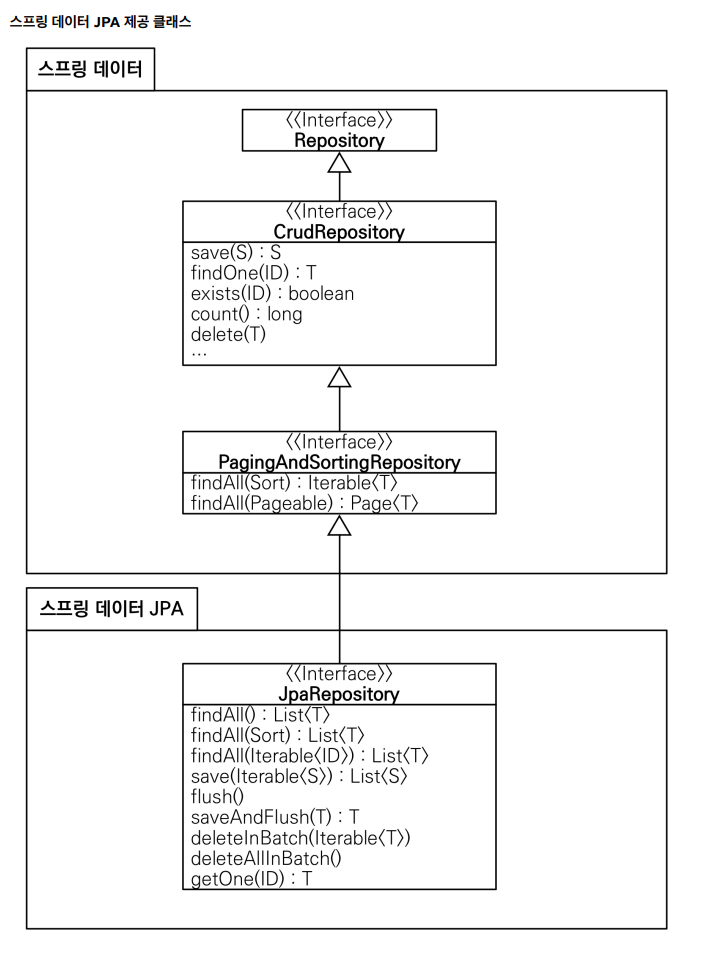
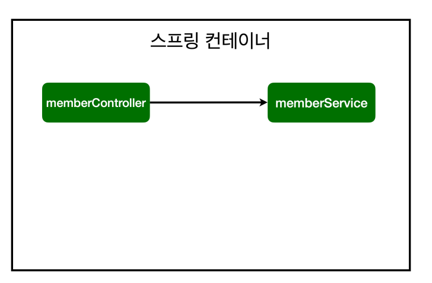
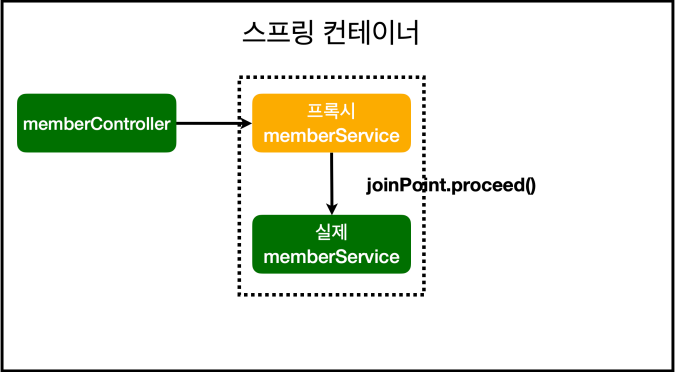
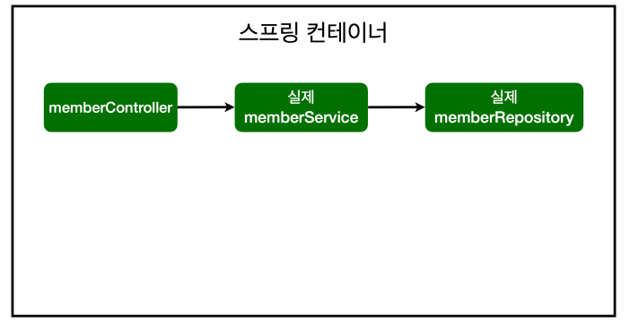
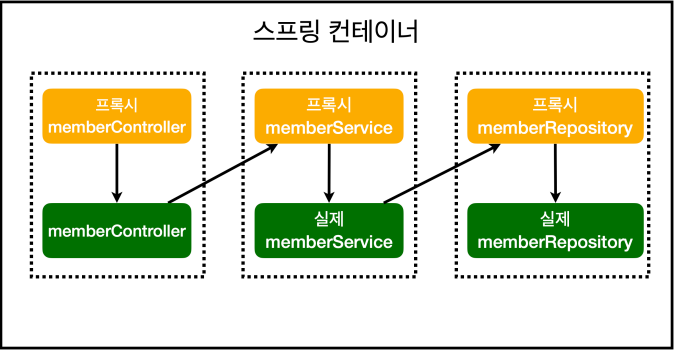

# [TIL] 2024-06-14

## 테스트 어노테이션
- @SpringBootTest : 스프링 컨테이너와 테스트를 함께 실행한다.
- @Transactional : 테스트 케이스에 이 애노테이션이 있으면, 테스트 시작 전에 트랜잭션을 시작하고, 테
스트 완료 후에 항상 롤백한다. 이렇게 하면 DB에 데이터가 남지 않으므로 다음 테스트에 영향을 주지 않는다
    - 테스트 케이스에서만 롤백 처리를 하고 서비스에서는 롤백을 하지 않는다.
    - 커밋을 하고 싶으면 @Commit을 달아준다.

## Spring JPA

- 스프링 데이터 JPA 제공 기능
    - 인터페이스를 통한 기본적인 CRUD
    - findByName() , findByEmail() 처럼 메서드 이름 만으로 조회 기능 제공
    - 페이징 기능 자동 제공

## AOP
- AOP가 필요한 상황
    - 모든 메소드의 호출 시간을 측정하고 싶다면?
    - 공통 관심 사항(cross-cutting concern) vs 핵심 관심 사항(core concern)
    - 회원 가입 시간, 회원 조회 시간을 측정하고 싶다면?

- 회원가입, 회원 조회에 시간을 측정하는 기능은 핵심 관심 사항이 아니다.
    - 시간을 측정하는 로직은 공통 관심 사항이다.
    - 시간을 측정하는 로직과 핵심 비즈니스의 로직이 섞여서 유지보수가 어렵다.
    - 시간을 측정하는 로직을 별도의 공통 로직으로 만들기 매우 어렵다.
    - 시간을 측정하는 로직을 변경할 때 모든 로직을 찾아가면서 변경해야 한다

## AOP 관계도
- 적용 전 의존관계

- 적용 후 의존관계

- 스프링 컨테이너가 올라올 때 실제 memberService가 아니라 가짜 memberService가(프록시)를 앞에 세운다.
- 프록시 종료 후 실제 memberService가 호출된다.

- 적용 전 전체

- 적용 후 전체
