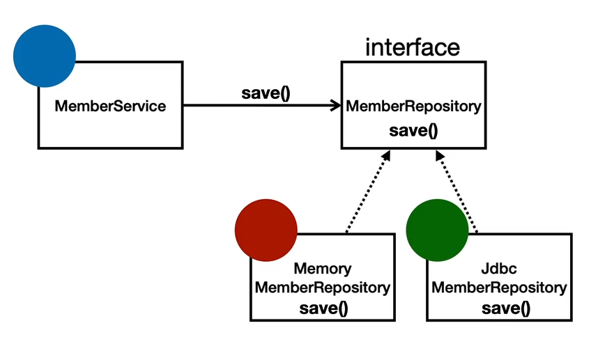

# [TIL] 2024-06-17
## 스프링이란?
- 특정한 하나의 기술이 아니라 여러 기술들의 집합체이다.

## 종류
- 스프링 프레임 워크 
- 스프링 부트
    - 단독으로 실행할 수 있는 스프링 애플리케이션을 생성
    - Tomcat 웹 서버 내장
    - 외부 라이브러리 자동 구성
- 스프링 데이터
- 스프링 세션
- 스프링 시큐리티
- 스프링 Rest Docs : API 명세
- 스프링 배치
- 스프링 클라우드 

## 스프링이라는 단어는 문맥에 따라 다르게 사용된다.
- 스프링 DI 컨테이너 기술
- 스프링 프레임워크
- 스프링 부트, 스프링 프레임워크 등을 모두 포함한 스프링 생태계를 말함

## 스프링 핵심
- 스프링은 자바 언어 기반의 프레임워크
- 자바의 가장 큰 특징 : 객체 지향 언어
- 스프링은 객체 지향 언어가 가진 강력한 특징을 살려내는 프레임 워크
- 스프링은 좋은 객체 지향 애플리케이션을 개발할 수 있게 도와주는 프레임워크

## 객체 지향 특징
- 컴퓨터 프로그램을 명령어의 목록으로 보는 시각에서 벗어나 여러개의 독립된 단위, 즉 "객체"들의 모임으로 파악하고자 하는 것

## 역할과 구현을 분리
- 자바 언어의 다형성을 활용
    - 역할 = 인터페이스
    - 구현 = 인터페이스를 구현한 클래스, 구현 객체
- 객체를 설계할 대 역할과 구현을 명확히 분리
- 객체 설계시 역할(인터페이스)를 먼저 부여하고, 그 역할을 구현하는 구현 객체 만들기

## 자바 언어의 다형성

## 다형성의 본질
- 인터페이스를 구현한 객체 인스턴스를 실행 시점에 유연하게 변경할 수 있다.
- 다형성의 본질을 이해하려면 협력이라는 객체사이의 관계에서 시작한다.
- 클라이언트를 변경하지 않고, 서버의 구현 기능을 유연하게 변경할 수 있다.

## OOP 5원칙 - SOLID
- SRP : 단일 책임 원칙
    - 한 클래스는 하나의 책임만 가져야한다.
    - 하나의 책임이라는 것은 모호함
        - 책임이라는 것이 클 수도, 작을 수도 있음
    - 중요한 기준은 변경이다. 변경이 있을 때 파급효과가 적으면 단일 책임 원칙을 잘 따르는 것

- OCP : 개방-폐쇄 원칙
    - SW 요소는 확장에는 열려 있으나 변경에는 닫혀 있어야 한다.
    - 다형성 활용
    - 인터페이스를 구현한 새로운 클래스를 하나 만들어서 새로운 기능을 구현
    - 역할과 구현의 분리
    - 문제점
        - 구현 객체를 변경하려면 클라이언트 코드를 변경해야한다.
        - 분명 다형성을 사용했지만 OCP 원칙을 지킬 수 없다.
        - 해결법은? 
            - 객체를 생성하고, 연관관계를 맺어주는 별도의 조립, 설정자가 필요하다.

- LSP : 리스코프 치환 원칙
    - 프로그램의 객체는 프로그램의 정확성을 깨뜨리지 않으면서 하위 타입의 인스턴스로 바꿀 수 있어야 한다.
    - 다형성에서 하위 클래스는 인터페이스 규약을 다 지켜야 한다는 것, 다형성을 지원하기 위한 원칙, 인터페이스를 구현한 구현ㅊ페는 믿고 사용하려면, 이 원칙이 필요하다.
    - 단순히 컴파일에 성공하는 것을 넘어서는 것
    - 예) 자동차 인터페이스의 엑셀은 앞으로 가는 기능 -> 뒤로 가게하면 위반

- ISP : 인터페이스 분리 원칙
    - 특정 클라이언트를 위한 인터페이스 여러 개가 범용 인터페이스 하나보다 낫다
    - 자동차 인터페이스 -> 운전 인터페이스, 정비 인터페이스 분리
    - 사용자 클라이언트 -> 운전사, 정비사 클라이언트로 분리 가능
    - 분리하면 정비 인터페이스 전체가 변해도 운전자 클라이언트에 영향을 주지 않는다.
    - 인터페이스가 명확해지고, 대체 가능성이 높아진다.

- DIP : 의존관계 역전 원칙
    - 프로그래머는 "추상화에 의존해야지, 구체화에 의존하면 안된다." 의존성 주입은 이 원칙을 따르는 방법 중 하나
    - 쉽게 얘기해서 구현 쿨래스에 의존하지 말고, 인터페이스에 의존하라는 뜻.
    - 역할에 의존하게 해야 한다는 것.
    - 클라이언트가 인터페이스에 의존해야 유연하게 구현체를 변경할 수 있다.
    - 구현체에 의존하게 되면 변경이 어려워진다.

- 정리
    - OOP의 핵심은 다형성
    - 다형성 만으로는 쉽게 부품을 갈아 끼우듯이 개발할 수 없다.
    - 다형성 만으로는 구현 객체를 변경할 때 클라이언트 코드도 함께 변경된다.
    - 다형성 만으로는 OCP, DIP를 지킬 수 없다.

## 스프링에 객체 지향 이야기가 나오는 이유
- 스프링은 다음 기술로 다형성 + OCP, DIP를 가능하게 지원
    - DI(Dependency Injection) : 의존관계, 의존성 주입
    - DI 컨테이너 제공
- 클라이언트 코드의 변경 없이 기능 확장
- 쉽게 부품을 교체하듯이 개발

