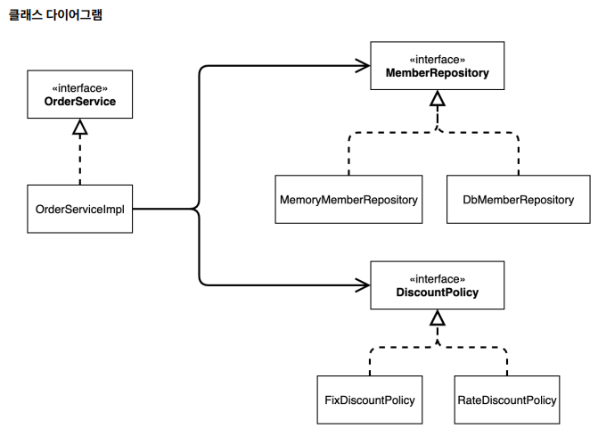
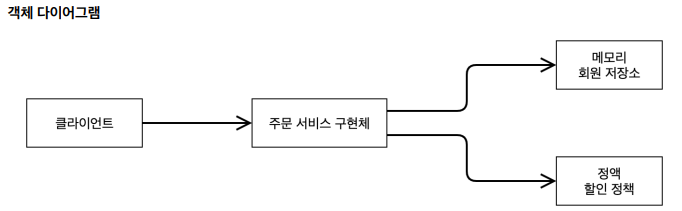
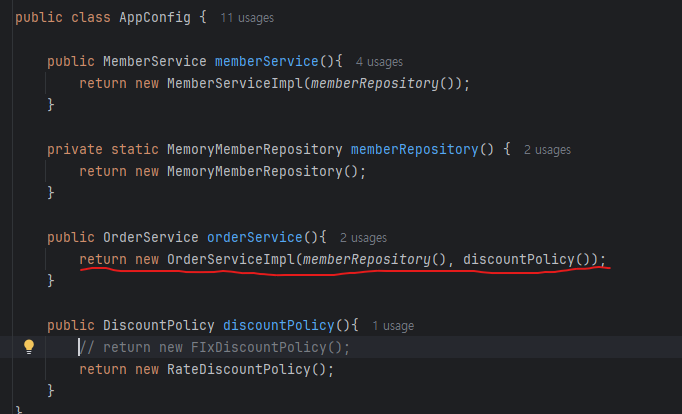
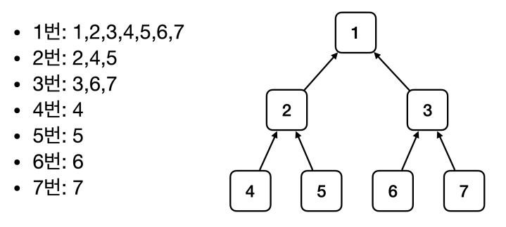

# [TIL] 2024-06-23

## OOP 설계 5원칙 SOLID
- SRP 단일 책임 원칙
    - 한 클래스는 하나의 책임만 가져야 한다.
    - 클라이언트 객체는 직접 구현 객체를 생성하고, 연결하고, 실행하는 다양한 책임을 가지고 있음
    - SRP 단일 책임 원칙을 따르면서 관심사를 분리함
    - 구현 객체를 생성하고 연결하는 책임은 AppConfig가 담당
    - 클라이언트 객체는 실행하는 책임만 담당
- DIP 의존관계 역전 원칙
    - 프로그래머는 “추상화에 의존해야지, 구체화에 의존하면 안된다.” 의존성 주입은 이 원칙을 따르는 방법 중 하나다.새로운 할인 정책을 개발하고, 적용하려고 하니 클라이언트 코드도 함께 변경해야 했다. 왜냐하면 기존 클라이언트 코드( OrderServiceImpl )는 DIP를 지키며 DiscountPolicy 추상화 인터페이스에 의존하는 것 같았지만, FixDiscountPolicy 구체화 구현 클래스에도 함께 의존했다.
    - 클라이언트 코드가 DiscountPolicy 추상화 인터페이스에만 의존하도록 코드를 변경했다.
    - 하지만 클라이언트 코드는 인터페이스만으로는 아무것도 실행할 수 없다.
    - AppConfig가 FixDiscountPolicy 객체 인스턴스를 클라이언트 코드 대신 생성해서 클라이언트 코드에 의존관계를 주입했다. 이렇게해서 DIP 원칙을 따르면서 문제도 해결했다.
- OCP
    - 소프트웨어 요소는 확장에는 열려 있으나 변경에는 닫혀 있어야 한다
    - 다형성 사용하고 클라이언트가 DIP를 지킴
    - 애플리케이션을 사용 영역과 구성 영역으로 나눔
    - AppConfig가 의존관계를 FixDiscountPolicy RateDiscountPolicy 로 변경해서 클라이언트 코드에 주입하므로 클라이언트 코드는 변경하지 않아도 됨
    - 소프트웨어 요소를 새롭게 확장해도 사용 영역의 변경은 닫혀 있다
- IoC
    - 기존 프로그램은 클라이언트 구현 객체가 스스로 필요한 서버 구현 객체를 생성하고, 연결하고, 실행했다. 한마디로 구현 객체가 프로그램의 제어 흐름을 스스로 조종했다. 개발자 입장에서는 자연스러운 흐름이다.
    - 반면에 AppConfig가 등장한 이후에 구현 객체는 자신의 로직을 실행하는 역할만 담당한다. 프로그램의 제어 흐름은 이제 AppConfig가 가져간다. 예를 들어서 OrderServiceImpl 은 필요한 인터페이스들을 호출하지만 어떤 구현 객체들이 실행될지 모른다.
    - 프로그램에 대한 제어 흐름에 대한 권한은 모두 AppConfig가 가지고 있다. 심지어 OrderServiceImpl 도 AppConfig가 생성한다. 그리고 AppConfig는 OrderServiceImpl 이 아닌 OrderService 인터페이스의 다른 구현 객체를 생성하고 실행할 수 도 있다. 그런 사실도 모른체 OrderServiceImpl 은 묵묵히 자신의 로직을 실행할 뿐이다
    - 이렇듯 프로그램의 제어 흐름을 직접 제어하는 것이 아니라 외부에서 관리하는 것을 제어의 역전(IoC)이라 한다
- DI
    - OrderServiceImpl 은 DiscountPolicy 인터페이스에 의존한다. 실제 어떤 구현 객체가 사용될지는 모른다.
    - 의존관계는 정적인 클래스 의존 관계와, 실행 시점에 결정되는 동적인 객체(인스턴스) 의존 관계 둘을 분리해서 생각해야 한다. 

## 프레임워크 vs 라이브러리
- 프레임워크가 내가 작성한 코들르 제어하고, 대신 실행하면 그것은 프레임워크가 맞다.(JUnit)

```java
    package hello.core.member;

import hello.core.AppConfig;
import org.assertj.core.api.Assertions;
import org.junit.jupiter.api.BeforeEach;
import org.junit.jupiter.api.Test;

public class MemberServiceTest {

    MemberService memberService;

    @BeforeEach // 테스트전 무조건 시행
    public void beforeEach(){
        AppConfig appConfig = new AppConfig();
        memberService = appConfig.memberService();
    }

    @Test
    void join(){
        // given
        Member member = new Member(1L, "memberA", Grade.VIP);

        // when
        memberService.join(member);
        Member findeMember = memberService.findMember(1L);

        // then
        Assertions.assertThat(member).isEqualTo(findeMember);
    }
}
```
    - join 메서드를 구현했지만 실행, 제어권은 Junit이 담당하며 프레임워크 본인만의 라이프 사이클로 동작한다
    - 이를 제어의 역전이라 한다.

- 반면에 내가 작성한 코드가 직접 제의의 흐름을 담당한다면 그것은 프레임워크가 아니라 라이브러리이다.

## 정적인 클래스 의존관계
- 클래스가 사용하는 import 코드만 보고 의존관계를 쉽게 판단할 수 있다. 정적인 의존관계는 애플리케이션을 실행하지
않아도 분석할 수 있다.
- ex) 다이어그램을 사용


- OrderServiceImpl 은 MemberRepository , DiscountPolicy 에 의존한다는 것을 알 수 있다.
- 그런데 이러한 클래스 의존관계 만으로는 실제 어떤 객체가 OrderServiceImpl 에 주입 될지 알 수 없다

# 동적인 객체 인스턴스 의존 관계
- 애플리케이션 실행 시점에 실제 생성된 객체 인스턴스의 참조가 연결된 의존 관계다


- 애플리케이션 *실행 시점(런타임)* 에 외부에서 실제 구현 객체를 생성하고 클라이언트에 전달해서 클라이언트와 서
버의 실제 의존관계가 연결 되는 것을 의존관계 주입이라 한다.
- 객체 인스턴스를 생성하고, 그 참조값을 전달해서 연결된다.
의존관계 주입을 사용하면 클라이언트 코드를 변경하지 않고, 클라이언트가 호출하는 대상의 타입 인스턴스를 변
경할 수 있다.
- 의존관계 주입을 사용하면 정적인 클래스 의존관계를 변경하지 않고, 동적인 객체 인스턴스 의존관계를 쉽게 변경
할 수 있다

## IoC 컨테이너, DI 컨테이너
- AppConfig 처럼 객체를 생성하고 관리하면서 의존관계를 연결해 주는 것을 IoC 컨테이너 또는 DI 컨테이너라 한다. 
- 의존관계 주입에 초점을 맞추어 최근에는 주로 DI 컨테이너라 한다.
- 또는 어샘블러, 오브젝트 팩토리 등으로 불리기도 한다

## 스프링 컨테이너
- ApplicationContext 를 스프링 컨테이너라 한다.
기존에는 개발자가 AppConfig 를 사용해서 직접 객체를 생성하고 DI를 했지만, 이제부터는 스프링 컨테이너를
통해서 사용한다.
- 스프링 컨테이너는 @Configuration 이 붙은 AppConfig 를 설정(구성) 정보로 사용한다. 여기서 @Bean 이라 적힌 메서드를 모두 호출해서 반환된 객체를 스프링 컨테이너에 등록한다. 이렇게 스프링 컨테이너에 등록된
객체를 스프링 빈이라 한다.
- 스프링 빈은 @Bean 이 붙은 메서드의 명을 스프링 빈의 이름으로 사용한다. ( memberService , 
orderService )

## 스프링 빈 조회 - 상속 관계

- 부모 타입으로 조회하면, 자식 타입도 함께 조회한다.
- 그래서 모든 자바 객체의 최고 부모인 Object 타입으로 조회하면, 모든 스프링 빈을 조회한다.

## BeanFactory와 ApplicationContext
- BeanFactory
    - 스프링 컨테이너의 최상위 인터페이스다.
    - 스프링 빈을 관리하고 조회하는 역할을 담당한다.
    - getBean() 을 제공한다.
    - 지금까지 우리가 사용했던 대부분의 기능은 BeanFactory가 제공하는 기능이다.

- ApplicationContext
    - BeanFactory 기능을 모두 상속받아서 제공한다.
    - 빈을 관리하고 검색하는 기능을 BeanFactory가 제공해주는데, 그러면 둘의 차이가 뭘까?
    - 애플리케이션을 개발할 때는 빈을 관리하고 조회하는 기능은 물론이고, 수 많은 부가기능이 필요하다.