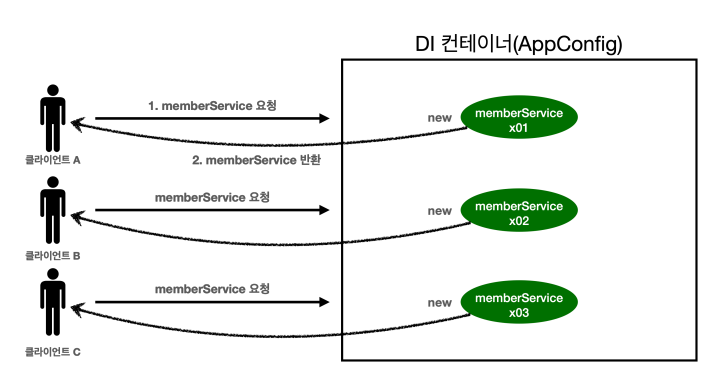
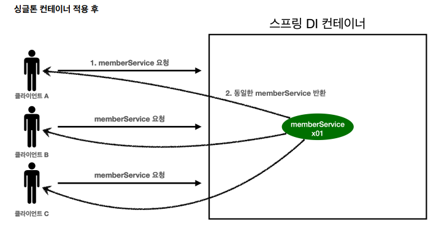
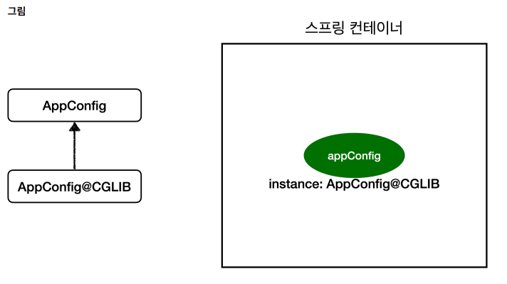

# [TIL] 2024-06-24

# 웹 애플리케이션과 싱글톤
- 스프링은 태생이 기업용 온라인 서비스 기술을 지원하기 위해 탄생했다.
- 대부분의 스프링 애플리케이션은 웹 애플리케이션이다. 물론 웹이 아닌 애플리케이션 개발도 얼마든지 개발할 수 있다.
- 웹 애플리케이션은 보통 여러 고객이 동시에 요청을 한다.


## 싱글톤 패턴 적용
```java
public class SingletonService {
 //1. static 영역에 객체를 딱 1개만 생성해둔다.
 private static final SingletonService instance = new SingletonService();
 //2. public으로 열어서 객체 인스턴스가 필요하면 이 static 메서드를 통해서만 조회하도록 허용한
다.
 public static SingletonService getInstance() {
 return instance;
 }
 //3. 생성자를 private으로 선언해서 외부에서 new 키워드를 사용한 객체 생성을 못하게 막는다.
 private SingletonService() {
 }
 public void logic() {
 System.out.println("싱글톤 객체 로직 호출");
 }
}
```
1. static 영역에 객체 instance를 미리 하나 생성해서 올려둔다.
2. 이 객체 인스턴스가 필요하면 오직 getInstance() 메서드를 통해서만 조회할 수 있다. 이 메서드를 호
출하면 항상 같은 인스턴스를 반환한다.
3. 딱 1개의 객체 인스턴스만 존재해야 하므로, 생성자를 private으로 막아서 혹시라도 외부에서 new 키워드
로 객체 인스턴스가 생성되는 것을 막는다

## 싱글톤 패턴의 문제점
- 싱글톤 패턴을 구현하는 코드가 많이 들어간다.
- 의존관계상 클라이언트가 구체 클래스에 의존한다. - > DIP 위반
- 클라이언트가 구체 클래스에 의존해서 OCP 원칙을 위반할 가능성이 높다.
- 테스트 하기가 어렵다. -> 이미 인스턴스를 미리 받아와서 설정이 마쳐지기 떄문
- 내부 속성을 변경하거나 초기화 하기 어렵다.
- private 생성자로 자식 클래스를 만들기 어렵다.
- 결론적으로 유연성 떨어진다.
- 안티 패턴으로 불리기도 한다.

## 싱글톤 컨테이너
스프링 컨테이너는 싱글톤 패턴의 문제점을 해결하면서, 객체 인스턴스를 싱글톤(1개만 생성)으로 관리한다.
스프링 빈이 바로 싱글톤으로 관리되는 빈이다

- 스프링 컨테이너는 싱글턴 패턴을 적용하지 않아도, 객체 인스턴스를 싱글톤으로 관리한다.
    - 컨테이너는 객체를 하나만 생성해서 관리한다.
- 스프링 컨테이너는 싱글톤 컨테이너 역할을 한다. 이렇게 싱글톤 객체를 생성하고 관리하는 기능을 싱글톤 레지스트리라 한다.
- 스프링 컨테이너의 이런 기능 덕분에 싱글턴 패턴의 모든 단점을 해결하면서 객체를 싱글톤으로 유지할 수 있다.
    - 싱글톤 패턴을 위한 지저분한 코드가 들어가지 않아도 된다.
    - DIP, OCP, 테스트, private 생성자로 부터 자유롭게 싱글톤을 사용할 수 있다
    

- 스프링 컨테이너 덕분에 고객의 요청이 올 때 마다 객체를 생성하는 것이 아니라, 이미 만들어진 객체를 공유해서
효율적으로 재사용할 수 있다
-  스프링의 기본 빈 등록 방식은 싱글톤이지만, 싱글톤 방식만 지원하는 것은 아니다. 요청할 때 마다 새로운
객체를 생성해서 반환하는 기능도 제공한다

## 싱글톤 방식의 주의점 (코드)
```java
package hello.core.singleton;

public class StatefulService {

    private int price; // 상태 유지하는 필드 10,000원이 B 사용자에 의해 20,000원으로 변경된다.

    public void order(String name, int price){
        System.out.println("name = " + name + " price = " + price);
        this.price = price; // 여기가 문제
    }

    public int getPrice(){
        return price;
    }
}
```

```java
package hello.core.singleton;

import org.assertj.core.api.Assertions;
import org.junit.jupiter.api.DisplayName;
import org.junit.jupiter.api.Test;
import org.springframework.context.annotation.AnnotationConfigApplicationContext;
import org.springframework.context.annotation.Bean;

import static org.junit.jupiter.api.Assertions.*;

class StatefulServiceTest {

    @Test
    void statefulServiceSingleton(){
        AnnotationConfigApplicationContext ac = new AnnotationConfigApplicationContext(TestConfig.class);
        StatefulService statefulService1 = ac.getBean(StatefulService.class);
        StatefulService statefulService2 = ac.getBean(StatefulService.class);

        // Thread A : A 사용자 10000원 주문
        statefulService1.order("userA", 10000);
        // Thread B : B 사용자 20000원 주문
        statefulService2.order("userB", 20000);

        // // Thread A : 사용자 A 주문 금액 조회
        int price = statefulService1.getPrice();
        System.out.println("price = " + price);

        // 기대값은 20,000원 이지만 같은 인스턴스를 참조하고 있기 때문에 사용자 B가 도중에 가격을 변경한것이 된다.
        Assertions.assertThat(statefulService1.getPrice()).isEqualTo(20000);

    }

    static class TestConfig {
        @Bean
        public StatefulService statefulService(){
            return new StatefulService();
        }
    }
}
```
- 싱글톤 패턴이든, 스프링 같은 싱글톤 컨테이너를 사용하든, 객체 인스턴스를 하나만 생성해서 공유하는 싱글톤 방식은 여러 클라이언트가 하나의 같은 객체 인스턴스를 공유하기 땜누에 싱글톤 객체는 상태를 유지(stateful)하도록 설계하면 안된다.
- 무상태(stateless)로 설계해야 한다.
    - 특정 클라이언트에 의존적인 필드가 있으면 안된다.
    - 특정 클라이언트가 값을 변경할 수 있는 필드가 있으면 안된다.
    - 가급적 읽기만 가능하게 한다.
    - 필드 대신에 자바에서 공유되지 않는, 지역변수, 파라미터, ThreadLocal 등을 사용한다.
- 스프링 빈의 필드에 공유 값을 설정하면 정말 큰 장애가 발생할 수 있다

```java
package hello.core.singleton;

public class StatefulService {

    //private int price; // 상태 유지하는 필드 10,000원이 B 사용자에 의해 20,000원으로 변경된다.

    public int order(String name, int price){
        System.out.println("name = " + name + " price = " + price);
        //this.price = price; // 여기가 문제
        return price;
    }

//    public int getPrice(){
//        // return price;
//    }
}
```

```java
package hello.core.singleton;

import org.assertj.core.api.Assertions;
import org.junit.jupiter.api.DisplayName;
import org.junit.jupiter.api.Test;
import org.springframework.context.annotation.AnnotationConfigApplicationContext;
import org.springframework.context.annotation.Bean;

import static org.junit.jupiter.api.Assertions.*;

class StatefulServiceTest {

    @Test
    void statefulServiceSingleton(){
        AnnotationConfigApplicationContext ac = new AnnotationConfigApplicationContext(TestConfig.class);
        StatefulService statefulService1 = ac.getBean(StatefulService.class);
        StatefulService statefulService2 = ac.getBean(StatefulService.class);

        // Thread A : A 사용자 10000원 주문
        int userAPrice = statefulService1.order("userA", 10000);
        // Thread B : B 사용자 20000원 주문
        int userBPrice = statefulService2.order("userB", 20000);

        // // Thread A : 사용자 A 주문 금액 조회
        //int price = statefulService1.getPrice();
        System.out.println("price = " + userAPrice);

        // 기대값은 20,000원 이지만 같은 인스턴스를 참조하고 있기 때문에 사용자 B가 도중에 가격을 변경한것이 된다.
        // Assertions.assertThat(statefulService1.getPrice()).isEqualTo(20000);

    }

    static class TestConfig {
        @Bean
        public StatefulService statefulService(){
            return new StatefulService();
        }
    }
}
```

## @Configuration과 바이트코드 조작
```java
package hello.core;

import hello.core.discount.DiscountPolicy;
import hello.core.discount.FIxDiscountPolicy;
import hello.core.discount.RateDiscountPolicy;
import hello.core.member.MemberService;
import hello.core.member.MemberServiceImpl;
import hello.core.member.MemoryMemberRepository;
import hello.core.order.OrderService;
import hello.core.order.OrderServiceImpl;
import org.springframework.context.annotation.Bean;
import org.springframework.context.annotation.Configuration;

@Configuration //AppConfig에 설정을 구성한다는 뜻의 @Configuration 을 붙여준다.

public class AppConfig { // AppConfig가 의존관계를 대신 주입하기 때문에 DI 컨테이너임

    // @Bean -> memberService -> new MemoryMemberRepository
    // @Bean -> orderSerivce -> new MemoryMemberRepository
    // 2번 호출이 된다.

    // 순서는 보장되지 않는다. memberRepository가 3번 호출되는 것이 예상
    // call AppConfig.memberService
    // call AppConfig.memberRepository
    // call AppConfig.memberRepository
    // call AppConfig.orderService
    // call AppConfig.memberRepository

    // 실제
    // call AppConfig.memberService
    // call AppConfig.memberRepository
    // call AppConfig.orderService

    @Bean // 각 메서드에 @Bean 을 붙여준다. 이렇게 하면 스프링 컨테이너에 스프링 빈으로 등록한다
    public MemberService memberService(){
        System.out.println("call AppConfig.memberService");
        return new MemberServiceImpl(memberRepository());
    }
    @Bean
    public MemoryMemberRepository memberRepository() {
        System.out.println("call AppConfig.memberRepository");
        return new MemoryMemberRepository();
    }
    @Bean
    public OrderService orderService(){
        System.out.println("call AppConfig.orderService");
        return new OrderServiceImpl(memberRepository(), discountPolicy());
    }
    @Bean
    public DiscountPolicy discountPolicy(){
        // return new FIxDiscountPolicy();
        return new RateDiscountPolicy();
    }
}
```

- 스프링 컨테이너는 싱글톤 레지스트리다. 따라서 스프링 빈이 싱글톤이 되도록 보장해주어야 한다. 그런데 스프링이 자바 코드까지 어떻게 하기는 어렵다.
- 그래서 스프링은 클래스의 바이트코드를 조작하는 라이브러리를 사용한다.

```java
@Test
    void configurationDeep(){ //AnnotationConfigApplicationContext에서 AppConfig.class를 넘기면 이 또한 스프링 빈으로 등록된다.
        AnnotationConfigApplicationContext ac = new AnnotationConfigApplicationContext(AppConfig.class);
        AppConfig bean = ac.getBean(AppConfig.class);

        System.out.println("bean = " + bean.getClass());
    }
```
- 순수한 클래스라면 다음과 같이 출력되어야 한다.
    - <class hello.core.AppConfig>
- 그런데 예상과 다르게 AppConfig$$SpringCGLIB$$0 로 출력 된다.
- 이것은 개발자가 만든 클래스가 아니라 스프링이 CGLIB라는 바이트코드 조작 라이브러리를 사용해서 AppConfig 클래스를 상속 받은 임의의 다른 클래스를 만들고, 그 다른 클래스를 스프링 빈으로 등록한 것이다.

- 그 임의의 다른 클래스가 바로 싱글톤이 보장되도록 해준다.
- 아마도 다음과 같이 바이트 코드를 조작해서 작성되어 있을 것이다.(실제로는 CGLIB의 내부 기술을 사용하는데 매우 복잡하다.)

## AppConfig@CGLIB 예상코드
```java
@Bean
public MemberRepository memberRepository() {
 
 if (memoryMemberRepository가 이미 스프링 컨테이너에 등록되어 있으면?) {
 return 스프링 컨테이너에서 찾아서 반환;
 } else { //스프링 컨테이너에 없으면
 기존 로직을 호출해서 MemoryMemberRepository를 생성하고 스프링 컨테이너에 등록
 return 반환
 }
}
```

- @Bean이 붙은 메서드마다 이미 스프링 빈이 존재하면 존재하는 빈을 반환하고, 스프링 빈이 없으면 생성해서 스프링 빈으로 등록하고 반환하는 코드가 동적으로 만들어진다.
- 덕분에 싱글톤이 보장되는 것이다

## @Configuration 을 적용하지 않고, @Bean 만 적용하면?
```text
call AppConfig.memberService
call AppConfig.memberRepository
call AppConfig.orderService
call AppConfig.memberRepository
call AppConfig.memberRepository
bean = class hello.core.AppConfig
```
- AppConfig가 CGLIB 기술 없이 순수한 AppConfig로 스프링 빈에 등록된 것을 확인할 수 있
다.
- MemberRepository가 총 3번 호출된 것을 알 수 있다. 1번은 @Bean에 의해 스프링 컨테이
너에 등록하기 위해서이고, 2번은 각각 memberRepository() 를 호출하면서 발생한 코드다
- 이 말은 즉, 스프링 컨테이너가 관리하지 않는 new로 새로운 객체를 생성한 것과 동일한 의미를 가진다.
