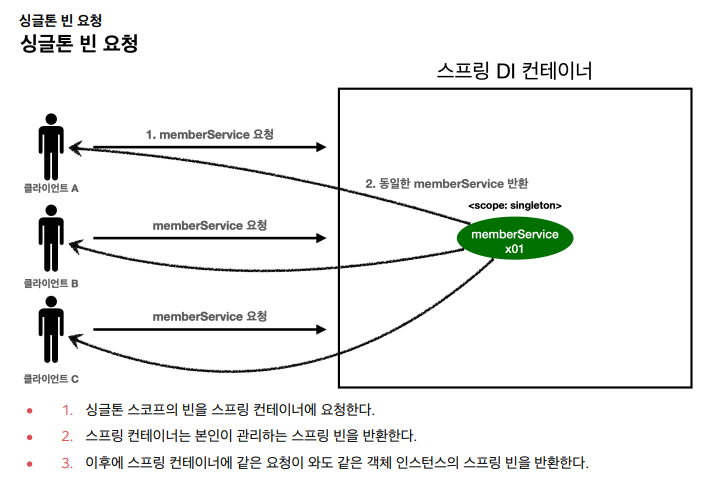
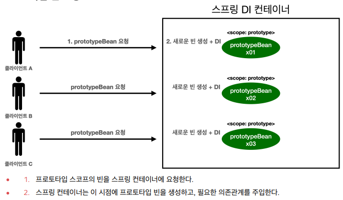
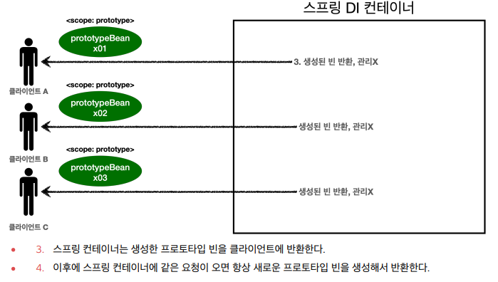

# [TIL] 2024-07-05
## 빈 스코프란?
- 스프링 빈이 스프링 컨테이너의 시작과 함께 생성되어서 스프링 컨테이너가 종료될 때 까지 유지된다
- 이것은 스프링 빈이 기본적으로 싱글톤 스코프로 생성되기 때문이다
- 스코프는 번역 그대로 빈이 존재할 수 있는 범위를 뜻한다

## 스프링이 지원하는 스코프
- 싱글톤: 기본 스코프, 스프링 컨테이너의 시작과 종료까지 유지되는 가장 넓은 범위의 스코프이다.
- 프로토타입: 스프링 컨테이너는 프로토타입 빈의 생성과 의존관계 주입까지만 관여하고 더는 관리하지 않는 매우 짧은 범위의 스코프이다.
- 웹 관련 스코프
    - request: 웹 요청이 들어오고 나갈때 까지 유지되는 스코프이다.
    - session: 웹 세션이 생성되고 종료될 때 까지 유지되는 스코프이다.
    - application: 웹의 서블릿 컨텍스트와 같은 범위로 유지되는 스코프이다.

## 싱글톤 빈 요청

## 프로토토입 빈 요청 1

## 프로토토입 빈 요청 2

 
 - 여기서 핵심은 스프링 컨테이너는 프로토타입 빈을 생성하고, 의존관계 주입, 초기화까지만 처리한다는 것이다.
 - 클라이언트에 빈을 반환하고, 이후 스프링 컨테이너는 생성된 프로토타입 빈을 관리하지 않는다.
 - 프로토타입 빈을 관리할 책임은 프로토타입 빈을 받은 클라이언트에 있다.
 - 그래서 @PreDestroy 같은 종료 메서드가 호출되지 않는다.
 