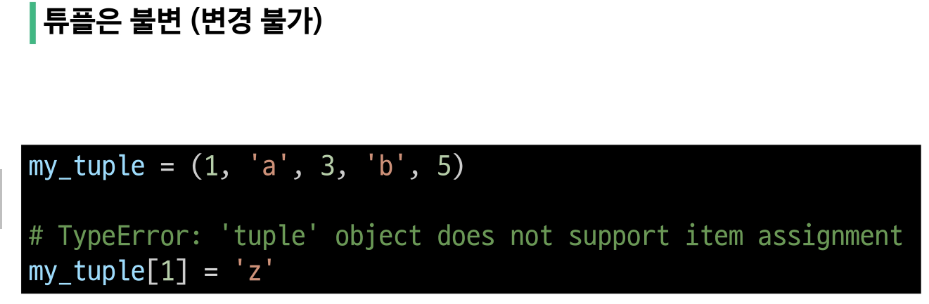

# 2024-01-16

### Sequence Types 특징

### list

여러 개의 값을 순서대로 저장하는 변경 가능한 시퀀스 자료형

### list 표현

- 0개 이상의 객체를 포함하며 데이터 목록을 저장
- 대괄호([])로 표기
  = 데이터는 어떤 자료형도 저장할 수 있음

### 리스트의 시퀀스 틍징

```python
my_list = [1,'a',3,'b',5]

#인덱싱
print(my_list[1]) # a

#슬라이싱
print(my_list[2:4]) #[3,'b']
print(my_list[:3]) # [1,'a',3]
print(my_list[3:]) #['b',5]
print(my_list[0:5:2]) #[1,3,5]
print(my_list[::-1]) # [5,'b',3,'a',1]

#길이
print(len(my_list)) #5
```

### 중첩된 리스트 접근

- 츨력 값 예상해보기
  
  ```python
  my_list = [1,2,3,'python',['hello','world','!!!']]
  print(len(my_list))
  print(my_list[4][-1])
  print(my_list[-1][1][0])
  ```

### 리스트는 가변(변경 가능)

```python
    my_list = [1,2,3]
    my_list[0] = 100

    print(my_list) #[100,2,3]
```

### tuple (튜플)

- 여러 개의 값을 순서대로 저장하는 변경 불가능한 시퀀스

## 튜플 표현

- 0개 이상의 객체를 포함하며 데이터 목록을 저장
- 소괄호 () 로 표기
- 데이터는 어떤 자료형도 저장할 수 있다.

```python
    my_tuple_1 = ()

    # (1) -> 1 튜플이 아니라 정수로 취급되기 떄문에 소괄호가 사라진다
    my_tuple_2 = (1,)

    my_tuple_3 = (1,'a',3,'b',5)
```




### 튜플은 어디에 쓰일까?

- 튜플의 불변 특성을 사용한 안전하게 여러 개의 값을 전달, 그룹화, 다중 할당 등 **개발자가 직접 사용하기 보다 '파이썬 내부 동작' 에서 주로 사용됨**

```python
    x,y = (10,20)
    print(x)
    print(y)

    #파이썬은 쉼표를 튜플 생성자로 사용하기 떄문에 괄호 생략 가능
    x,y = 10,20
```

### range

- 연속된 정수 시퀀스를 생성하는 변경 불가능한 자료형

## range 표현

- range(n) : 0부터 n-1까지의 숫자 시퀀스
- range(n,m) : n부터 m-1까지의 숫자 시퀀스

```python
    my_range_1 = range(5)
    my_range_2 = range(1,10)

    print(my_range_1) # range(0,5)
    print(my_range_2) # range(1,10)
```

```python
    my_range_1 = range(5)
    my_range_2 = range(1,10)

    print(my_range_1) # range(0,5)
    print(my_range_2) # range(1,10)

    # 리스트로 형 변환시 데이터 확인 가능
    print(list(my_range_1)) # [0,1,2,3,4]
    print(list(my_range_2)) # [1,2,3,4,5,6,7,8,9]
```

## Non-sequence Types

### dict : 딕셔너리

- **key-value 쌍**으로 이루어진 **순서와 중복이 없는 변경 가능한** 자료형

### 딕셔너리 표현

- key는 변경 불가능한 자료형만 사용 가능하다 (str,int,float,tuple,range...)
- value는 모든 자료형 가능
- 중괄호({})로 표기

```python
    my_dict_1={}
    my_dict_2={'key':'value'}
    my_dict_3={'apple':12,'list':[1,2,3]}

    print(my_dict_1) #{}
    print(my_dict_2) #{'key':'value'}
    print(my_dict_3) #{'apple':12,'list':[1,2,3]}
```

### 딕셔너리 사용

- key를 통해 value에 접근한다
- 순서가 없기 떄문에 인덱스로 접근이 불가능하다.
- key는 불변, value는 변경가능하다.


### 세트 표현

- 수학에서의 집합과 동일한 연산 처리 가능

- 중괄호({})로 표기

```python
my_set_1 = set() #딕셔너리와 표기법이 겹치기 떄문에 myset = {} 방식으로는 불가능하다

my_set_2 = {1,2,3}

my_set_3 = {1,1,1}

print(my_set_1)
print(my_set_2)
print(my_set_3)
```

### 세트의 집합 연산

```python
my_set1 = {1,2,3}

my_set2 = {3,6,9}

#합집합
print(my_set1||my_set2) # {1,2,3,6,9}

# 차집합
print(my_set1-my_set2) #{1,2}

#교집합
print(my_set1&my_set2) #{3}
```


## Other Data Type

### None

- 파이썬에서 '값이 없을'을 표현하는 자료형

### Boolean

- 비교/논리 연산의 평과 결과로 사용

- 주로 조건/반복문과 함께 사용한다
  
  ```python
  bool_1 = True
  bool_2 = False
  
  print(bool_1) # False
  print(bool_2) # False
  print(3>1) # True
  print('3'!=3) # True
  ```

### Collection

- 여러 개의 항목 또는 요소를 담는 자료 구조
  
  - str, list, tuple, set, dict


## 암시적 형변환

- 파이썬이 자동으로 형변환을 하는 것

### 예시

- boolean과 Numeric Type에서만 가능

```python
print(3+5.0) #8.0

print(True+3) #4

print(True+False) #1
```


### 명시적 형변환

- 개발자가 직접 형변환을 하는 것

- 암시적 형변환이 아닌 경우를 모두 포함

### 예시

- str -> integer : 형식에 맞는 숫자만 가능

- integer -> str : 모두 가능


```python
print(int('1') #1
print(str(1+)+'등') #1등
print(float('3.5')) #3.5
print(int(3.5)) # 3

# ValueError : invalid literal for int() with base 10 : '3.5'
print(int('3.5'))
```


### is 비교 연산자

- 메모리 내에서 같은 객체를 참조하는지 확인

- ==는 동등성(equality), is는 식별성(identify)

- 값을 비교하는 ==dhksms ekfma
  
  - is : 같음
  
  - is not : 같지 않음

### 비교 연산자 예시

```python
print(3>6) # False
print(2.0==2) #True
print(2!=2) #False
print('HI'=='hi') #False

# SyntaxWarning
# ==은 값(데이터)을 비교하는 것이지만 is는 레퍼런스(주소)를 비교하기 때문
# is 연산자는 되도록이면 None,True,False등을 비교할 때 사용
print(2.0 is 2) #False
```


### and = 논리곱 연산자

- 피연산자를 왼쪽에서 오른쪽으로 확인하며, 하나라도 falsy인 경우 " 해당 Falsy를 반환한다."

- 처음부터 끝까지 모든 피연사자가 truthy인 경우 " 마지막 truthy 반환한다"

### or = 논리합 연산자

- 피연산자를 왼쪽에서 오른쪽으로 확인하며, 하나라도 truthy인 경우 " 해당 truthy를 반환한다.

- 처음부터 끝까지 모든 피연사자가 falsy인 경우 " 마지막 falsy 반환한다"


### 단축평가


- 논리 연산에서 두 번째 피연산자를 평가하지 않고 결과를 결정하는 동작

```python
vowels = 'aeiou'
print(('a' and 'b') in vowels)
print(('b' and 'a') in vowels)

print(3 and 5) 
print(3 and 0)
print(0 and 3)
print(0 and 0)

print(5 or 3)
print(3 or 0)
print(0 or 3)
print(0 or 0)
```

### 단축평가를 사용하는 이유

- 코드 실행을 최적화하고, 불필요한 연산을 피할 수 있도록 함


### 멤버십 연산자

- 특정 값이 시퀀스나 다른 컬렉션에 속하는지 여부를 확인

- in : 왼쪽 피연산자가 오른쪽 피연산자의 시퀀스에 속하는 지를 확인

- not in :  왼쪽 피연산자가 오른쪽 피연산자의 시퀀스에 속하는 않는 지를 확인


```python
# id = "hbs@gmail.com"
# pw = "******"

# if id and pw:
#     print("로그인되었습니다")
# else:
#     print("로그인실패하였습니다")

dic = {
    "id" : "hbs@gmail.com",
    "pw" : "******"
}

# print(dic["id"], dic["pw"])


if dic and dic["id"] and dic["pw"]:
    print("로그인되었습니다")
else:
    print("로그인실패하였습니다")
```