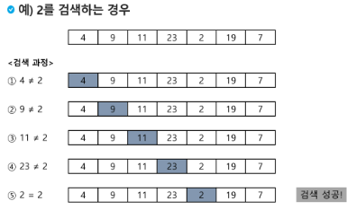
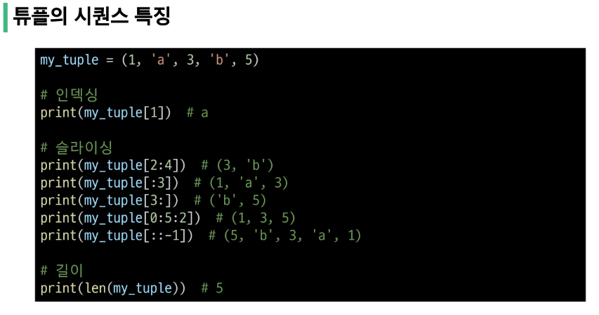
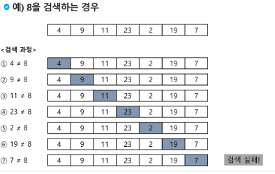
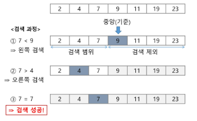

# [TIL] 2024-01-31

## 2차원 배열

- 1차원 List를 묶어놓은 List

- 2차원 이상의 다차원 List는 차원에 따라 Index를 선언

- 2차원 List의 선언 : 세로 길이 (행의 갯수), 가로 길이(열의 갯수)를 필요로 함

- Python에서는 데이터 초기화를 통해 변수 선언과 초기화가 가능함

- arr = [[0,1,2,3],[4,5,6,7]]

- | 0   | 1   | 2   | 3   |
  | --- | --- | --- | --- |
  | 4   | 5   | 6   | 7   |
  
  ```python
  # 3
  # 1 2 3
  # 4 5 6
  # 7 8 9
  
  N = int(input())
  arr = [list(map(int,input().split())) for _ in range(N)]
  ```

- ```python
  # 3
  # 123
  # 456
  # 789
  N = int(input())
  arr = [list(map(int,input())) for _ in range(N)]
  ```

## 배열 순회

- n x m 배열의 n*m개의 모든 원소를 빠짐 없이 조사하는 방법

### 행 우선 순회

```python
  # i 행의 좌표
  # j 열의 좌표
  for i in range(n):
    for j in range(m):
      f(arr[i][j])
```


### 열 우선 순회
```python
  # i 행의 좌표
  # j 열의 좌표
  for j in range(n):
    for i in range(m):
      f(arr[i][j])
```


### 지그재그 순회
```python
  # i 행의 좌표
  # j 열의 좌표
  for i in range(n):
    for j in range(m):
      f(arr[i][j] + (m-1-2*j) * (i%2))
```


### 델타를 이용한 2차 배열 탐색

- 2차 배열의 한 좌표에서 4방향의 인접 배열 요소를 탐색하는 방법
- 인덱스 (i,j)인 칸의 상하좌우 칸(ni,nj)


### 전치 행렬
```python
  # i : 행의 좌표, len(arr)
  # j : 열의 좌표, len(arr[0])
  arr = [[1,2,3],[4,5,6],[7,8,9]] # 3*3 행렬

  for i in range(3):
    for j in range(3):
      if i<j:
        arr[i][j], arr[j][i] = arr[j][i],arr[i][j]
```


## 부분 집합 합
- 유한 개의 정수로 이루어진 집합이 있을 때, 이 집합의 부분 집합 중에서 그 집합의 원소를 모두 더한 값이 0이 되는 경우가 있는 지를 알아내는 문제
- 예를 들어, [-7,-3,-2,5,8] 이라는 집합이 있을 때, [-3,2,5]는 이 집합의 부분집합이면서
(-3)+(-2)+5=0 이므로 이 경우의 답은 참이 된다.

### 부분 집합의 수
- 집합의 원소가 n개일 때, 공집합을 포함한 부분 집합의 수는 2^n개이다.
- 이는 각 원소를 부분 집합에 포함시키거나 포함시키지 않는 2가지 경우를 모든 원소에 적용한 경우의 수와 같다.


### 부분 집합 생성하기
- 각 원소가 부분 집합에 포함되었는지를 loop 이용하여 확인하고 부분 집합을 생성하는 방법
```python
  bit = [0,0,0,0]
  for i in range(2):
    bit[0] = i # 0번 원소
    for j in range(2):
      bit[1] = j # 1번 원소
      for k in range(2):
        bit[2] = k # 2번 원소
        for l in range(2):
          bit[3] = l # 3번 원소
          print_subset(bit) # 생성된 부분집합 출력
```

## 비트 연산자
|  '&'  | 비트 단위로 AND 연산을 한다.              |
| ---   | --- |
|  '|'  | 비트 단위로 OR 연산을 한다.               |
| ---   | --- |
|  '<<' | 피연산자의 비트 열을 왼쪽으로 이동시킨다.   |
| ---   | --- |
|  '>>' | 피연산자의 비트 열을 오른쪽으로 이동시킨다. |
| ---   | --- |

### 보다 간결하게 부분 집합을 생성하는 방법
```python
  arr = [3,6,7,1,5,4]
  n = len(arr) # n은 원소의 갯수

  for i in range(1<<n) : # 1<<n : 부분 집합의 갯수
    for j in range(n): # 원소의 수만큼 비트를 비교
      if i & (i<<j):  # i의 j번 비트가 1인 경우
        print(arr[j], end=',') # j번 원소 출력
    print()
  print() 
```