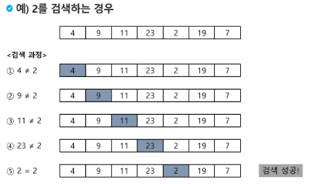
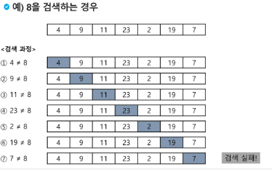
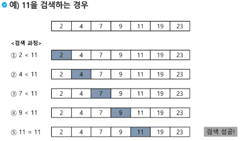
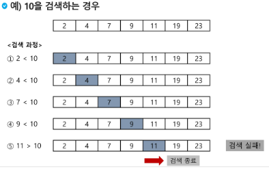
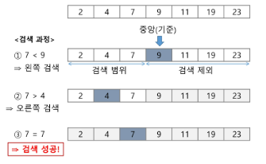
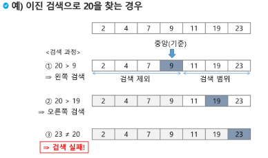
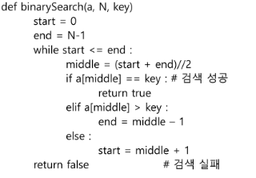
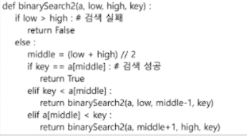

<<<<<<< HEAD
#[TIL] 2024-02-01

## 검색

- 저장되어 있는 자료 중에서 원하는 항목을 찾는 작업

- 목적하는 탐색 키를 가진 항목을 찾는 것
  
  - 탐색 키(searcj key) : 자료를 구별하여 인식할 수 있는 키
    
    ## 검색의 종류

- 순차 검색

- 이진 검색

- 해쉬

### 순차검색

- 일렬로 되어 있는 자료를 순서대로 검색하는 방법
  
  - 가장 간단하고 직관적
  - 배열이나 연결리스트 등 순차구조로 구현된 자료구조에서 원하는 항목을 찾을때 유용
  - 검색 대상의 수가 많은 경우에는 수행시간이 급격히 증가하여 비효율 적

- 2가지 경우
  
  - 정렬되어 있지 않은 경우
  - 정렬되어 있는 경우

- 검색 과정
  
  - 첫 번째 원소부터 순서대로 검색 대상과 키 값이 같은 원소가 있는지 비교하며 찾는다.
  - 키 값이 동일한 원소를 찾으면 그 원소의 인덱스를 반환한다.
  - 자료 구조의 마지막에 이를 때 까지 검색 대상을 찾지 못하면 검색 실패

### 정렬되어 있지 않은 경우




- 찾고자 하는 원소의 순서에 따라 비교 횟수가 결정된다.
  
  - 첫 번째 원소를 찾을 때는 1번 비교, 두 번재 원소를 찾을 때는 2번 비교
  
  - 정렬되지 않은 자료에서의 순차 검색의 평균 비교 횟수
    
    - = (1/n) * (1+2+3+....+n) = (n+1)/2
  
  - 시간 복잡도 : O(n)
  
  - ex)
    
    ```python
      def sequential_search(a,n,key):
          i<-0
          while i<n and a[i] != key:
              i<-i+1
          if 1<n return i
          else : return -1
    ```
    
    ### 정렬되어 있는 경우

- 검색 과정
  
  - 자료가 오름차순으로 정렬된 상태에서 검색을 실시한다고 가정
  - 자료를 순차적으로 검색하면서 키 값을 비교하여, 원소의 키 값이 검색 대상의 키 값보다 크면 찾는 원소가 없다는 것이므로 더 이상 검색하지 않고 검색 종료
    
    

- 찾고자 하는 원소의 순서에 따라 비교 횟수가 결정됨
  
  - 정렬이 되어있으므로, 검색 실패를 반환하는 경우 평균 비교 횟수가 반으로 줄어든다
  
  - 시간 복잡도 : O(n)
  
  - ex)
    
    ```python
      def sequential_search2(a,n,key):
          i<-0
          while i<n and a[i] < key:
              i<-i+1
          if 1<n and a[i]==Key
              return i
          else:
              return -1
    ```

### 이진 탐색

- 자료의 가운데에 있는 항목의 키 값과 비교하여 다음 검색의 위치를 결정하고 검색을 계속 진행하는 방법
  - 목적 키를 찾을 때 까지 이진 검색을 순환적으로 반복 수행함으로써 검색 범위를 반으로 줄여가며 보다 빠르게 검색을 수행함
- 이진 검색을 하기 위해선 자료가 정렬된 상태여야 한다.

### 검색과정

- 자료의 중앙에 있는 원소 선택
- 중앙 원소의 값과 목표 값을 비교한다.
- 목표 값이 중앙 원소의 값보다 작으면 자료의 왼쪽 반에 대하서 새로 검색을 수행하고, 크다면 오른쪽 반에 대하여 검색 수행
- 찾고자 하는 값을 찾을때 까지 1~3 과정 반복
  
  

### 구현

- 검색 범위의 시작점과 종료점을 이용하여 검색을 반복 수행한다.
- 이진 검색의 경우, 자료에 삽입이나 삭제가 발생했을 때 배열의 상태를 항상 정렬 상태로 유지하는 추가 작업 필요
  

### 재귀 함수 이용



-------------------------------------------------------------------------------------------

평가

1. 풍선팡
2. 
3. 이진 탐색이란 무엇인가? 설명 및 소스 코드 작성

3-1. 완탐이란? + 장단 비교
3-2. 베이비진을 판단하는 방법 code 설명
=======

# [TIL] 2024-02-01

> > > > > > > b9a10f68c7cc5f13df475fb90711217227c596d1
