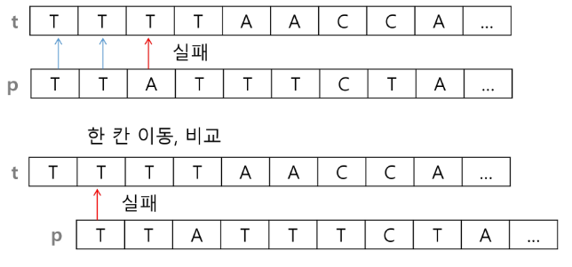
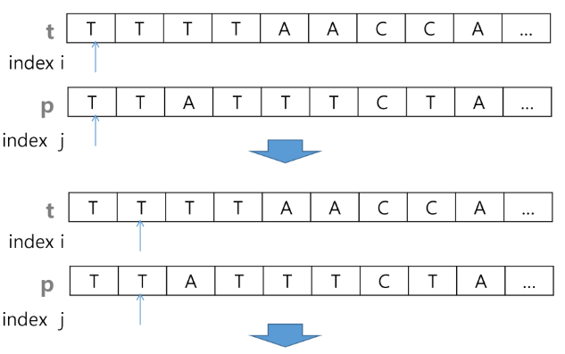
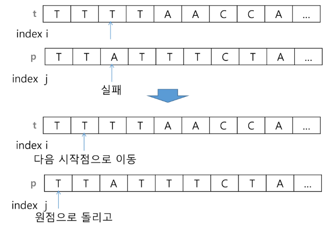

# [TIL] 2024-02-06

## 브루트 포스
- 본문 문자열을 처음부터 끝까지 차례대로 순회하면서 패턴내의 문자들을 일일이 비교하는 방식으로 동작



```python
p = "is" # 찾을 패턴
t = "this is a book~!" # 전체 텍스트
M = len(p) # 찾을 패턴의 길이
N = len(t) # 전체 텍스트의 길이

def BruteForce(p,t):
    i=0 # t의 인덱스
    j=0 # p의 인덱스
    while j < M and i < N:
        if t[i] != p[j]:
            i = i-j
            j = -1
        i = i+1
        j = j+1
    if j == M :
        return i-M # 검색 성공
    else:
        return -1 # 검색 실패
```

### 브루트 포스의 시간 복잡도
- 최악의 경우 시간 복잡도는 텍스트의 모든 위치에서 패턴을 비교해야 하므로 O(MN)이 된다.
- 길이가 10,000인 문자열에서 길이 80인 패턴을 찾는다고 한다면, 최악의 경우 
  약 10,000*80 = 800,000번의 비교가 발생한다
- 