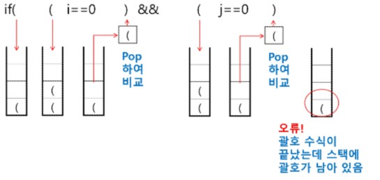
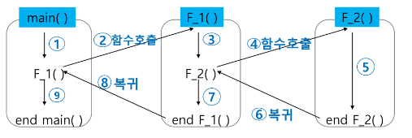
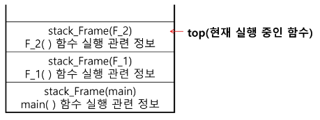
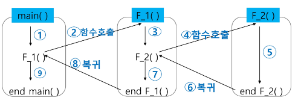
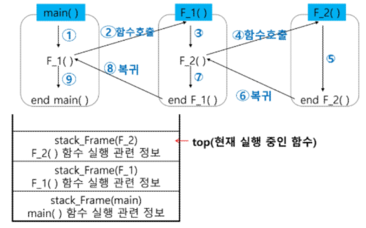
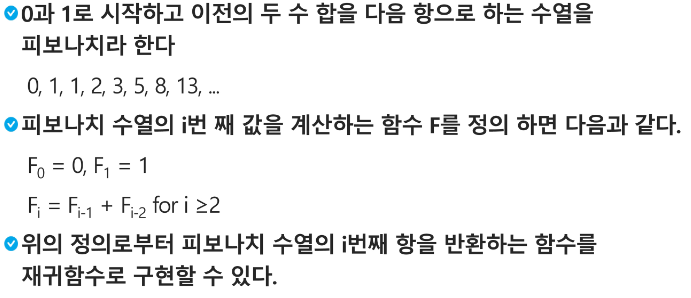

# [TIL] 2024-02-07
## 스택1
### 스택(stack)의 특성
- 물건을 쌓아 올리듯 자료를 쌓아 올린 형태의 자료구조이다.
- 스택에 저장된 자료는 *선형 구조*를 갖는다.
    - 선형구조 : 자료 간의 관계가 *1대 1*의 관계를 갖는다.
    - 비선형구조 : 자료 간의 관계가 *1대 N*의 관계를 갖는다 (예:트리)
- 스택에 자료를 삽입하거나 스태겡서 자료를 꺼낼 수 있다.
- 마지막에 삽입한 자료를 가장 먼저 꺼낸다. (후입선출-LIFO(Last In First Out))
- 1,2,3 삽입 -> 역순 -> 3,2,1 순으로 꺼낼 수 있다.
### 스택을 구현하기 위한 자료구조와 연산
- 자료구조 : 자료를 선형으로 저장할 저장소
    - 배열을 사용할 수 있다.
    - 저장소 자체를 스택이라고 부르기도 한다.
    - 스택에서 마지막 삽입된 원소의 위치를 TOP라고 한다.
- 연산
    - 삽입 : 저장소에 자료를 저장한다. 보통 push라고 부른다.
    - 삭제 : 저장소에서 자료를 꺼낸다. 꺼낸 자료는 삽입한 자료의 역순으로 꺼낸다. 보통 pop이라고 함
    - 스택이 공백인지 아닌지를 확인하는 연산. isEmpty
    - 스택의 top에 있는 원소를 반환하는 연산. peek

### 스택의 삽입/삭제 과정
- 빈 스택에 원소 A,B,C를 차례로 삽입 후 한번 삭제하는 연산과정


### 스택의 push 알고리즘
- append 메소드를 통해 리스트의 마지막에 데이터를 삽입
```python
    def push(item):
        s.append(item)
```
### 스택의 구현
```python
    def push(item,size):
        global top
        top+=1
        if top == size:
            print('overflow!')
        else:
            stack[top] = item
    size = 10
    stack = [0]*size
    top = -1

    push(10,size)
    top+=1 # push(20)
    stack[top] = 20
```
### 스택의 pop 알고리즘
```python
    def pop():
        if len(s)==0:
            # underflow
            retrun
        else:
            return s.pop()
```
```python
    def pop():
        global top
        if top == -1:
            print('underflow')
            return 0 
        else:
            top-=1
            return stack[top+1]
    print(pop())

    if top>-1 : # pop()
        top-=1
        print(stack[top+1])
```

### 연습 문제1 : 스택 구현해보기
```python
    def push(n):
        top+=1
        if top == size:
            print('overflow')
        else:
            stack[top] = n


    top = -1
    size = 10
    stack[0]*size

    top+=1
    stack[top]=10

    top+=1
    stack[top]=20

    push(30)

    while top>=0:
        top-=1
        print(stack[top+1])
```

### 스택 구현 고려 사항
- 1차원 배열을 사용하여 구현할 경우 구현이 용이하다는 장점이 있지만 스택의 크기를 변경하기가 어렵다는 단점이 있다.
- 이를 해결하기 위한 방법으로 저장소를 동적으로 할당하여 스택을 구현하는 방법이 있다. 
동적 연결 리스트를 이용하여 구현하는 방법을 의미한다. 구현이 복잡하다는 단점이 있지만 메모리를 효율적으로 사용한다는 장점을 가진다. 스택의 동적 구현은 생략한다.

### 스택의 응용 1 : 괄호 검사
- 괄호의 종류 : 대괄호 : [], 중괄호 : {}, 소괄호 ()
- 조건
    1. 왼쪽 괄호의 개수와 오른쪽 괄호의 개수가 같아야 한다.
    2. 같은 괄호에서 왼쪽 괄호는 오른쪽 괄호보다 먼저 나와야 한다.
    3. 괄호 사이에는 포함 관계만 존재한다.
- 잘못된 괄호 사용의 예
    - (a(b)
    - a(b)c)
    - a{bc[d]e}f)
- 스택을 이용한 괄호 검사


### 괄호를 조사하는 알고리즘 개요ㅕ
- 문자열에 있는 괄호릏 차례대로 조사하면서 왼쪽 괄호를 만나면 스택에 삽입하고, 오른쪽 괄호를 만나면 스택에서 top 괄호를 삭제한 후 오른쪽 괄호와 짝이 맞는지를 검사한다.
- 이 때, 스택이 비어 있으면 조건 1 또는 조건 2에 위배되고 괄호의 짝이 맞지 않으면 조건 3에 위배된다.
- 마지막 괄호까지를 조사한 후에도 스택에 괄호가 남아 있으면 조건 1에 위배된다.

### 연습문제 2
- 괄호의 짝을 검사하는 프로그램

```python


```

## 스택의 응용2: function call
### function call
- 프로그램에서의 함수 호출과 복귀에 따른 수행 순서를 관리
- 가장 마지막에 호출된 함수가 가장 먼저 실행을 완료하고 복귀하는 후입선출 구조이므로, 후입선출 구조의 스택을 이용하여 수행 순서 관리

- 함수 호출이 발생하면 호출한 함수 수행에 필요한 지역변수, 매개변수 및 수행 후 복귀할 주소 등의 정보를 스택 프레임에 저장하여 시스템 스택에 삽입

- 함수의 실행이 끝나면 시스템 스택의 top 원소(스택 프레임)를 삭제(pop)하면서 프레임에 저장되어 있던 복귀 주소를 확인하고 복귀
- 함수 호출과 복귀에 따라 이 과저을 반복하여 전체 프로그램 수행이 종료되면 시스템 스택은 공백 스택이 된다.


### 함수 호출과 복귀에 따른 전체 프로그램의 수행 순서

```python
    def f2(n):
        n*=2
        print(n)

    def f1(c,d):
        e=c+d
        f2(e)
    
    a=10
    b=20
    c=a+b
    f1(a,b)
```

## 재귀 호출
- 필요한 함수가 자신과 같은 경우 다시 호출하는 구조
- 함수에서 실행해야 하는 작업의 특성에 따라 일반적인 호출방식 보다 재귀호출 방식을 사용하여 함수를 만들면 프로그램의 크기를 줄이고 간단하게 작성 가능
    - 재귀 호출의 예) factorial 
### n에 대한 factorial : 1부터 n까지의 모든 자연수를 곱하여 구하는 연산
```python
    n! = n x (n-1)!
    (n-1)! = (n-1)x(n-2)!
    (n-2)! = (n-2)x(n-3)!
    ....
    2! = 2x1!
    1! = 1
```


### 피보나치 수를 구하는 재귀함수
```python
    def fibo(n):
        if n<2:
            return n
        else:
            return fibo(n-1)+fibo(n-2)
```