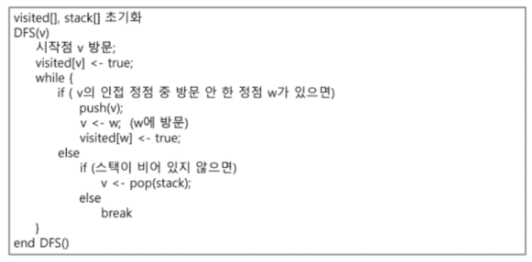

# [TIL] 2024-02-08

# DP
- 동적 계획 알고리즘은 그리디 알고리즘과 같이 최적화 문제를 해결하는 알고리즘이다.
- 동적 계획 알고리즘은 먼저 입력 크기가 작은 부분 문제들을 모두 해결한 후에 그 해들을 이용하여 보다 큰 크기의 부분 문제들을 해결하여, 최종적으로 원래 주어진 입력의 문제를 해결하는 알고리즘

## 피보나치 수 DP 적용
- 피보나치 수는 부분 문제의 답으로부터 본 문제의 답을 얻을 수 있으므로 최적 부분 구조로 이루어져 있다.
1. 문제를 부분 문제로 분할한다.

2. 부분 문제로 나누는 일을 끝냈으면 가장 작은 부분 문제부터 해를 구한다.
3. 그 결과는 테이블에 저장하고, 테이블에 저장된 부분 문제의 해를 이요하여 상위 문제의 해를 구한다.


## 피보나치 수 DP 적용 알고리즘
```python
    def fibo2(n):
        f = [0] * (n+1)
        f[0] = 0
        f[1] = 1
        for i in range(2,n+1):
            f[i] = f[i-1] + f[i-2]
        return f[n]
```
## DP의 구현 방식
- recursive 방식 : fib1()
- interative 방식 : fibo2()

- memoization을 재귀적 구조에 사용하는 것보다 반복적 구조로 DP를 구현한 것이 성능 면에서 보다 효율적이다.
- 재귀적 구조는 내부에 시스템 호출 스택을 사용하는 오버헤드가 발생하기 떄문이다.
```python
    def f(i,k):
        if i==k:
            print('end')
        else:
            f(i+1,k)
    f(0,1000)
```
- 최대 재귀 깊이가 초과

# DFS(깊이우선탐색)
- 비선형구조인 그래프 구조는 그래프로 표현된 모든 자료를 빠짐없이 검색하는 것이 중요함.
- 두가지 방법
    - 깊이 우선 탐색 (DFS)
    - 너비 우선 탐색 (BFS)

- 시작 정점의 한 방향으로 갈 수 있는 경로가 있는 곳 까지 깊이 탐색해 가다가 더 이상 갈 곳이 없게 되면, 가장 마지막에 만났던 갈림길 간선이 있는 정점으로 되돌아 와서 다른 방향의 정점으로 탐색을 계속 반복하여 결국 모든 정점을 방문하는 순회방법
- 가장 마지막에 만났던 갈림길의 정점으로 되돌아가서 다시 깊이 우선 탐색을 반복해야 하므로 후입선출 구조의 스택 사용

## 사용 방법

1. 시작 정점 v를 결정하여 방문한다.
2. 정점 v에 인접한 정점 중에서
    - 방문하지 않은 정점 w가 있으면, 정점 v를 스택에 push하고 정점 w를 방문한다.
    - 방문하지 않은 정점이 없으면, 탐색 방향을 바꾸기 위해 스택을 pop하여 받은 가장 마지막 방문 정점을 v로 하여 다시 2를 반복한다.
3. 스택이 공백이 될 때 까지 2를 반복한다.