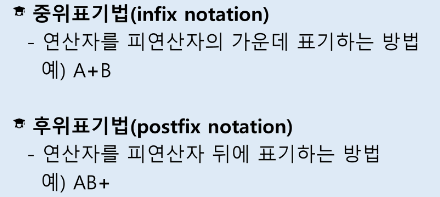
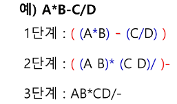
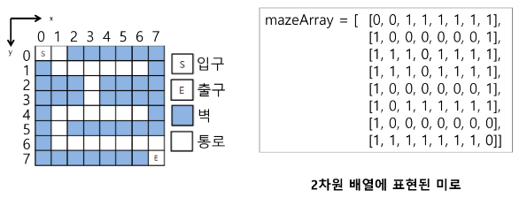
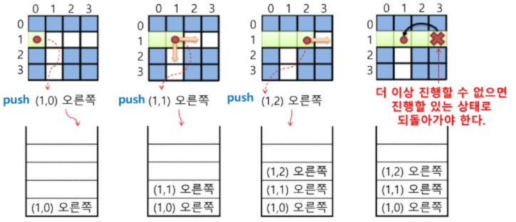

# [TIL] 2024-02-13
# stack2

## 계산기1
- 문자열로 된 계산식이 주어질 때, 스택을 이용하여 이 계산식의 값을 계산할 수 있다.
- 문자열 수식 계산의 일반적 방법
    - step1. 중위 표기법의 수식을 후위 표기법으로 변경한다(스택)
    

step 1. 중위 표기식의 후위 표기식 변환 방법1
- 수식의 각 연산자에 대해서 우선 순위에 따라 괄호를 사용하여 다시 표현한다.
- 각 연산자를 그에 대응하는 오른쪽 괄호의 뒤로 이동시킨다.
- 괄호를 제거한다.

step 1. 중위표기식의 후위표기식 변환 방법2
- 입력 받은 중위 표기식에서 토큰을 읽는다
- 토큰이 피연산자이면 토큰을 출력한다.
- 토큰이 연산자(괄호포함)일 때, 이 토큰이 

### 연습문제


## 계산기2
step 2. 후위 표기법의 수식을 스택을 이용하여 계산
1. 피연산자를 만나면 스택에 push
2. 연산자를 만나면 필요한 만큼의 피연산자를 스택에서 pop하고, 연산결과를 다시 스택에 push
3. 수식이 끝나면, 마지막으로 스택을 pop하여 출력

```python
top = -1
stack = [0]*100
icp = {'(' : 3, '*' : 2, '/' : 2, '+' : 1, '-' : 1} # 스택 밖에서의 우선순위
isp = {'(' : 0, '*' : 2, '/' : 2, '+' : 1, '-' : 1} # 스택 안에서의 우선순위

fx = (6+5*(2-8)/2)
postfix = ''
for tk in fx:
    # 여는 괄호 push, 연산자이고 top 원소보다 우선순위가 높다면 push
    if tk == '(' or (tk in'8/+-' and isp[stack[top]] < icp[tk]): 
        top+=1 #push
        stack[top] = tk
    elif (tk in'*/+-' and isp[stack[top]] >= icp[tk]): # 연산자이고 top 원소보다 우선순위가 낮다면
        while isp[stack[top]] >= icp[tk]: # top 원소의 우선순위가 낮을 때까지 pop
            top -= 1 #pop
            postfix += stack[top+1]
        top+=1 #push
        stack[top] = tk
    elif tk == ')': # 닫는 괄호면, 여는 괄호를 만날 때까지 pop
        while stack[top] != '(':
            top-=1
            postfix+=stack[top+1]
        top -= 1 # 여는 괄호 pop해서 버림
        stack[top+1]
    else: # 피연산자인 경우
        postfix += tk
print(postfix)
```
```python
for tc in range(10):
    icp = {'(': 3, '*': 2, '/': 2, '+': 1, '-': 1}  # 스택 밖에서의 우선순위
    isp = {'(': 0, '*': 2, '/': 2, '+': 1, '-': 1}  # 스택 안에서의 우선순위
    n = int(input())
    fx = input()
    stack = []
    result = []
    for tk in fx:
        if tk.isdigit():
            result.append(tk)
        else:
            if tk == '(':
                stack.append(tk)
            elif tk in '*/+-':
                if len(stack)==0 or icp[tk] > isp[stack[-1]]:
                    stack.append(tk)
                elif icp[tk] <= isp[stack[-1]]:
                    while isp[stack[-1]] >= icp[tk]:
                        result.append(stack.pop())
                        if len(stack)==0:
                            break
                    stack.append(tk)
            elif tk == ')':
                while stack[-1]!='(':
                    result.append(stack.pop())
                stack.pop
    result.append(stack.pop())
```


## 백트래킹
- 해를 찾는 도중에 '막히면' (즉, 해가 아니면) 되돌아가서 다시 해를 찾는 기법이다.
- 최적화 문제와 결정 문제를 해결할 수 있다.
- 결정 문제 : 문제의 조건을 만족하는 해가 존재하는지의 여부를 'yes' 또는 'no'가 답하는 문제
    - 미로찾기
    - n-Queen
    - Map coloring
    - 부분 집합의 합(Subset Sum)문제 등

### 미로 찾기
- 입구와 출구가 주어진 미로에서 입구부터 출구까지의 경로를 찾는 문제
- 이동할 수 있는 방향은 4방향으로 제한


### 미로 찾기 알고리즘


### 백트래킹과 DFS와의 차이
- 어떤 노드에서 출발하는 경로가 해결책으로 이어질 것 같지 않으면 더 이상 그 경로를 따라가지 않음으로써 시도의 횟수를 줄임.(Prunning 가지치기)
- DFS가 모든 경로를 추적하는 데 비해 백트래킹은 불필요한 경로를 조기에 차단
- DFS를 하기에는 경우의 수가 너무나 많음, 즉 N! 가지의 경우의 수를 가진 문제에 대해 DFS를 실시하면 처리 불가능
- 백트래킹을 적용하면 경우의 수가 줄어들지만 이 역시 최악의 경우 지수함수 시간을 요하므로 처리 불가능
- 모든 후보를 검사? : No
### 백트래킹 절차
1. 상태 공간 트리의 깊이 우선 탐색을 실시
2. 각 노드가 유망한지를 점검
3. 만일 그 노드가 유망하지 않으면, 그 노드의 부모 노드로 돌아가서 탐색 계속


## 부분집합
- 어떤 집합의 공집합과 자기 자신을 포함한 모든 부분 집합을 powerset이라고 하며 구하고자 하는 어떤 집합의 원소 개수가 n일 경우 부분집합의 개수는 2의 n제곱 개 이다.

- 백트래킹 기법으로 powerset을 만들어보자
    - 앞에서 설명한 일반적인 백트래킹 접근 방법을 이용한다.
    - n개의 원소가 들어있는 집합의 2의 n제곱개의 부분 집합을 만들 때는, true 또는 false 값을 가지는 항목들로 구성된 n개의 배열을 만드는 방법을 이용.
    - 여기서 배열의 i번째 항목은 i번째의 원소가 부분집합의 값인지 아닌지를 나타내는 값이다.


```python
    def f(i,k):
        if == k :
            for j in range(k):
                if bit[j]:
                    print(arr[j], end='')
                print()
                    
        else:
            # for j in range(2):
            #     bit[i]=j
            #     f(1+1,j)
            bit[i]=1
            f(i+1,k)
            bit[i]=0
            f(i+1,k)
    N=4
    arr=[1,2,3,4]
    bit = [0]*N # bit[i]:arr[i]가 부분집합에 포함되었는지 나타내는 배열
    f(0,N) # bit[i]에 1 또는 0을 채우고, N개의 원소가 결정되면 부분집합을 출력
```

## 순열

### 단순하게 순열을 생성하는 방법
- 예) {1,2,3}을 포함하는 모든 순열을 생성하는 함수
    - 동일한 숫자가 포함되지 않았을 때, 각 자리수 별로 loop을 이용해 구현할 수 있다.
    ```python
        for i in range(1,4):
            for j in range(1,4):
                if j!=i:
                    for k in range(1,4):
                        if k != i and k != j:
                            print(i,j,k)
    ```

### 부분집합과 순열
