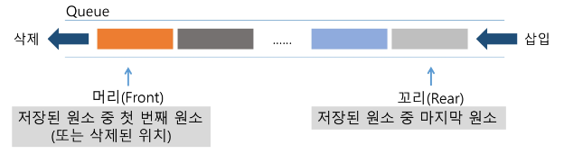

# [TIL] 2024-02-15
## 큐(queue)의 특성
- 스택과 마찬가지로 삽입과 삭제의 위치가 제한적인 자료구조
- 큐의 뒤에서는 삽입만 하고, 큐의 앞에서는 삭제만 이루어지는 구조
- 선입선출 구조
    - 큐에 삽입한 순서대로 원소가 저장되어, 가장 먼저 삽입된 원소는 가장 먼제 삭제된다.
    - 
- 기본 연산
    - 삽입 : enQueue
    - 삭제 : deQueue
- 주요 연산
| 연산 | 기능 |
|-----|-------|
|enQueue|큐의 뒤쪽(rear 다음)에 원소를 삽입하는 연산|
|deQueue|큐의 앞쪽(front)에서 원소를 삭제하고 반환하는 연산|
|createQueue|공백 상태의 큐를 생성하는 연산|
|isEmpty|큐가 공백상태인지를 확인하는 연산|
|isFull|큐가 포화상태인지를 확인하는 연산|
|Qpeek|큐의 앞쪽(front)에서 원소를 삭제 없이 반환하는 연산|

### 큐의 구현
- 선형 큐
    - 1차원 배열을 이용한 큐
    - 큐의 크기 = 배열의 크기
    - front : 마지막으로 삭제된 인덱스
    - rear : 저장된 마지막 원소의 인덱스
- 상태 표현
    - 초기 상태 : front = rear = 1
    - 공백 상태 : front == rear
    - 포화 상태 : rear == n-1 (n:배열의 크기, n-1:배열의 마지막 인덱스)

### 구현 과정
- 삽입 enQueue
    - 마지막 원소 뒤에 새로운 삽입하기 위해
    1. rear값을 하나 증가시켜 새로운 원소를 삽입할 자리 마련
    2. 그 인덱스의 해당하는 배열 원소 Q[rear]에 item을 저장
    ```python
    def enQueue(item):
        global rear
        if isFull():print("Queue_Full")
        else:
            rear <- rear + 1
            Q[rear] <- item
    ```
- 삭제 deQueue
    - 가장 앞에 있는 원소를 삭제하기 위해
    1. front 값을 하나 증가시켜 큐에 남아 있는 첫 번째 원소 이동
    2. 새로운 첫 번째 원소를 리턴 함으로써 삭제와 동일한 기능
    ```python
    def deQueue():
        if(isEmpty()) then Queue_empty()
        else{
            front <- front+1
            return Q[front]
        }
    ```
- 공백상태 및 포화상태 검사 : isEmpty(), isFull()
    - 공백상태 : front == rear
    - 포화상태 : rear == n-1(n:배열의 크기, n-1:배열의 마지막 인덱스)
    ```python
    def isEmpty():
        return front == rear
    def isFull():
        return rear == len(Q)-1
    ```
- 검색 : Qpeek()
    - 가장 앞에 있는 원소를 검색하여 반환하는 연산
    - 현재 front의 한자리 뒤(front+1)에 있는 원소, 즉 큐의 첫 번째에 있는 원소를 반환
    ```python
    def Qpeek():
        if isEmpty(): print("Queue_Empty")
        else : return Q[front+1]
    ```