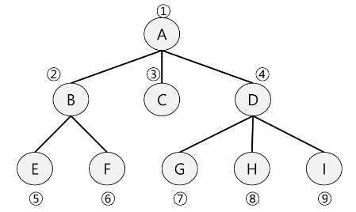

# [TIL] 2024-02-16
## BFS
- 그래프를 탐색하는 방법에는 크게 두 가지가 있음
    - 깊이 우선 탐색 - DFS
    - 너비 우선 탐색 - BFS
- 너비 우선 탐색은 탐색 시작점의 *인접한 정점을 먼저 모두 차례*로 방문한 후에, 방문했던 정점을 시작점으로 하여 다시 인접한 정점들을 차례로 방문하는 방식
- 인접한 정점들에 대해 탐색을 한 후, 차례로 다시 너비우선탐색을 진행해야 하므로, 선입선출 형태의 자료구조인 큐를 활용함

### BFS 그래프 탐색 순서


### BFS 알고리즘
- 입력 파라미터 : 그래프 G와 시작점 v
```python
def BFS(G,v) #그래프 G, 탐색 시작점v
    visited = [0]*(n+1) # n : 정점의 개수
    que = [] # 큐 생성
    que.append(v) # 시작점 v를 큐에 삽입
    while que:
        t = que.popleft() # 큐의 첫번째 원소 반환
        if not visited[t]: # 방문하지 않았다면
            visited[t]=True # 방문 처리
            visit(t) # 정점 t에서 할일
            for i in G[t]: # t와 연결된 모든 정점에 대해
                if not visited[i]: # 방문하지 않았다면
                    que.append(i) # 큐에 넣기  
```