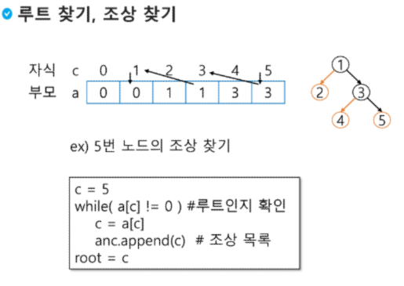

# [TIL] 2024-02-21

## 순회
- 순회란 트리의 각 노드를 중복되지 않게 전부 방문(visit)하는 것을 말하는데 트리는 비 선형 구조이기 때문에 선형구조에서와 같이 선후 연결 관계를 알 수 없다.
- 따라서 특별한 방법이 필요하다.

### 이진 트리 - 순회
- 순회 : 트리의 노드를 체계적으로 방문하는 것
    - 전위 순회 : VLR
        - 부모 노드 방문 후, 자식 노드를 좌,우 순서로 방문한다.
    - 중위 순회 : LVR
        - 왼쪽 자식 노드, 부모 노드, 오른쪽 자식 노드 순으로 방문한다.
    - 후위 순회 : LRV
        - 자식 노드를 좌우 순서로 방문한 후, 부모 노드로 방문

### 전위 순회
- 수행 방법
1. 현재 노드 n을 방문하여 처리한다 -> V
2. 현재 노드 n의 왼쪽 서브트리로 이동한다. -> L
3. 현재 노드 n의 오른쪽 서브트리로 이동한다. -> R
- 알고리즘
```python
def preorder_traverse(T) : #전위 순회
    if T : # T is not None
        visit(T) # print(T.item)
        preorder_traverse(T.left)
        preorder_traverse(T.right)
```
left  = [0,0,0,0,0,0]
right  = [0,0,0,0,0,0]
```python
def preorder_traverse(T) : #전위 순회
    if T>0 : # T is not None
        visit(T) # print(T.item)
        preorder_traverse(left[T])
        preorder_traverse(rigth[T])
```
포화,완전 이진 트리의 경우
```python
def preorder_traverse(T) : #전위 순회
    if T<=N : # T is not None
        visit(T) # print(T.item)
        preorder_traverse(T*2)
        preorder_traverse(T*2+1)
```
### 연습문제

- preorder
```python
if T:
    visit(t)
    pre(t.left)
    pre(t.right)
```
- in_order
```python
if T:
    pre(t.left)
    visit(t)
    pre(t.right)
```
- post_order
```python
if T:
    pre(t.left)
    pre(t.right)
    visit(t)
```

### 수식 트리
- 수식을 표현하는 이진트리
- 수식 이진 트리라고도 함
- 연산자는 루트 노드이거나 가지 노드
- *피연산자는 모두 잎 노드*


## 이진 탐색 트리
- 탐색 작업을 효율적으로 하기 위한 자료구조
- 모든 원소는 서로 다른 유일한 키를 갖는다.
- 왼쪽 서브트리<루트노드<오른쪽 서브트리
- 왼쪽 서브트리와 오른쪽 서브트리도 이진 탐색 트리다.

- 중위 순회하면 오름차순으로 정렬된 값을 얻을 수 있다.

### 탐색 연산
- 루트에서 시작한다
- 탐색할 키 값 x를 루트 노드의 키 값과 비교한다.
    - (키 값x = 루트 노드의 키 값)인 경우 : 원하는 원소를 찾았으므로 연산 성공
    - (키 값x < 루트 노드의 키 값)인 경우 : 루트 노드의 왼쪽 서브 트리에 대해서 탐색 연산 수행
    - (키 값x > 루트 노드의 키 값)인 경우 : 루트 노드의 오른쪽 서브 트리에 대해서 탐색 연산 수행
- 서브트리에 대해서 순환적으로 탐색 연산을 반복한다.

### 삽입 연산
1. 먼저 탐색 연산을 수행
    - 삽입할 원소와 같은 원소가 트리에 있으면 삽입할 수 없으므로, 같은 원소가 트리에 있는 지 탐색하여 확인한다.
    - 탐색에서 탐색 실패가 결정되는 위치가 삽입 위치가 된다.
2. 탐색 실패한 위치에 원소를 삽입한다.
- 다음 예는 5를 삽입하는 상황


### 성능
- 탐색, 삽입, 삭제 시간은 트리의 높이 만큼 시간이 걸린다
    - O(h), h : BST의 깊이(height)
- 평균의 경우
    - 이진 트리가 균형적으로 생성되어 있는 경우
    - O(n)
    - 순차탐색과 시간 복잡도가 같다.
- 완전 이진 혹은 균형 트리로 바꿀 수 있다면, 최악의 경우를 없앨 수 있다.
    - 새로운 원소를 삽입할 때 삽입 시간을 줄인다.
    - 평균과 최악의 시간이 같다. O(logn)
- 해쉬 검색 : O(1)
    - 추가 저장 공간 필요

## 힙(heap)
- 완전 이진 트리에 있는 노드 중에서 키 값이 가장 큰 노드나 키 값이 가장 작은 노드를 찾기 위해서 만든 자료구조
- 최대힙
    - 키 값이 가장 큰 노드를 찾기 위한 완전 이진 트리
    - 부모 노드의 키 값 > 자식 노드의 키 값
    - 루트 노드 : 키 값이 가장 큰 노드
- 최소힙
    - 키 값이 가장 작은 노드를 찾기 위한 완전 이진 트리
    - 부모 노드의 키 값 < 자식 노드의 키 값
    - 루트 노드 : 키 값이 가장 작은 노드


### 힙 연산 - 삭제
- 힙에서는 루트 노드의 원소만을 삭제할 수 있다.
- 루트 노드의 원소를 삭제하여 반환한다.
- 힙의 종류에 따라 최대값 또는 최소값을 구할 수 있다.
```python


```