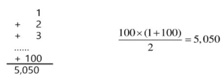

# [TIL] 2024-02-22
# Algorithm Problem Solvin 응용
- sw 문제 해결 - 코딩문제 잘 푸는 방법 - 3가지 전략
- 복잡도 분석 - 시간복잡도
- 표준 입출력 방법 - map // sys 모듈 파일 입출력
- 비트연산
- 진수 2진수,16진수 <-> 10진수

### 문제 해결 역량이란?
- 프로그래머가 사용하는 언어나 라이브러리, 자료구조, 알고리즘에 대한 지식을 적재적소에 퍼즐을 배치하듯 이들을 연결하여 큰 그림을 만드는 능력
- 문제 해결 역량을 향상시키기 위해서 훈련이 필요함
    - 역량 향상? => 기업 코테 합격

### 문제 해결 과정
1. 문제를 읽고 *이해*한다. - > 하나하나 꼼꼼히, 
2. 문제를 익숙한 용어로 재정의 한다.
3. 어떻게 해결할지 *계획*을 세운다
4. *계획을 검증*한다.
5. 프로그램으로 *구현*한다.
6. 어떻게 풀었는지 분석하고, 개선 방법 찾기

### 전략
1. 이해
2. 계획
3. 구현 -> 디버깅

### 문제 해결 능력을 기르는 이유
- 코딩을 더 잘하게 하는 능력을 기르기 위함.
- swea 문제를 통해 기본문법 & 자료구조 & 알고리즘을 더 능숙하게 쓸수 있도록한다.

## 복잡도 분석
- 알고리즘이란?
 - 유한한 단계를 통해 *문제를 해결*하기 위한 절차나 *방법*
 주로 컴퓨터 용어로 쓰이며, 컴퓨터가 어떤 일을 수행하기 위한 단계적 방법
 - 문제를 해결하기 위한 방법, 절차
 - 1부터 100까지 합 구하는 문제
 

 ### 알고리즘 효ㅕ율
- 공간적, 시간적 효율성
   - 공간적 : 연산량 대비 얼마나 적은 메모리를 요하는가?
   - 시간적 : 연산량 대비 얼마나 적은 시간을 요하는가?
- 시간 복잡도 : 반복(문)을 얼마나 많이 

### 복잡도 표기 법

O(n) -> 오더 엔

### 빅오 표기법

- 상수는 배제하기 때문에 O(n^2)의 시간 복잡도를 표기할 수 있다.
- 단순히 *실행시간이 n^2에 비례*하는 알고리즘이라고 말한다.
```python
n=int(input())
for i in range(50):
    print(i)
```
-> 상수의 배수는 계산 x -> O(1)

### 자주 사용하는 O-표기


### 빅오 표기법 이해하기
- O(N)
    - 만약 N이 10,000이고 O(N)으로 짠 알고리즘이있다면?
        - 10,000회 수행
- O(N^2)
    10,000 * 10,000 -> 1억

- O(logN)
    - n이 10,000일 때
    - log2^10,000 - > 2^N = 10,000 -> n = 약 14로 추정

# 시험문제
문제수 ) sea(파리퇴치,풍선팡,배열최소합)+ 백준
스위치 켜고 끄기
3문항은 1,2,버은 프로그래밍 형, 코딩형
3번 서술형

3문항은 1,2,버은 프로그래밍 형, 코딩형
3번 서술형

서술형 swea ) 반복 문자 지우기
어떻게 푸는지 설명
어떤 자료구조 사용하는지? 왜 이렇게 구현했는지?

이진트리란?
 중위 순회란?
중위 순회시 결과값 출력