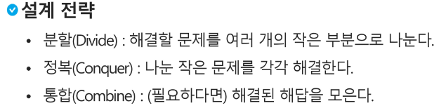

# [TIL] 2024-02-24

## 부분집합 
### 연습문제
- {1,2,3,4,5,6,7,8,9,10}의 powerset중 원소의 합이 10인 부분집합을 구하시오

f(i,k) -> bit(i)를 결정
    if i==k:
        break
    else:
        bit[i] = 1  
        f(i+1,k) # 다음으로 진행
        bit[i] = 0
        f(i+1,k)

- bit[i] : A[i]의 포함여부 1 or 0
- i = 0 bit[0] 포함 -> 1
- i = 1 bit[1] 포함 -> 1
.....
- i = 9 bit[9] 포함 -> 1
- i = 10 -> 출력 or 계산
[1,2,3,...,10]

-> bit[9] 미포함 -> 0
[1,2,3,....,9]

### 부분집합의 합


```python
def f(i,k,target): # k개의 원소를 가진 배열A, 부분 집합의 합이 t인 경우
    if i==k: # 모든 원소에 대해 결정하면(부분집합이 완성되는 부분)
        ss = 0 # 부분 집합의 합
        for j in range(k):
            if bit[j]: # A[j]가 포함된 경우
                ss += A[j]
        if ss == target: # 부분집합의 합이 target인 경우
            for j in range(k):
                if bit[j]: # A[j]가 포함된 경우
                    print(A[j], end= ' ')
            print()
    else:
        for j in range(1,-1,-1):
            bit[i]=j
            f(i+1,k,target)
        # bit[i]=1
        # f(i+1,k)
        # bit[i]=0
        # f(i+1,k)

N = 10
A = [1,2,3,4,5,6,7,8,9,10]
bit = [0]*N # bit[i] = A[i]의 포함여부를 결정한다.
f(0,N,10)
```
### 다른 풀이법


## 순열
- A[1,2,3]의 모든 원소를 사용한 순열
- 123, 132, 213, 231, 312, 321
- 총 6가지의 경우


-p[0] 결정 p [1,2,3] -> p [2,1,3] -> p [3,2,1]

-p[1] 결정 p [1,2,3] -> p [1,3,2]

-p[2] 결정 p [1,2,3] 

# 분할 정복 알고리즘

- 주어진 배열을 두 개로 분할하고, 각각을 정렬한다.
- 다른점 1. : 합병정렬은 그냥 두 부분으로 나누는 반면에, 퀵정렬은 분할할 때, 기준 아이템(pivot item) 중심으로,. 이보다 작은 것은 왼편, 큰것은 오른편에 위치시킨다.
- 다른점 2. : 각 부분이 정렬이 끝난 후, 합병 정렬은 "합병"이란 후처리 작업이 필요하나, 퀵정렬은 필요로 하지 않는다.