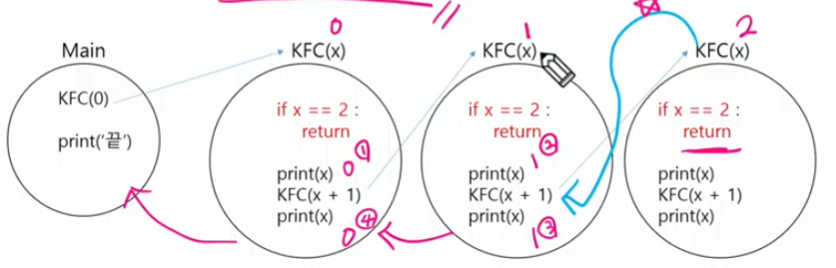
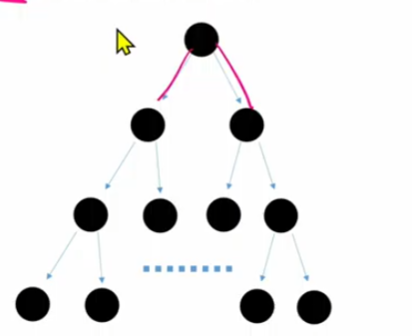
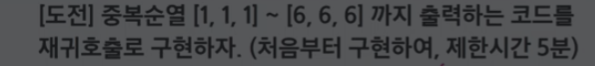
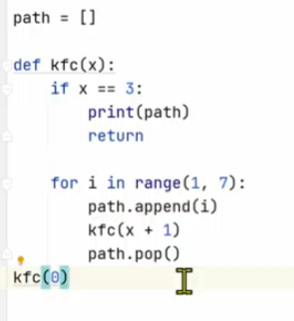
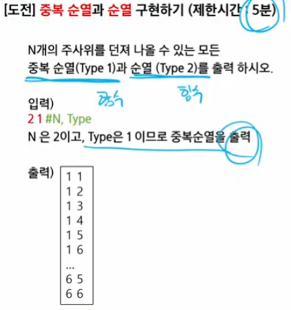

# [TIL] 2024-02-27

## 완전 탐색

### 반복과 재귀
- 반복과 재귀는 유사한 작업을 수행할 수 있다.
- 반복은 수행하는 작업이 완료될 때 까지 계속 반복
    - 루프 (for,while)
    - *반복문은 코드를 n번 반복시킬 수 있다.*
- 재귀는 주어진 문제의 해를 구하기 위해 동일하면서 더 작은 문제의 해를 이용하는 방법
    - 재귀 호출은 n번의 반복문을 만들 수 있다.

### 연습
- 1111~3333까지 출력하는 코드 (중복순열)
```python
# 중복순열
for i in range(1,4):
    for j in range(1,4):
        for k in range(1,4):
            for z in range(1,4):
                print(i,j,k,z)
```
### 재귀 연습 전 알아야할 함수 특징
- KFC 함수 호출할 때, int 타임 객체를 전달하면 값만 복사된다.
```python
def kfc(x):
    print(x) # 4
    x+=1
    print(x) # 5
x=3
kfc(x+1)
print(x) # 3
```
- 함수가 끝나면, main으로 되돌아 오는 것이 아니라, 해당 함수를 호출했던 곳으로 돌아온다.

### 무한 재귀호출
```python
def kfc(x):
   kfc(x+1)


kfc(0)
print('끝')
```
- 재귀 깊이 초과 오류가 발생한다.
- 재귀 호출의 시작은 무한 재귀 호출을 막는 것 부터 시작
    - 출력 결과는 0110dlek.
    - 아래 if문을 '기저조건(base case)라고 한다.
    

### 연습문제
- 0 1 2 3 4 5 5 4 3 2 1 0
```python
# 0 1 2 3 4 5 5 4 3 2 1 0

def sol(x):
    if x==6:
        return
    print(x,end=' ')
    sol(x+1)
    print(x,end=' ')

sol(0)
```


### [도전] 


### [도전]



## 순열
- 중복을 취급하지 않는 '순열' 구현 방법
    - 중복을 제거하는 코드를 추가한다.
- 중복을 제거하는 원리
    - 전역 리스트를 사용하면, 이미 선택했던 숫자 확인 가능
