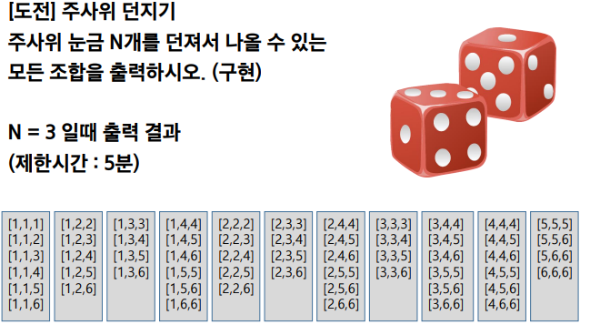

# [TIL] 2024-02-28

### 완전 탐색
- 재귀 호출을 이용한 완탐으로, 부분 집합을 구할 수 있다.
- 실전 보다는 완탐 학습용으로 사용

### Binary Counting
- 2진수 & 비트연산을 이용하여 부분집합을 구할 수 있다.
- 부분 집합이 필요할 때 사용하는 것 추천


### 부분 집합 구현
- 원소 수에 해당하는 N개의 비트열을 이용한다.
- 0 0 1 이면 {A} 임을 나타냄
- 1 1 0 이면 {B,C}임을 나타냄

```python
arr = ['A','B','C']
n = len(arr)

def get_sub(tar):
    for i in range(n):
        if tar & 0x1: # 1 비트가 1인지 확인
            print(arr[i],end='')
        tar>>=1

for tar in range(1<<n):
    print('{',end='')
    get_sub(tar)

```
## 조합
- 서로 다른 n개의 원소 중 r개를 순서 없이 골라낸 것을 조합이라고 부른다.

### 순열과 조합의 차이
- 순열 : {A,B,C,D,E} 5명 중 1등,2등,3등 뽑기
    - A,B,C 와 C,B,A는 다른 경우이다.
- 조합 : 5명 중 3명 뽑기
    - A,B,C 와 C,B,A는 같은 경우이다.

### 조합 연습
- {A,B,C,D,E} 5명 중 3명 뽑을 수 있는 모든 경우의 수를 적어보자
- ABC, ABD, ABE, ACD, ACE, ADE
- BCD, BCE, BDE CDE


### 코드로 구현
```python
arr = ['A','B','C','D','E']
path = []
n=3

def run(lev,start):
    if lev==n:
        print(path)
        return
    for i in range(start,5):
        path.append(arr[i])
        run(lev+1,i+1)
        path.pop()

run(0,0)
```
1. 처음 run 함수의 start 값은 0 이다.
따라서 0~5까지 반복하면서 재귀호출을 한다.
2. 만약 i가 3이 선택되는 경우는 재귀 호출시 start가 4가 된다.
다음 for문은 4부터 수행한다

### 연습문제 


# 그리디
- 결정이 필요할 때, 현재 기준으로 가장 좋아 보이는 선택지로 결정하여 답을 도출하는 알고리즘
- 대표적인 기법
    - 완전 탐색 : 답이 될 수 있는 모든 경우를 시도해보는 알고리즘
    - 그리디 : 결정이 필요할 때, 현재 기준으로 가장 좋아 보이는 선택지로 결정
    - DP : 과거의 데이터를 이용하여, 현재의 데이터를 만들어내는 기법
    - 분할정복 : 큰 문제를 작은 문제로 나누어 해결하는 기법

## 그리디가 성립하는 경우 vs 성립하지 않는 경우


### 화장실 문제
- 사용시간이 짧은 사람부터 순차적으로 들어간다.