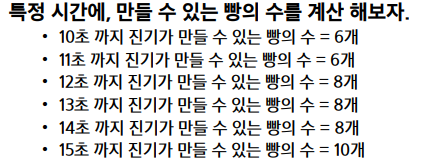

# [TIL] 2024-02-29

## 진기의 최고급 붕어빵
- 예시
    - 3초당 2개씩 빵을 만들어낼 때,
    3,4,6,9 초후에 도착하는 손님 4명에게 빵을 즉시 판매하는 경우
    
    - 공식 발견 : ( target_sev / 3초 ) * 2개
```python
import sys
sys.stdin = open('ex01_input.txt')
sys.stdout = open('ex01_output.txt','w')

def start():
    sold_bread = 0
    for person in client:
        # 공식, 특정시간에 만들수 있는 빵의 갯수
        made_bread = (person//m)*k

        # 빵 1개 판매
        sold_bread+=1

        # 재고 계산
        remain = made_bread-sold_bread
            
        # 재고가 음수이면 판매 불가
        if remain<0:
            return 'Impossible'
        # 재고가 양수면 판매 가능
        return 'Possible'

for tc in range(int(input())):
    # n명의 손님, m초에 k개의 빵을 만들 수 있다.
    n,m,k = map(int,input().split())
    # 손님들이 도착하는 시간
    client = list(map(int,input().split()))
    client.sort()
    print(f'#{tc+1} {start()}')

```

## Magnetic
- A -> B 발견될때마다 교착