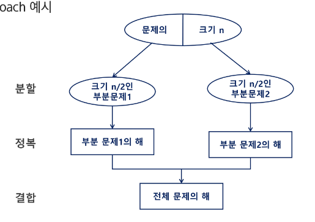
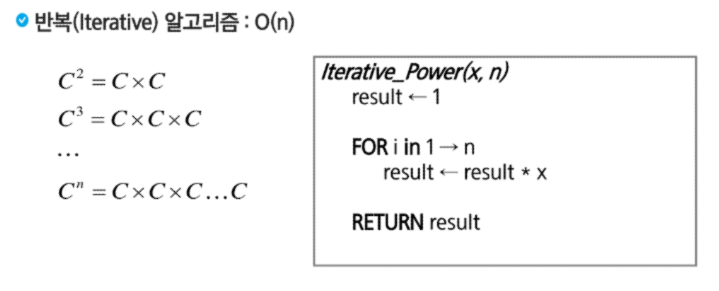

# [TIL] 2024-03-18
## 알고리즘 설계 기법의 종류
1. 전체를 그냥 다 보자. (완전탐색)
    - 배열 : for, while
    - 그래프(관계가 있는 데이터)
        - DFS,BFS
-------- 완탐을 구현하면, 시간 or 메모리 초과가 일어나면
2. 상황마다 좋은 걸 고르자 (그리디)
    - 규칙 + 증명 -> 구현
3. 큰 문제를 작은 문제로 나누어 부분적으로 해결하자 (Dynamic Programing)
    - 분할 정복과 다르게 작은 문제가 중복
    - 중복된 문제의 해답을 저장해놓고 재활용하자 (Memoization)
4. 큰 문제를 작은 문제로 나누어 부분적으로 해결하자(분할 정복)
5. 전체 중 가능성 없는 것을 빼자 (백트래킹)
-> 이 기본들을 기반으로 더 고급 알고리즘들이 개발된다.

## 분할정복 & 백트래킹
- 분할 정복
- 대표적인 분할 정복 알고리즘
    - 병합 정렬
    - 퀵 정렬
    - 이진 검색


### 가짜 동전 찾기

- 24개를 12개 12개로 나누어 저울질 -> 가벼운쪽 12개를 다시 절반으로 나눔
- 12-> 6 / 6 으로 저울질 -> 3/3 -> 1

### 설계 전략
- 비슷한 로직이 반복되는데 하나라도 틀리면 전체 결과가 잘못나온다.
- 보통 재귀로 구현
    - 분할 : 해결할 문제를 여러 개의 작은 부분으로 나눈다.
    - 정복 : 나눈 작은 문제를 각각 해결한다.
    - 통합 : (필요시) 해결된 해답을 모은다.


- 분할은 더이상 나눌수 없을 때 까지

### 분할 정복 기법 예시
- 분할 정복 기법을 거듭 제곱 문제를 통해 이해하기
- 자연수 C의 제곱 값을 구하는 함수를 구현해보기



### 병합 정렬
- 여러 개의 정렬된 자료의 집합을 병합하여 한 개의 정렬된 집합으로 만드는 방식
- 분할 정복 알고리즘 활용
    - 자료를 최소단위의 문제까지 나눈 후에 차례대로 정렬하여 최종 결과를 얻음
    - top-down 방식
- 시간복잡도 
    - O(n log n)


### 퀵 정렬
- 주어진 배열을 두 개로 분할하고, 각각을 정렬한다.
    - 병합 정렬과 동일?
- 다른점 1 : 병합 정렬은 그냥 두 부분으로 나누는 반면, 퀵 정렬은 분할할 때, 기준 아이템 중심으로 분할한다.
- 다른점 2 : 각 부분 정렬이 끝난 후, 병합 정렬은 "병합"이란 후처리 작업이 필요하나, 퀵 정렬은 필요없음


### 병합 정렬 vs 퀵정렬
- 외부 정렬의 기본이 되는 정렬 알고리즘
 - 멀티코어 CPU나 프로세서에서 정렬 알고리즘을 병렬화하기 위해 병합 정렬 아고리즘이 활용된다.

- 퀵정렬은 매우 큰 입력 데이터에 대해서 좋은 성능을 보여준다.


## 이진탐색
- 자료의 가운데에 있는 키 값과 비교하여 다음 검색의 위치를 결정하고 검색을 계속 진행하는 방법
    - 목적 키를 찾을 때까지 이진 검색을 순환적으로 반복 수행함으로써 검색 범위를 반으로 줄여가면서 보다 빠르게 검색을 수행
- 이진 탐색을 하기 위해서는 자료가 정렬되어 있어야 함


```python
arr = [324,32,22114,16,48,93,422,21,316]
arr.sort()

def binarySearch(target):
    low = 0
    high = len(arr)-2

    # 해당 숫자를 찾으면 종료
    # 더 이상 쪼갤 수 없을 때까지 반복
    while low<=high:
        mid = (low+high)//2

        if arr[mid] == target:
            return mid
        elif arr[mid] > target:
            high = mid - 1
        elif arr[mid] < target:
            low = mid + 1
    # 못찾으면 -1 반환
    return -1

def binarySearch2(low,high,tartget): # 재귀버전
    # 기저 조건 (언제까지 재귀 반복?)
    if low>high:
        return -1

    # 다음 재귀 들어가기전에 무엇을 해야할까?
    # 정답 판별
    mid = (low+high)//2
    if target == arr[mid]:
        return mid
    # 다음 재귀 함수 호출(파라미터)
    if target < arr[mid]:
        return binarySearch2(low,mid-1,target)
    else:
        return binarySearch2(mid+1,high,target)
    # 재귀 함수에서 돌아왔을 때 어떤 작업을 해야할까?
        
print(f'21 = {binarySearch(21)}')
print(f'21 = {binarySearch2(0,len(arr)-1,21)})
```

- 정렬된 데이터를 기준으로 특정 값이나 범위를 검색하는 데 사용
- 이진 검색을 활용한 심화 학습 ㅣ워드 [Lower Bound, Upper Bound]
    - 정렬된 배열에서 특정 값 이상 또는 이하가 처음으로 나타나는 위치를 찾는 알고리즘
    - 특정 데이터의 범위 검색 등에서 활용