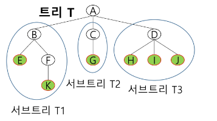

# [TIL] 2024-03-19

## 백트래킹 응용 & 그래프(트리)
- 완전탐색 + 가지치기
- 가능성이 없는(볼 필요 없는) 경우의 수를 제거하는 방법
- 흐름
    1. 완전탐색
    2. 조건 (볼 필요가 없는 조건 설정->가지치기)

### 중복된 순열
- 1~3 까지 숫자 배열
- 111,112,113,121,122,123...332,333
### 재귀함수 => 특정 시점으로 돌아오는 게 핵심
- 구조를 먼저 잡고난 후에 자연스럽게 필요한 변수들이 보인다.
```python
def dfs(level):
    # 기저조건 - 이 문제에선 3개 뽑음
    if level == 3:
        print(*visit)
        return
    # 들어가기 전
    # 다음 재귀 호출
    #   - 다음에 갈 수 있는 곳은 어디인가?
    #   - 이 문제에서는 1,2,3의 세가지(arr의 길이 만큼) 경우가 존재
    
    # 기본 코드
    # visit[level] = 1
    # dfs(level+1)

    # visit[level] = 2
    # dfs(level+1)

    # visit[level] = 3
    # dfs(level+1)
    for i in range(len(arr)):
        visit[level] = arr[i]
        dfs(level+1)

    # 갔다와서 할 로직


arr = [i for i in range(1,4)]
visit = [0] * 3

```

### 순열 -> 중복되지 않는 순열
- 123,132,213,231,312,321 
- 숫자는 한 번만 사용가능
```python
def dfs(level):
    # 기저조건 - 이 문제에선 3개 뽑음
    if level == 3:
        print(*visit)
        return
    # 들어가기 전
    # 다음 재귀 호출
    #   - 다음에 갈 수 있는 곳은 어디인가?
    #   - 이 문제에서는 1,2,3의 세가지(arr의 길이 만큼) 경우가 존재
    
    # 기본 코드
    # visit[level] = 1
    # dfs(level+1)

    # visit[level] = 2
    # dfs(level+1)

    # visit[level] = 3
    # dfs(level+1)
    
    # 갈 수 있는 후보군
    for i in range(len(arr)):
        # 못가는 경우 (갈 수 있는 경우는 조건이 복잡해질 가능성이 큼)
        if arr[i] not in visit:
            continue
        
        visit[level] = arr[i]
        dfs(level+1)
        # 기존 방문 초기화
        visit[level] = 0

    # 갔다와서 할 로직


arr = [i for i in range(1,4)]
visit = [0] * 3
```
### 연습문제 2 
- {1,2,3,4,5,6,7,8,0,10}의 부분집합 중 *원소의 합이 10*인 부분집합을 모두 출력하시오

```python
def dfs(sum):
    if sum == 10:
        return
    if sum > 10:
        return


```


## 트리
### 싸이클이 없는 무향 연결 그래프
- 두 노드 사이에는 유일한 경로가 존재한다.
- 각 노드는 최대 하나의 부모 노드가 존재할 수 있다.
- 각 노드는 자식 노드가 없거나 하나 이상이 존재할 수 있다.
### 비선형 구조
- 원소들 간에 1:n 관계를 가지는 자료구조
- 원소들 간에 계측 관곌ㄹ 가지는 계층형 자료구조 

-정의
    
    - 한 개 이상의 노드로 이루어진 유한 집합이며 다음 조건 을 만족한다.
        - 노드 중 부모가 없는 노드를 루트라고 한다.
        - 나머지 노드들은 n(>=0)개의 분리집합 t1,t2..tn으로 분리될 수 있다.
    - 이들 t1,t2,...,tn은 각각 하나의 트리가 되며(재귀적 정의) 루트의 서브트리라고 한다.
1.싸이클
    - 방문했던 노드로 다시 돌아오는 경로가 있는 경우
2. 무향
    - 간선에 방향이 없다.(양방향)
3. 연결 그래프
    - 모든 꼭지점이 서로 갈 수 있는 정보가 있다.