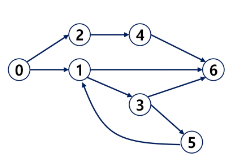

# [TIL] 2024-03-20

## 그래프 
- 노드 + 간선으로 이루어진 자료구조
    - (데이터 간의 관계를 표현하기 위해)
    - A->B (A에서 B로 넘어간다.)
- 그래프는 정점(Vertex)들의 집합과 이들을 연결하는 간선(Edge)들의 집합으로 구성된 자료구조
    - |V| : 정점의 개수, |E| : 그래프에 포함된 간선의 개수
    - |V|개의 정점을 가지는 그래프는 최대 |V|(|V|-1)/2 간선이 가능
        - 예 : 5개의 정점이 있는 그래프의 최대 간선 수는 10(=5*4/2)개이다.
- 선형 자료구조나 트리 자료구조로 표현하기 어려운 N:N 관계를 가지는 원소들을 표현하기에 용이하다.

### 그래프 유형
- 무향 그래프 (양방향)
- 유향 그래프
- 가중치 그래프
- 사이클 없는 방향 그래프
- 완전 그래프
    - 정점들에 대해 가능한 모든 간선들을 가진 그래프
- 부분 그래프
    - 원래 그래프에서 일부의 정점이나 간선을 제외한 그래프

### 인접, 정점
- 인접(Adjacency)
    - 두 개의 정점에 간선이 존재(연결됨)하면 서로 인접해 있다고 한다.
    - 완전 그래프에 속한 임의의 두 정점들은 모두 인접해 있다.
### 경로

- 경로 중 한 정점을 최대한 한번만 지나는 경로를 *단순경로*라고 한다.
    - 0-2-4-6, 0-1-6
- 시작한 정점에서 끝나는 경로를 사이클(Cycle)이라고 한다.
    - 1-3-5-1

### 풀이 순서
1. 그래프를 코드로 표현
    - 연결 리스트 : 몇 개가 연결될지 잘 모름
        - 이진 트리에서는 Left, Right만 연결되기 때문에 사용했음
        - 구현이 복잡해짐( 사용 비추 )
    - 인접 행렬
        - VxV 배열을 활용해서 표현
        - 갈 수 없다면 0, 갈 수 있다면 1을 저장
        - 장점
            - 노드간의 연결정보를 한 번에 확인 가능
            - 간선이 많을수록 유리
            - 행렬곱을 이용해서 탐색이 쉽게 가능함
        - 단점
            - 노드 수가 커지면 메모리 낭비
            - 연결이 안된 것도 0으로 저장해야하기 때문
            -> 노드 수 + 메모리 제한 반드시 확인해야함 
    - 인접 리스트
        - V개의 노드가 갈 수 있는 정보만 저장
        - 장점
            - 메모리 사용량이 적다
            - 탐색할 때 갈 수 있는 곳만 확인하기 때문에 시간적으로 효율적임
        - 단점
            - 특정 노드 간 연결 여부를 확인하는 데 시간이 걸린다.


### 인접 행렬
- 두 정점을 연결하는 간선의 유무로 행렬을 표현
- 행 번호와 열 번호는 그래프의 정점에 대응
- 두 정점이 인접되어 있으면 1, 그렇지 않으면 0으로 표현
- 무향 그래프
    - i번째 행의 합 = i번째 열의 합 = v1 의 차수

- 양방향 그래프는 중앙 우하단 대각선 기준으로 대칭을 이룬다.
```python
graph = [
    [0,1,0,1,0],
    [1,0,1,0,1],
    [0,1,0,0,0],
    [1,0,0,0,1],
    [0,1,0,1,0]
]
visited = [0]*5

def dfs(now):
    # 기저 조건
    # 현재 문제에선 없음

    # 다음 재귀 호출 전
    visited[now]=1
    print(now, end = ' ')

    # 다음 재귀 호출
    # dfs : 현재 노드에서 다른 노드들을 확인
    # 다른 노드들 == 반복문
    for to in range(5):
        # 갈 수 없다면 pass
        if graph[now][to]==0:
            continue 
        if visited[to]:
            continue 
        dfs(to)

    # 돌아왔을 때 작업
    


```

### 인접 리스트

```python
graph = [
    [1,3],
    [0,2,4],
    [1],
    [0,4],
    [1,3]
]
```

### Union set

```python

def find_set(x):
    # 자기 자신이 대표 끝
    if parents[x] == x:
        retrun x
    # 위의 조건이 걸리지 않았다 == 대표자가 따로 있음
    return find_set(parents[x])

# 3.union
def union(x,y):
    if :
        parents[y]=x
    
    else:
        parents[x]=y
```