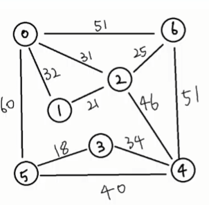

# [TIL] 2024-03-21

## 최소 신장 트리(MST)
### Prim, Kruskal 알고리즘(그리디)
- 그래프에서 최소 비용 문제
    1. 모든 정점을 연결하는 간선들의 가중치의 합이 최소가 되는 트리
    2. 두 정점 사이의 최소 비용의 경로 찾기
- 신장 트리
    - n개의 정점으로 이루어진 무방향 그래프에서 n개의 정점과 n-1개의 간선으로 이루어진 트리
- 최소 신장 트리
    - 무방향 가중치 그래프에서 신장 트리를 구성하는 간선들의 가중치의 합이 최소인 신장 트리

- 간선의 개수를 최소화하여 모든 정점을 연결하는 방법은?
    1. 여러 가지 방법이 있다.
    2. 싸이클이 발생하지 않는다.(갔던 곳은 안감)
    3. 간선의 개수 : (V-1)개 {V:노드의 갯수}
    ==> 신장 트리
- 최소 비용 신장 트리
    - 그 중에 비용의 합이 제일 적은 신장 트리
    - 방법
        1. 완탐
            - 모든 신장 트리를 구해야함
            - 시간적으로 너무 많이 걸림
        2. 백트래킹
        3. DP, 그리디 등등
    1. 제일 작은 것 부터
    2. 특정 노드를 시작으로 갈 수 있는 곳들 중 작은 곳들로

### MST - Prim 알고리즘
- 하나의 정점에서 연결된 간선들 중에 하나씩 선택하면서 MST를 만들어 가는 바식
    1. 임의 정점을 하나 선택해서 시작
    2. 선택한 정점과 *인접하는 정점(bfs)*들 중의 
    *최소 비용(que+우선순위 -> 우선순위 큐(힙큐사용))*의 간선이 존재하는 정점을 선택
    3. 모든 정점이 선택될 때 까지 1,2 과정 반복

### 최단 경로
- 최단 경로 정의
    - 간선의 가중치가 있는 그래프에서 두 정점 사이의 경로들 중에 간선의 가중치의 합이 최소인 경로
- 하나의 시작 정점에서 끝 정점까지의 최단경로
    - 다익스트라
        - 음의 가중치를 허용하지 않음
    - 벨만-포드
        - 음의 가중치 허용
- 모든 정점들에 대한 최단 경로
    - 플로이드 워셜 알고리즘

### 다익스트라
- 시작 정점에서 거리가 최소인 정점을 선택해 나가면서 최단경로 구하는 방식
- 시작 정점(s)에서 끝정점(e) 까지의 최단 경로에 정점 x가 존재
- 이때, 최단 경로 s에서 x까지의 최단 경로와 x에서 t까지의 최단 경로 구성된다.

### 사용 상황
1. 프림 : v(n) > e
2. 크루스칼 : v(n) < e
3. 다익 : 정점 -> 정점(최단거리) -> 가중치 중에 음수가 없다.