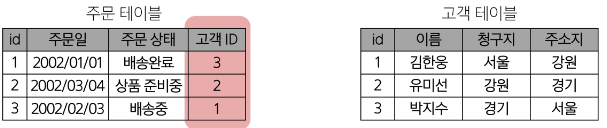

# [TIL] 2024-04-02

## 데이터베이스
- 체계적인 데이터 모음
    ### 데이터
    - 저장이나 처리에 효율적인 형태로 변환된 정보
    ### 기존의 데이터 저장 방식
    1. 파일 이용
        - 어디에서나 쉽게 사용
        - 데이터를 구조적으로 관리하기 어려움
    2. 스프레드 시트(엑셀) 이용
        - 테이블의 열, 행을 이용해 데이터를 구조적으로 관리 가능
        - 한계
            - 일반적으로 100만행 제한
            - 파일, 링크 소유 여부에 따른 단순한 접근 권한 관리
            - 정확성
    ### 데이터베이스 역할
    - 데이터를 저장하고 조작(CRUD)

    ### 관계형 데이터베이스 RDB
    - 데이터 간에 관계가 있는 데이터 항목들의 모음
    
    - 테이블, 행, 열의 정보를 구조화 하는 방식
    
    - 서로 관련된 데이터 포인터를 저장하고 이에 대한 액세스를 제공
    - 관계 : 여러 테이블 간의 논리적 연결

    ### 관계로 할 수 있는 것
    - 이 관계로 인해 두 테이블을 사용하여 데이터를 다양한 형식으로 조회할 수 있음
        - 특정 날짜에 구매한 모든 고객 조회
        - 지난 달에 배송일이 지연된 고객 조회 등
    ### 예시
    
    - 다음과 같이 고객 데이터가 저장되어 있음
    - 고객 데이터 간 비교를 위해서는 어떤 값을 활용해야 하는가 ? 
    
    
    

    ### 관련 키워드
    
    1. Table : 데이터를 기록하는 곳
    
    2. Field : 각 필드에는 고유한 데이터 형식(타입)이 지정됨
    
    3. Record : 각 레코드에는 구체적인 데이터 값이 저장됨
    
    4. Database : 테이블의 집합
    
    5. Primary Key : 각 레코드의 고유한 값, RDB에서 레코드의 식별자로 활용
    
    6. Foreign Key : 다른 테이블의 기본키 참조, 각 레코드에서 서로 다른 테이블 간의 관계를 만드는 데 사용

    ### DBMS
    
    - DB를 관리하는 SW 프로그램
    ### RDBMS
    - 관계형 DB를 관리하는 SW 프로그램

    ### DB 정리
    

## SQL
- DB에 정보를 저장하고 처리하기 위한 프로그래밍 언어
    ### 문법
    <SELECT column_name From table_name;>
    1. SQL 키워드는 대소문자를 구분하지 않음
        - 대문자 권장(명시적 구분)
    2. SQL Statements의 끝에는 세미콜론(';')이 필요
        - 명령어의 마침표
    ### SQL Statements
    - SQL을 구성하는 가장 기본적인 코드 블록
    <SELECT column_name From table_name;>
    - 해당 구문은 SELECT문 이라고 부름
    - 이 구문은 SELECT, FROM 2개의 키워드로 구성
    ### 수행 목적에 따른 Statements 4가지 유형
    1. DDL - 데이터 정의
    2. DQL - 데이터 검색
    3. DML - 데이터 조작
    4. DCL - 데이터 제어
    
    ### Query
    - DB로부터 정보를 요청 하는 것
    - 일반적으로 SQL로 작성하는 코드를 쿼리라고 함

## SELECT
- 테이블에서 데이터를 조회
